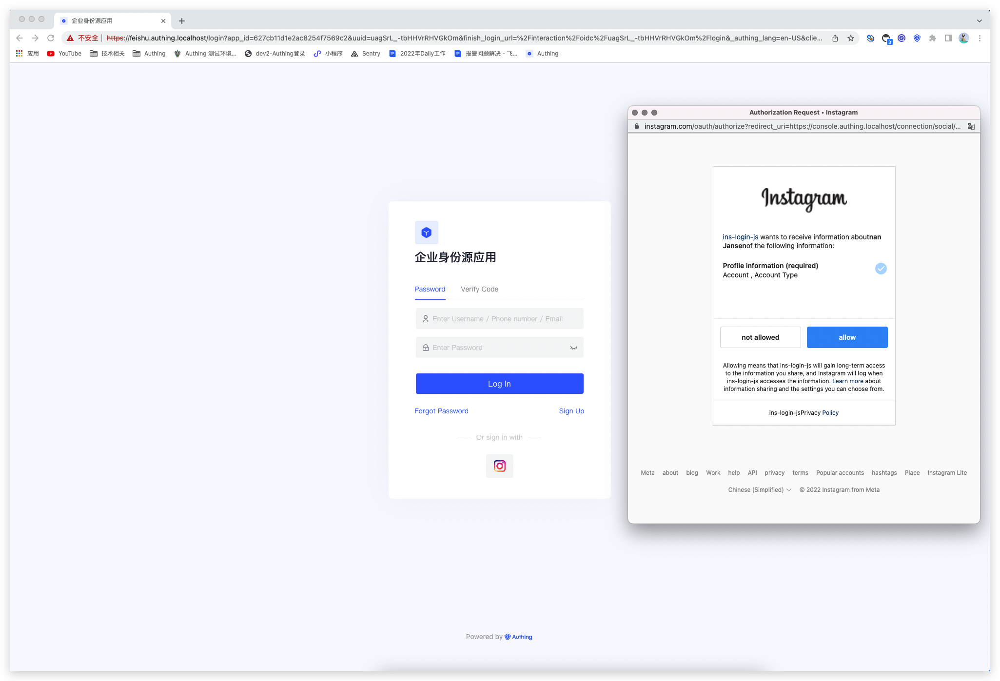
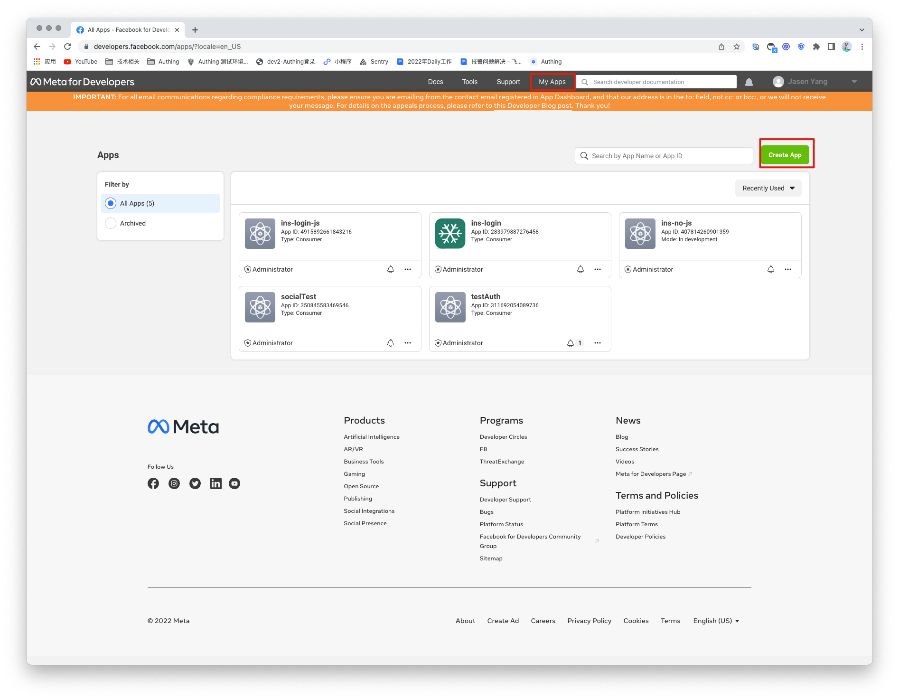
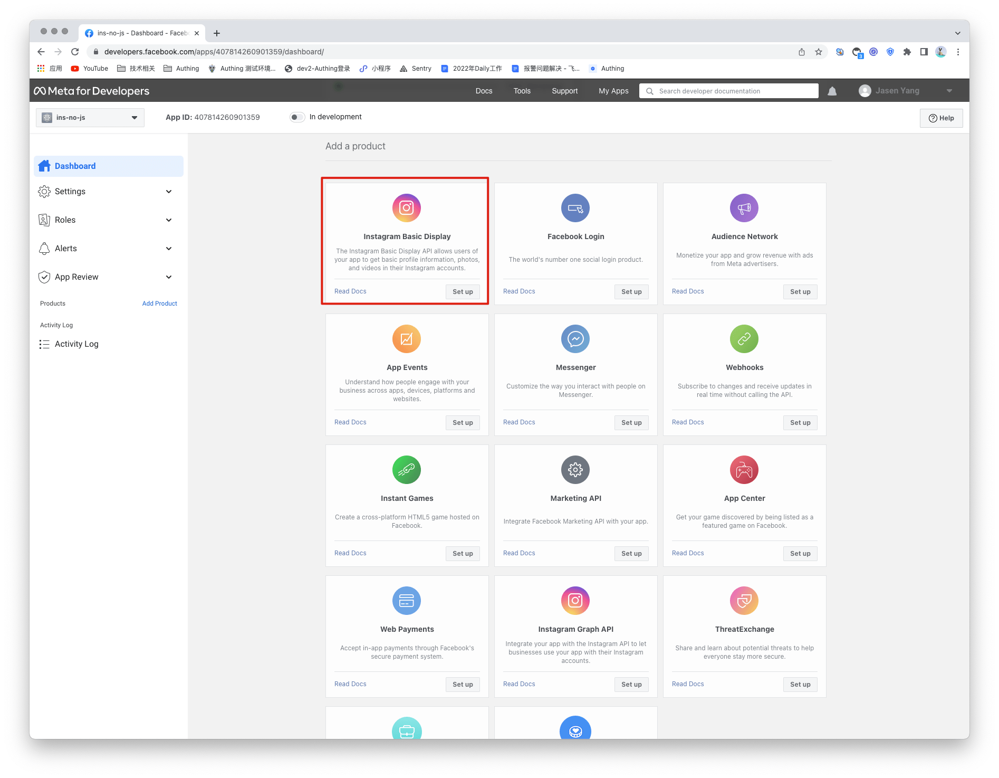
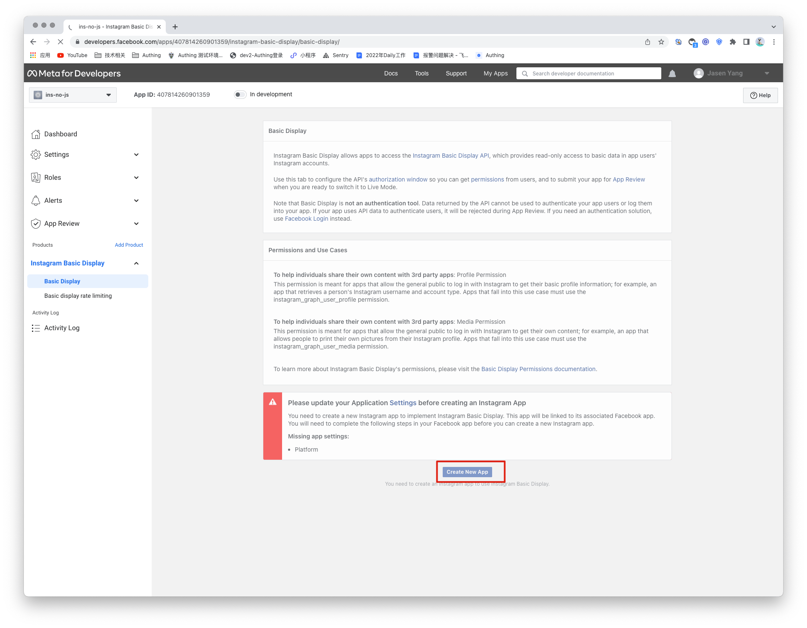
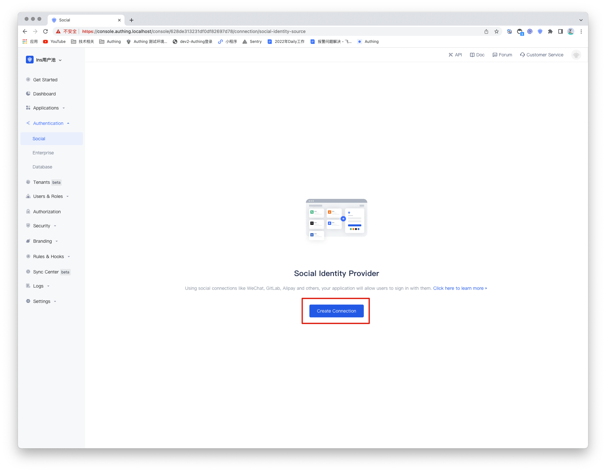
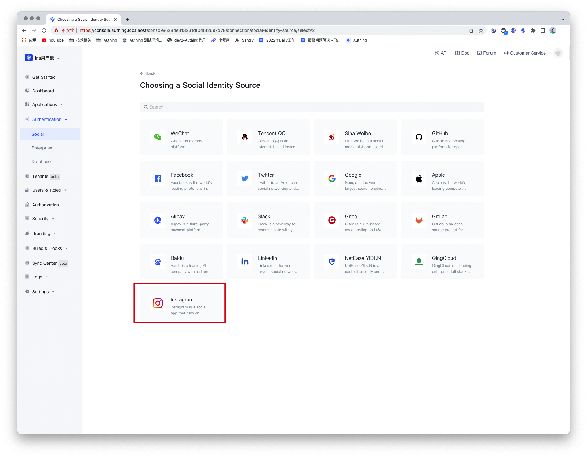
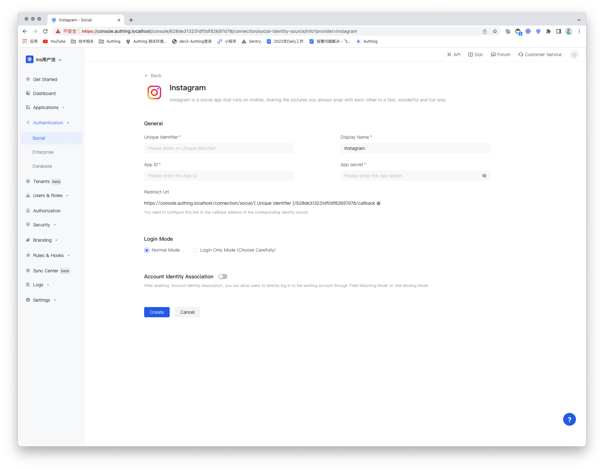
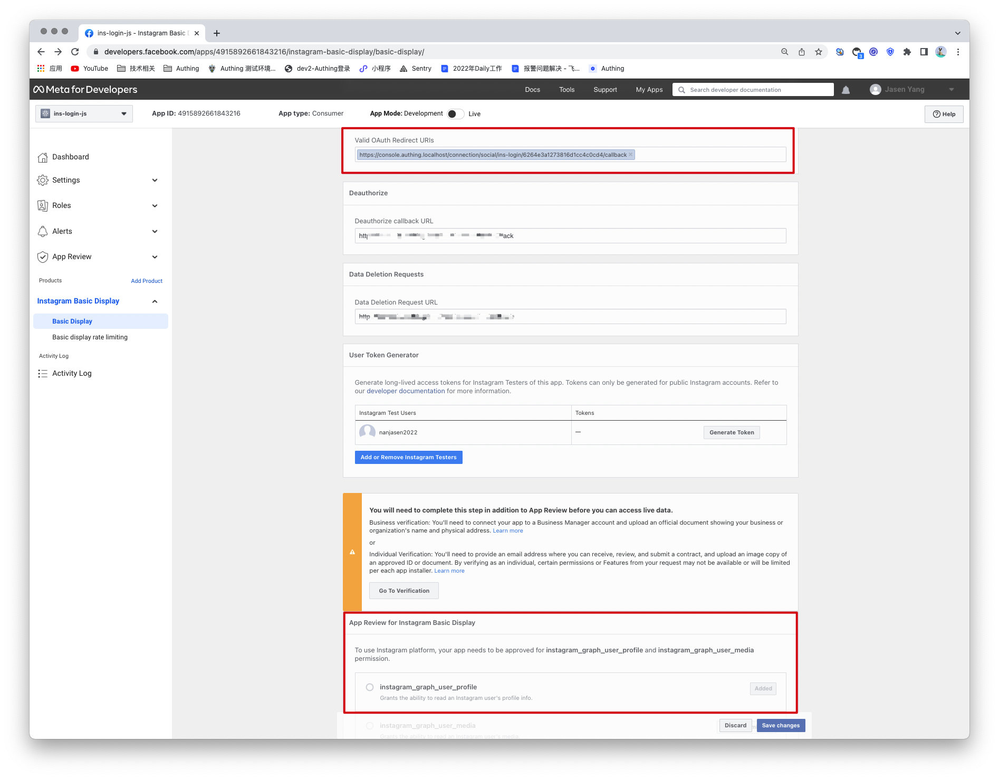
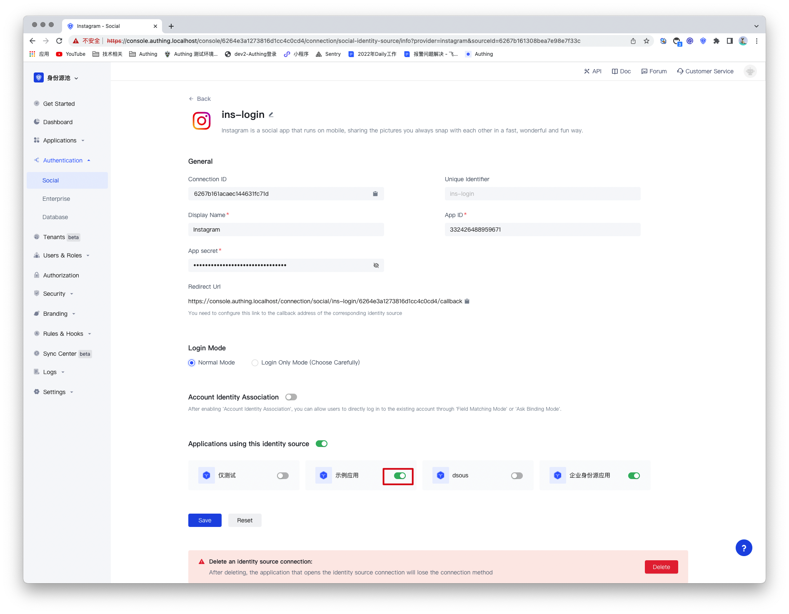
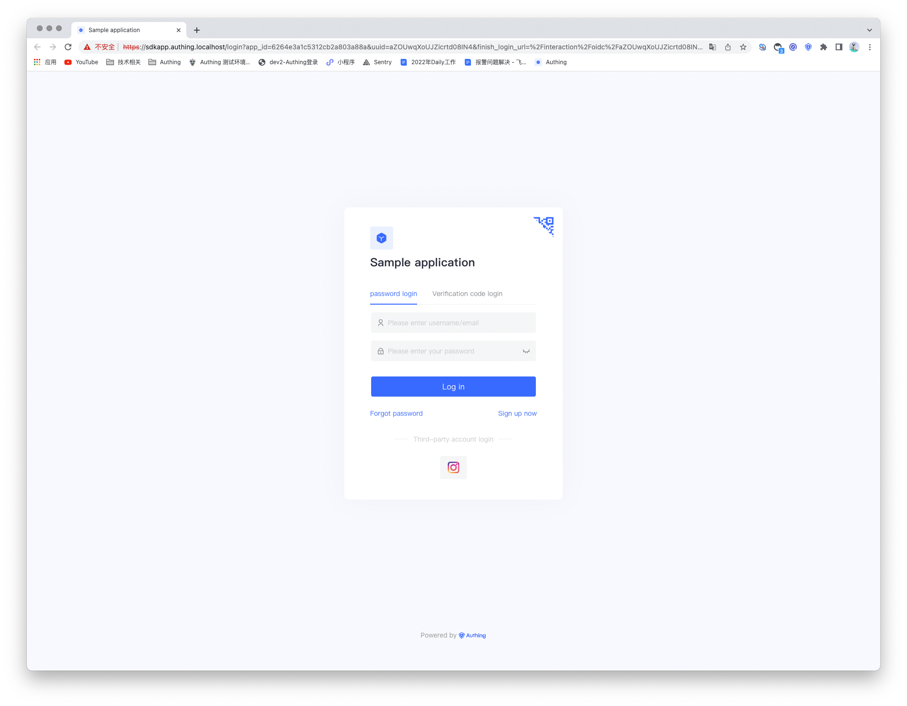

# Instagram 社会化登录

<LastUpdated/>

## Introduction

- **Overview**：Instagram social login is the secure login of users to third-party applications or websites using Instagram as their identity source. By configuring and enabling Instagram's social login in Authing, you can quickly obtain basic open information on Instagram and help users achieve password-free login through Authing.
- **Application scenarios**：PC Website
- **End-User Preview**：

## Precautions：

- If you do not have an Instagram account, please go to [Instagram Open Platform](https://developers.facebook.com/) to register a developer account. Because Instagram belongs to Facebook, the Instagram open platform mentioned here is Facebook's open platform;
- Open an [Instagram account](https://www.instagram.com/) with multimedia content;
- If you do not have an Authing console account, please go to the [Authing Console](https://authing.cn/) to register a developer account;

## Step 1：Create a Facebook app

Go to [developers.facebook.com](https://developers.facebook.com/), click **My Apps**, then create a new app and select **Consumer** or **No App Type** , fill in the application name.

In the control panel, find the **Instagram Basic Display** product and click Settings to add it to your app.

Scroll to the bottom of the page and click **Create new app**.

## Step 2：Configure Instagram in the Authing console

2.1 On the 「Social Identity Source」 page of the Authing Console, click the 「Create Social Identity Source」button to enter the 「Select Social Identity Source」page.

2.2 请在 Authing Console 控制台 的「社会化身份源」-「选择社会化身份也」页面，点击「Instagram」身份源按钮，进入 「Instagram 登录模式」页面。

2.3 Please configure the relevant field information on the 「Social Identity Sources」 - 「Instagram」 page of the Authing Console.

| 编号  | 字段/功能                    | 描述                                                                                                                                                                                                                                                                                                     |
| ----- | ---------------------------- | -------------------------------------------------------------------------------------------------------------------------------------------------------------------------------------------------------------------------------------------------------------------------------------------------------- |
| 2.3.1 | unique identifier            | a. The unique identifier consists of lowercase letters, numbers, and -, and the length is less than 32 digits. b. This is the unique identifier of this connection and cannot be modified after setting.                                                                                                 |
| 2.3.2 | display name                 | This name will be displayed on the button on the end user's login screen.                                                                                                                                                                                                                                |
| 2.3.3 | application number           | application number，Requires access on Instagram Open Platform                                                                                                                                                                                                                                           |
| 2.3.4 | application secret           | application secret，Requires access on Instagram Open Platform                                                                                                                                                                                                                                           |
| 2.3.5 | redirect url                 | Instagram valid OAuth redirect URI. This URL needs to be configured on the Instagram Open Platform.                                                                                                                                                                                                      |
| 2.3.6 | login mode                   | After enabling 「Login Only Mode」, you can only log in to an existing account and cannot create a new account. Please choose carefully.                                                                                                                                                                 |
| 2.3.7 | Account identity association | When 「Account Identity Association」is not enabled, a new user is created by default when a user logs in through an identity source. After enabling 「Account Identity Association」, you can allow users to log in to existing accounts directly through 「Field Matching」 or 「Asking for Binding」. |

After the configuration is complete, click the "Create" or "Save" button to complete the creation.

After creating the Instagram identity source on the Authing console, you need to configure the callback address to the **OAuth client authorization settings** in the Instagram app on Instagram's open platform.

In the last step, Instagram needs permission to access **instagram_graph_user_profile**, so this permission needs to be increased. Then click and save the changes, the instagram application is created successfully.

## Step 3：Development access

- **Recommended development access method**：Use a hosted login page

- **Description of advantages and disadvantages**：The operation and maintenance are simple, and Authing is responsible for the operation and maintenance. Each user pool has an independent second-level domain name; if you need to embed it into your application, you need to use the pop-up mode to log in, that is: after clicking the login button, a window will pop up, the content is the login page hosted by Authing, or the browser The server redirects to the login page hosted by Authing.

- **Detailed access method**：

  3.1 Create an app in the Authing console. For details, see: [How to create an app in Authing](https://docs.authing.cn/v2/guides/app/create-app.html)

  3.2 On the created Instagram identity source connection details page, open and associate an app created in the Authing console

3.3 Experience third-party login for Instagram on the login page

