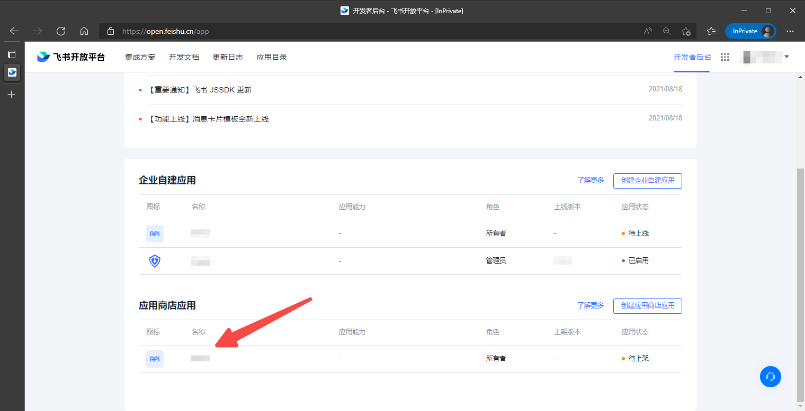
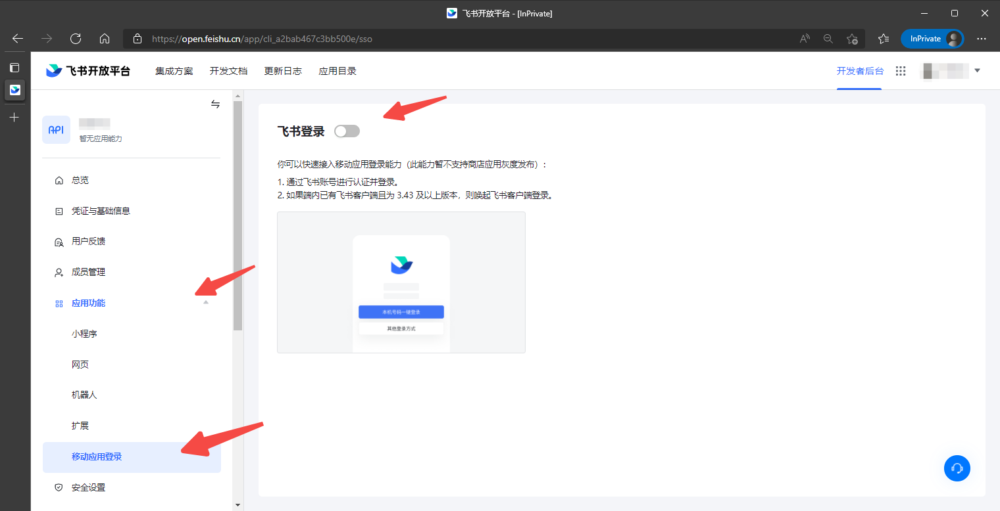
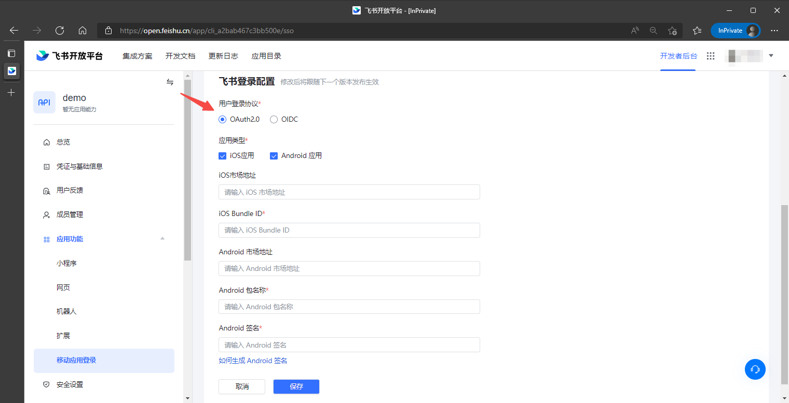

<IntegrationDetailCard title="开启飞书应用商店应用移动应用登录功能">

1. 在[飞书开发者后台](https://open.feishu.cn/app)，点击需要开启移动应用登录功能的应用，进入应用详情页面：

2. 在飞书应用详情的**应用功能**选项中选择**移动应用登录**，点击按钮开启功能；

2. 开启后填写下方的飞书登录配置,填写完成后保存；

</IntegrationDetailCard>
