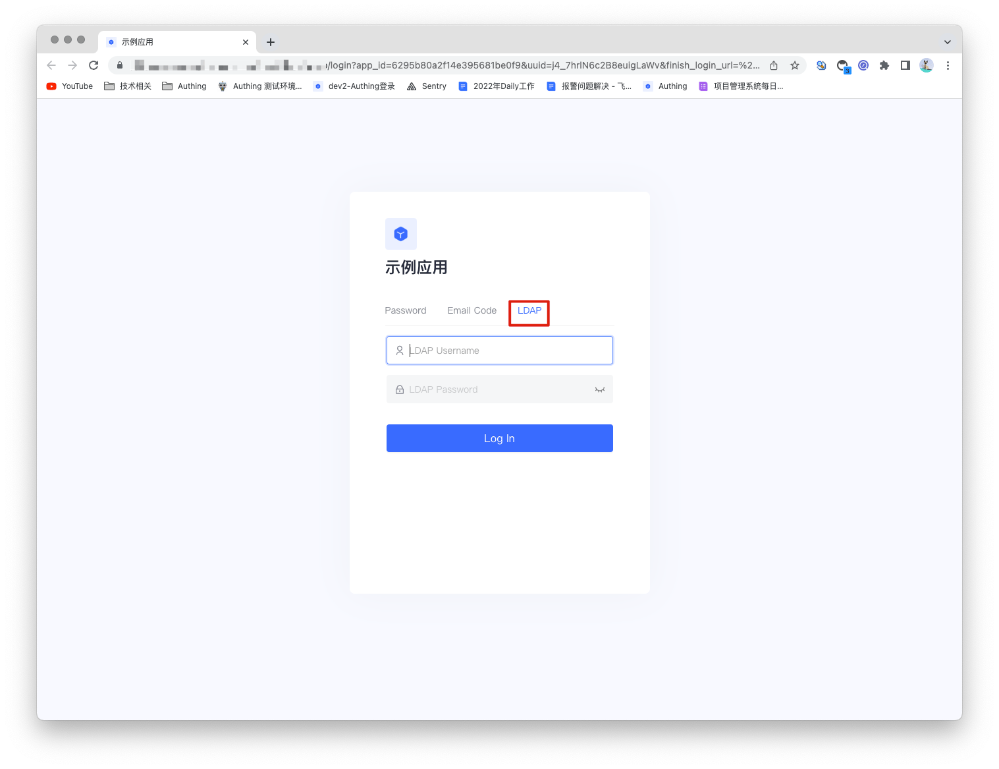
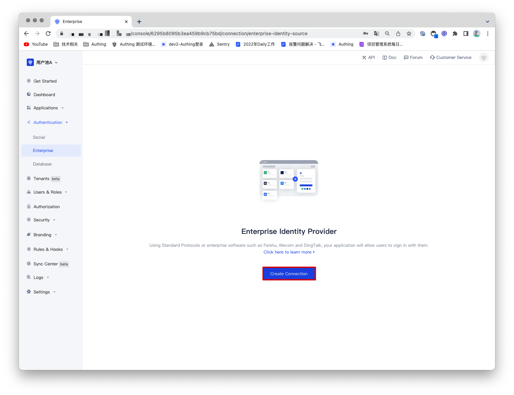
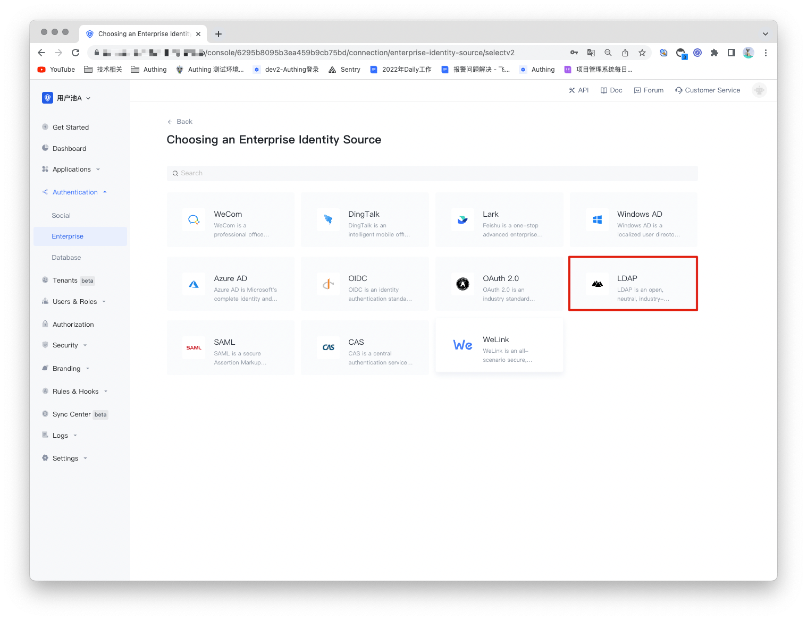
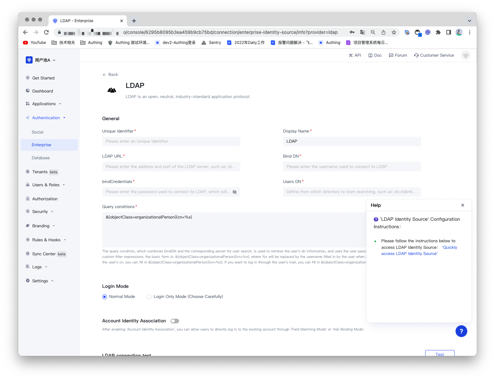
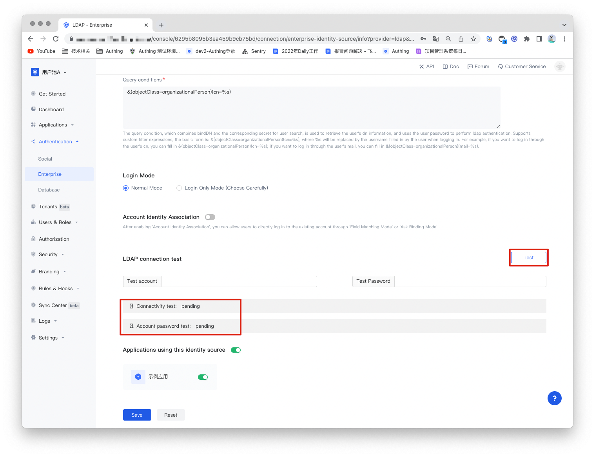
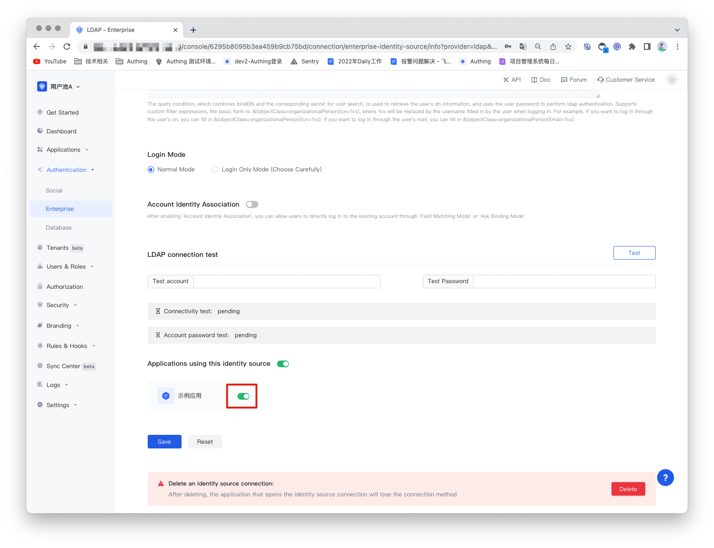

# Ldap Identity Source

<LastUpdated/>

## Introduction

- **Overview**：LDAP (Lightweight Directory Access Protocol) is a software protocol that enables anyone on the public Internet or corporate intranet to find data on organizations, individuals, and other resources (such as files and devices) on a network. LDAP is a "lightweight" version of the Directory Access Protocol (DAP), which is part of X.500 (a standard for directory services in the network).
- **Application scenarios**：PC Website
- **End-User Preview**：

## Precautions:

- requires an LDAP service;
- If you do not have an Authing console account, please go to the [Authing Console](https://authing.cn/) to register a developer account;

## Step 1: Create an LDAP Identity Source

Authing supports viewing, modifying, adding and deleting user information using the LDAP protocol. So if you don't have your own LDAP, you can [use Authing's LDAP user directory](https://docs.authing.cn/v2/guides/users/ldap-user-directory.html).

## Step 2: Configure the LDAP identity source in the Authing console

2.1 Open the **Authing console** and enter the user pool that you want to connect to the LDAP identity source, here called **"User Pool A"**. On the left menu, select Connect to Identity Source > Enterprise Identity Source, and select Create Enterprise Identity Source on the right panel.

2.2 Find "LDAP" in the right panel and click it.

2.3 According to the LDAP configuration requirements, fill in the configuration content required by the LDAP protocol.

| NO.    | Fields/Function | Description                                                  |
| ------ | --------------- | ------------------------------------------------------------ |
| 2.3.1  | Uniquely Identifies          | a. The unique identifier consists of lowercase letters, numbers, and -, and the length is less than 32 digits. b. This is the unique identifier of this connection and cannot be modified after setting. |
| 2.3.2  | Display Name                 | This name will be displayed on the button on the end user's login screen. |
| 2.3.3  | LDAP Link       | The address of the LDAP server. |
| 2.3.4  | Bind DN         | The username used to connect to LDAP, this username will be used to test connection results and search for users or user groups. |
| 2.3.5  |bindCredentials    | The password used to connect to LDAP, which will be encrypted and stored in the database. |
| 2.3.6  | Users DN        | Define which directory to start searching from, such as: dc=fabrikam,dc=local. |
| 2.3.7  | Query conditions        | This condition is combined with bindDN and the corresponding secret to perform user search, which is used to retrieve the user's dn information, and combined with the user password to perform ldap authentication. Supports custom filter expressions, the basic form is: &(objectClass=organizationalPerson)(cn=%s). |
| 2.3.8 | Login Mode                   | After enabling the "Login Only Mode", you can only log in to an existing account and cannot create a new account. Please choose carefully. |
| 2.3.9 | Account identity association | When "Account Identity Association" is not enabled, a new user is created by default when a user logs in through an identity source. After enabling "Account Identity Association", you can allow users to log in to existing accounts directly through "Field Matching" or "Asking for Binding". |

After the configuration is complete, click the "Save" button to complete the creation.

Authing also provides a test for LDAP connection to test the connectivity of the LDAP service and whether the account password is correct, helping you to check whether the parameters are filled in correctly.

## Step 3: Development Access

- **Recommended development access method**: use the hosted login page

- **Description of advantages and disadvantages**: Simple operation and maintenance, Authing is responsible for operation and maintenance. Each user pool has an independent second-level domain name; if you need to embed it into your application, you need to use the pop-up mode to log in, that is: after clicking the login button, a window will pop up, the content is the login page hosted by Authing, or the browser The server redirects to the login page hosted by Authing.

- **Detailed access method**:

3.1 Create an app in the Authing console. For details, see: [How to create an app in Authing](/guides/app-new/create-app/create-app.md).

3.2 On the created LDAP identity source connection details page, open and associate an application created in the Authing console.

3.3 Experience the enterprise login of LDAP on the login page.

