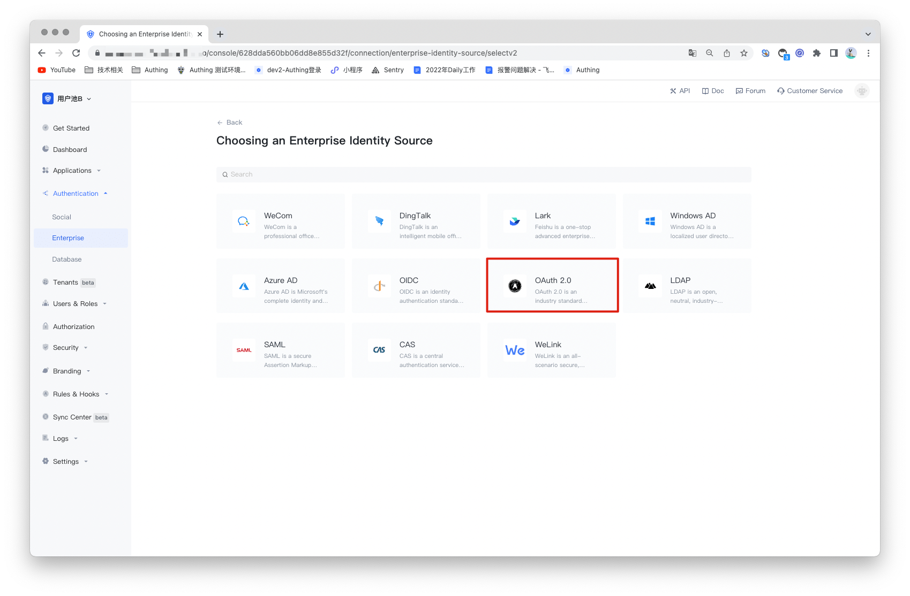
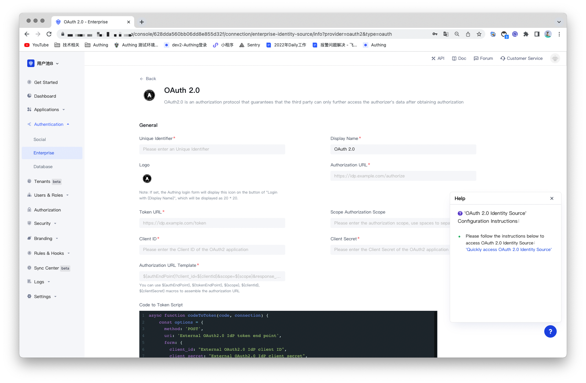
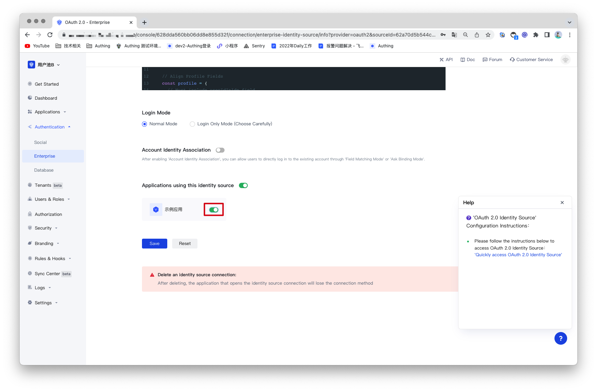

#OAuth2.0 Identity Source

<LastUpdated/>

## Introduction

- **Overview**：OAuth2.0  is an authorization standard protocol. When a user logs in to a third-party application, the user can securely authorize the data to the caller by using the OAuth2.0 protocol. It allows users to access multiple applications while providing credentials (such as user ID and password) to the central CAS server application only once. Authing supports the authentication capability of the OAuth2.0 protocol, and the user only needs to provide the OAuth2.0 authentication service. After configuring the OAuth2.0 identity source, you can use it to complete the single sign-on and logout functions.
- **Application scenarios**：PC Website
- **End-User Preview**：

## Precautions：

- Requires a service that supports OAuth2.0 protocol capabilities;
- If you do not have an Authing console account, please go to the [Authing Console](https://authing.cn/) to register a developer account;

## Step1：Create An OAuth2.0 Identity Source

The third-party login provided by many existing websites follows the OAuth2.0 standard protocol. Many websites may have inconsistent processing details and can be extended based on the OAuth2.0 protocol, but the overall authorization and authentication process is the same. So you can use a third-party login application that supports OAuth2.0 authentication as an identity source.

If there is no available identity source, Authing can also be used as an OAuth2.0 identity source, and other systems can access Authing as an identity provider through the OAuth2.0 protocol. For details, please refer to: [Become an OAuth2.0 Identity Source](https://docs.authing.cn/v2/guides/federation/oauth.html).

## Step 2: Configure the OAuth2.0 identity source in the Authing console

2.1 Open the **Authing console** and enter the user pool that you want to connect to the OAuth2.0 identity source, here called **"User Pool B"**. On the left menu, select Connect to Identity Source > Enterprise Identity Source, and select Create Enterprise Identity Source on the right panel.

2.2 Find "OAuth2.0" in the right panel and click it.

2.3 According to the configuration requirements of OAuth2.0, fill in the configuration content required by the OAuth2.0 protocol.

| 编号   | 字段/功能                    | 描述                                                         |
| ------ | ---------------------------- | ------------------------------------------------------------ |
| 2.3.1  | Uniquely Identifies          | a. The unique identifier consists of lowercase letters, numbers, and -, and the length is less than 32 digits. b. This is the unique identifier of this connection and cannot be modified after setting. |
| 2.3.2  | Display Name                 | This name will be displayed on the button on the end user's login screen. |
| 2.3.3  | Application Logo             | The identity source logo displayed on the login screen button. |
| 2.3.4  | Authorization URL            | The URL used to initiate an authentication request to the CAS IdP. Fill in the "Login Endpoint" recorded earlier. |
| 2.3.5  | Token URL                    | The URL used to obtain identity information from the CAS IdP. Fill in the previously recorded "service ticket verification endpoint (CAS 2.0"). |
| 2.3.6  | Authorization Scope          | The authorization scope carried in the authorization request. |
| 2.3.7  | Client ID                    | The Client ID of your OpenID Connect provider.               |
| 2.3.8  | Client Secret                | The Client Secret of your OpenID Connect provider.           |
| 2.3.9  | Authorization Link Template  | The concatenated authorization URL is used to request an authorization request link to be automatically generated. |
| 2.3.10 | Code for Token script        | A script to exchange Code for Token required in the authorization process. |
| 2.3.11 | Token change user script     | A script to exchange the token required during the authorization process for user information. |
| 2.3.12 | Login Mode                   | After enabling the "Login Only Mode", you can only log in to an existing account and cannot create a new account. Please choose carefully. |
| 2.3.13 | Account identity association | When "Account Identity Association" is not enabled, a new user is created by default when a user logs in through an identity source. After enabling "Account Identity Association", you can allow users to log in to existing accounts directly through "Field Matching" or "Asking for Binding". |

After the configuration is complete, click the "Save" button to complete the creation.

## Step 3: Development Access

- **Recommended development access method**: use the hosted login page

- **Description of advantages and disadvantages**: Simple operation and maintenance, Authing is responsible for operation and maintenance. Each user pool has an independent second-level domain name; if you need to embed it into your application, you need to use the pop-up mode to log in, that is: after clicking the login button, a window will pop up, the content is the login page hosted by Authing, or the browser The server redirects to the login page hosted by Authing.

- **Detailed access method**:

3.1 Create an app in the Authing console. For details, see: [How to create an app in Authing](https://docs.authing.cn/v2/guides/app/create-app.html).

3.2 On the created OAuth2.0 identity source connection details page, open and associate an application created in the Authing console.

3.3 Experience OAuth2.0 enterprise login on the login page.

