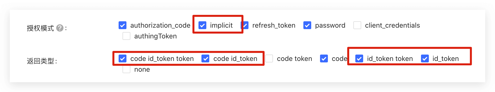

<IntegrationDetailCard :title="`Configur OIDC Client in ${$localeConfig.brandName}`">

You need configur OIDC Client in ${$localeConfig.brandName}

1. Enter Enterprice IdP config page in [{{$localeConfig.brandName}} Console](https://console.authing.cn)
2. Locate **OIDC** IdP
3. Modify the configuration setting:

- **Link label**: Must be Identical
- **Display Name**: will show a button name as "login via {Display Name}" on Authing Login UI
- **Logo URL**: will show the logo on Authing Login UI. Image size 20 \* 20
- **Issuer URL**: Issuer URL from OIDC
- **Client ID**: Client ID from OIDC
- **Callback URL**: must be https://core.authing.cn/connections/oidc/callback.
- Click **Create**

There are two modes when integrating OIDC IdP

- `Front Channel` : User information exchange only took place in browser. `response_mode=form_post` and `response_type=id_token`, make sure `implicit` mode and `id_token` are enabled in your application.

- `Backend Channe`: User information exchange only took place in Authing server. `response_type=code`. Make sure authorization_code is enabled and OIDC client secret is known.

4. Click **Save**

</IntegrationDetailCard>
