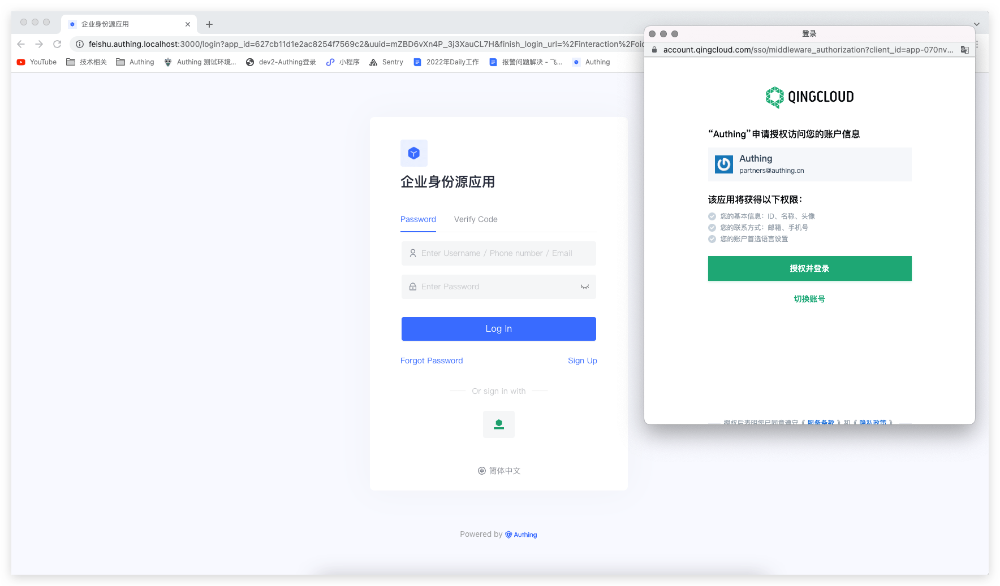
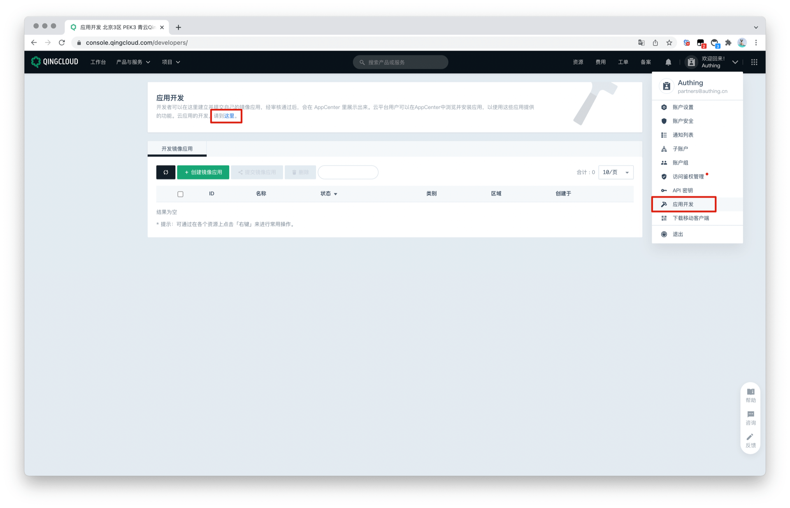
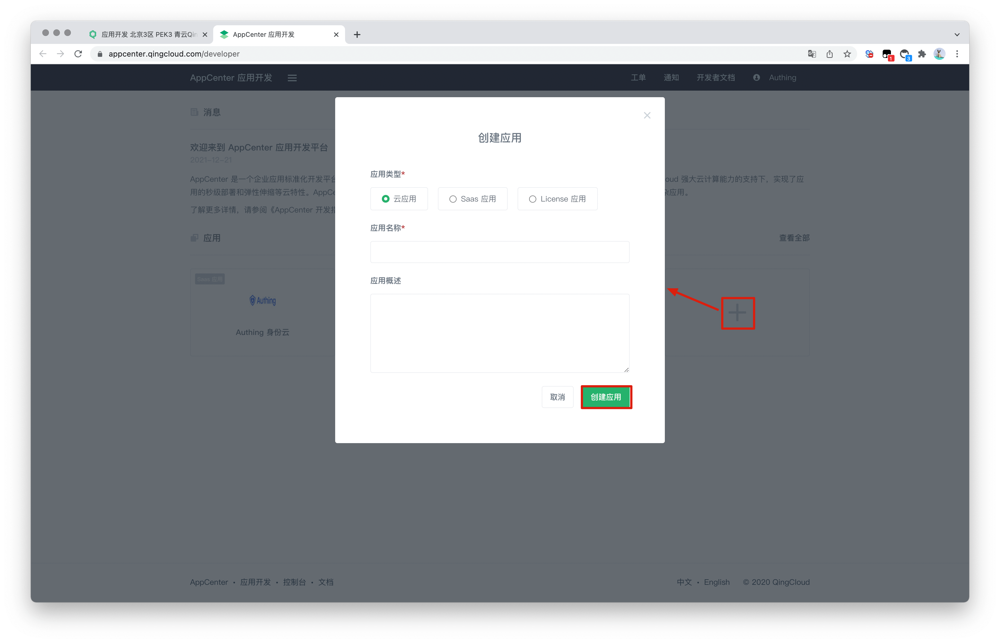
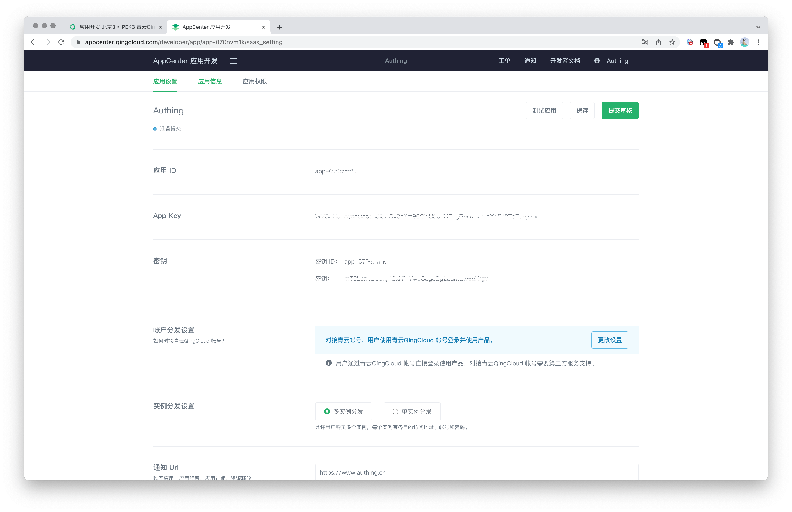
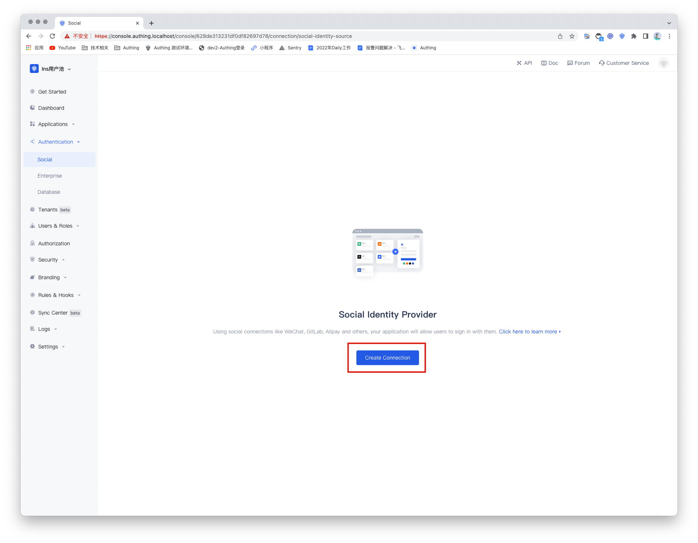
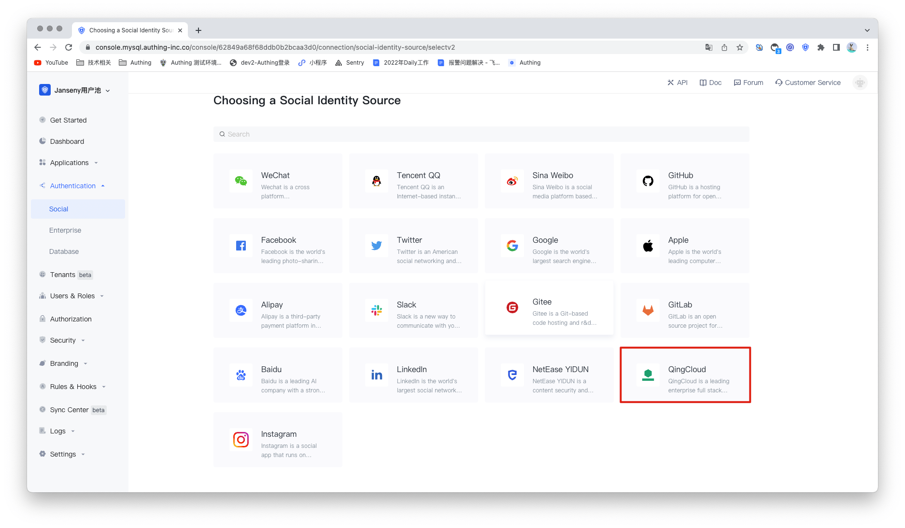
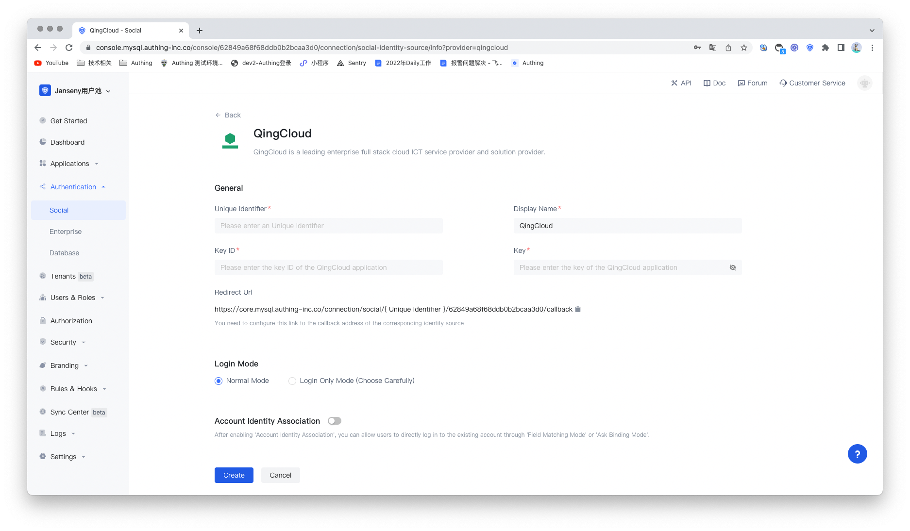
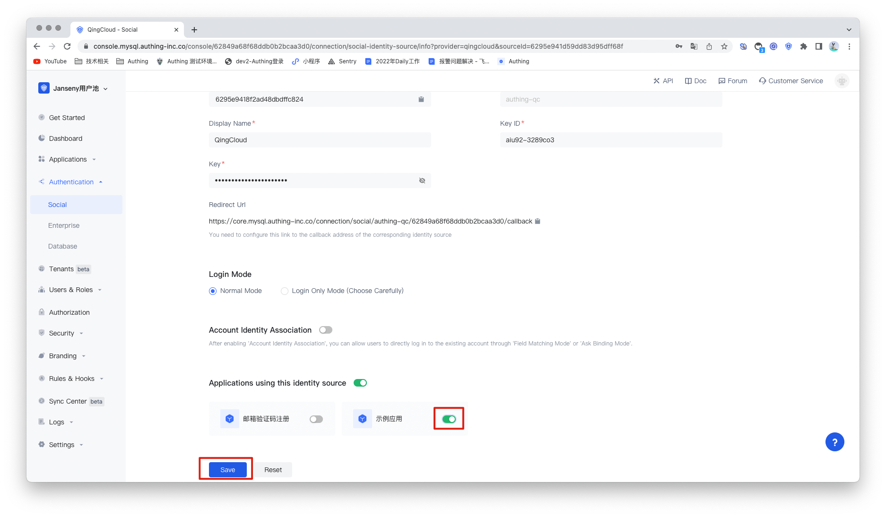

# QingCloud Social Login

<LastUpdated/>

## Introduction

- **Overview**：QingCloud is a technology-leading enterprise-level full-stack cloud ICT service provider and solution provider. QingCloud social login means that users securely log in to third-party applications or websites with QingCloud as the identity source. By configuring and enabling QingCloud's social login in Authing, you can quickly obtain basic open information of QingCloud through Authing and help users achieve password-free login.
- **Application scenarios**：PC Website
- **End-User Preview**：

## Precautions：

- If you do not have a QingCloud account, please go to the [QingCloud](https://www.qingcloud.com/) platform to register an account.
- You need to create an application that supports protocol authentication in [Application Development Platform](https://appcenter.qingcloud.com/developer/) on QingCloud.
- If you do not have an Authing Console account, please go to the [Authing Console](https://authing.cn/) to register a developer account.

## Step 1 ：Create QingCloud Application

Go to QingCloud's [AppCenter Application Development Platform](https://appcenter.qingcloud.com/developer/ ). If you can't find it, you can create an app according to the [QingCloud documentation(opens new window)](https://docsv3.qingcloud.com/appcenter/dev-platform/saas-developer-guide/release/#Create app) guide, You need to record the **App ID** and **App Secret** of the application, which will be used later.

1.1 Enter the console, click the avatar in the upper right corner, click Application Development, and click "here" under Application Development to enter the application list.

1.2 Click the 「+」 sign in the application list to create an application. Select the application type, fill in the application name, and click 「Create Application」.

1.3 Record the key ID (namely the application ID) and key of the QingCloud application.

## Step 2 : Configure QingCloud in the Authing console

2.1 In the [Authing Console](https://console.authing.cn/), go to the 「Social Identity Source」 configuration page, and click 「Create Social Identity Source」 to start selecting and creating.

2.2 In all social identity source icons, find and enter **QingCloud** social login.

2.3 Please configure the relevant field information on the 「Social Identity Sources」 - 「QingCloud」 page of the Authing Console.

- `App ID`: QingCloud Secret ID；
- `App Secret`: QingCloud Secret；

| No.   | Field/Function               | Description                                                  |
| ----- | ---------------------------- | ------------------------------------------------------------ |
| 2.3.1 | unique identifier            | a. The unique identifier consists of lowercase letters, numbers, and -, and the length is less than 32 digits. b. This is the unique identifier of this connection and cannot be modified after setting. |
| 2.3.2 | display name                 | This name will be displayed on the button on the end user's login screen. |
| 2.3.3 | secret id                    | secret id . It needs to be obtained in the application created by QingCloud open platform. |
| 2.3.4 | secret                       | secret . It needs to be obtained in the application created by QingCloud open platform. |
| 2.3.5 | redirect url                 | Instagram valid OAuth redirect URI. This URL needs to be configured on the Instagram Open Platform. |
| 2.3.6 | login mode                   | After enabling 「Login Only Mode」, you can only log in to an existing account and cannot create a new account. Please choose carefully. |
| 2.3.7 | Account identity association | When 「Account Identity Association」is not enabled, a new user is created by default when a user logs in through an identity source. After enabling 「Account Identity Association」, you can allow users to log in to existing accounts directly through 「Field Matching」 or 「Asking for Binding」. |

2.4 After the configuration is complete, click the 「Create」 button to complete the creation.

## Step 3 : Development Access

- **Recommended development access method**：Use a hosted login page

- **Description of advantages and disadvantages**：The operation and maintenance are simple, and Authing is responsible for the operation and maintenance. Each user pool has an independent second-level domain name; if you need to embed it into your application, you need to use the pop-up mode to log in, that is: after clicking the login button, a window will pop up, the content is the login page hosted by Authing, or the browser The server redirects to the login page hosted by Authing.

- **Detailed access method**：

3.1 Create an app in the Authing console. For details, see: [How to create an app in Authing](/guides/app-new/create-app/create-app.md).

3.2 On the created QingCloud identity source connection details page, open and associate an app created in the Authing console

