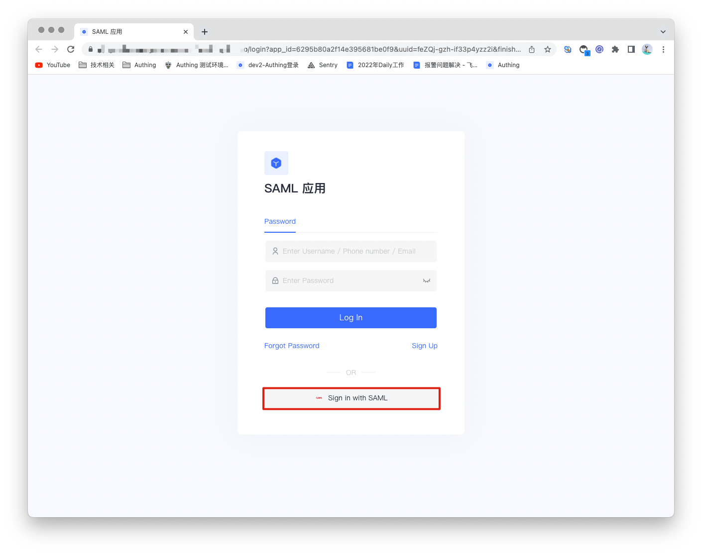
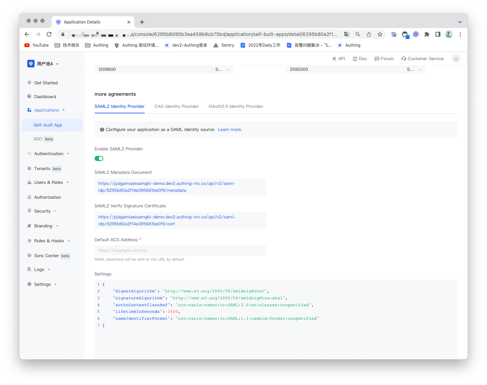
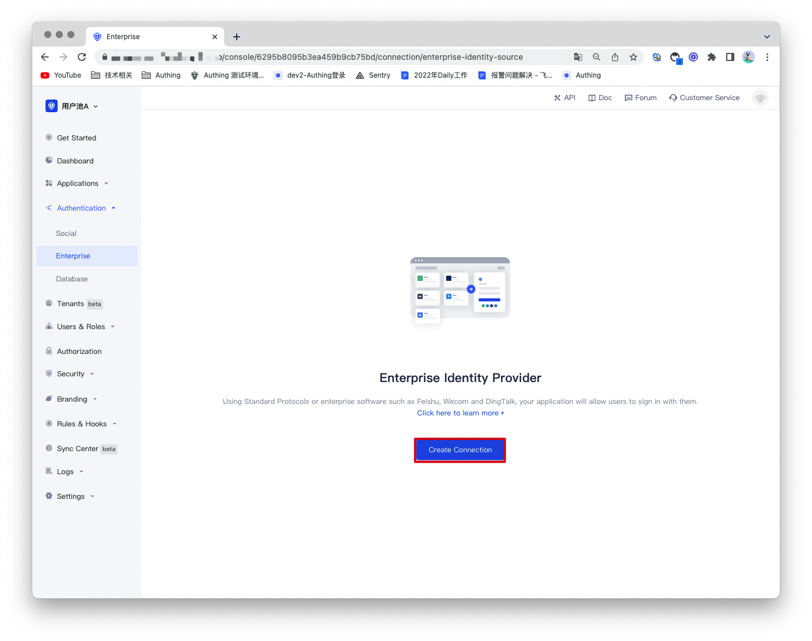
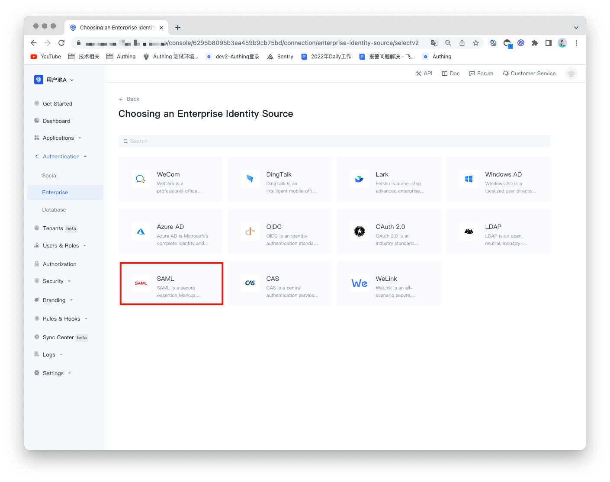
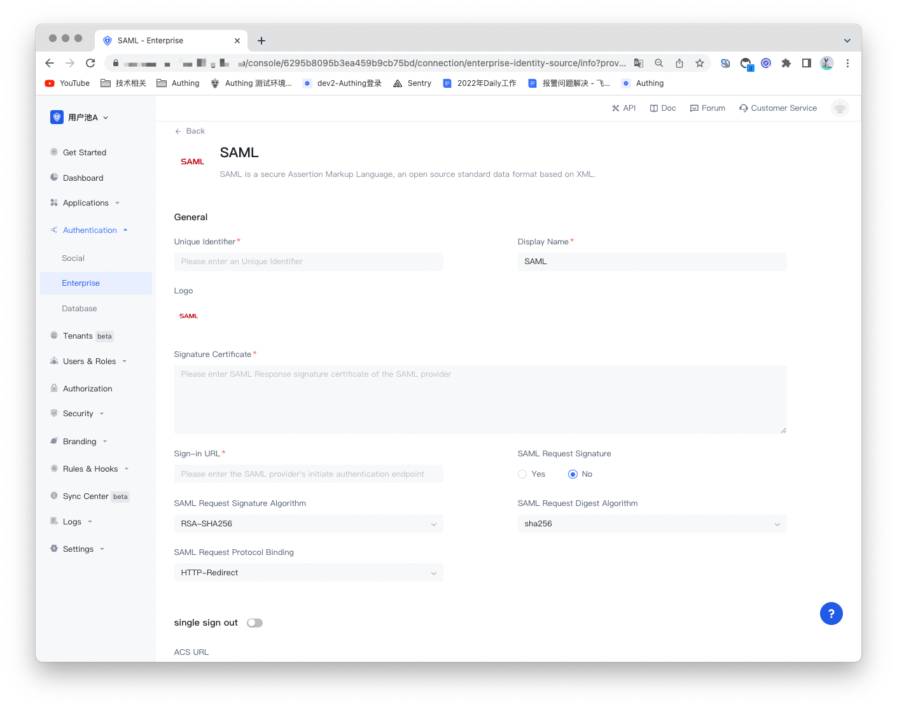
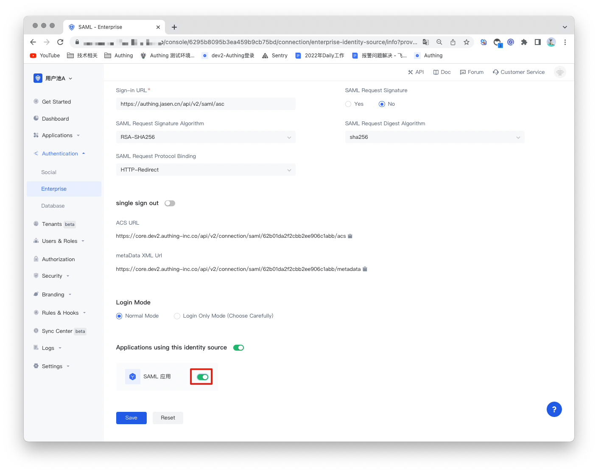

# SAML SOURCE

<LastUpdated/>

## Introduction

- **Overview**：Security Assertion Markup Language (SAML, pronounced sam-el) is an XML-based open source standard data format for exchanging authentication and authorization data between parties, especially Exchange between identity providers and service providers. SAML2.0 can implement network-based cross-domain single sign-on (SSO) in order to reduce the management overhead of distributing multiple authentication tokens to a user.
- **Application scenarios**：PC Website
- **End-User Preview**：

## Precautions:

- requires a service that supports SAML protocol capabilities;
- If you do not have an Authing console account, please go to the [Authing Console](https://authing.cn/) to register a developer account;

## Step 1: Create a SAML Identity Source

Enable SAML2 identity provider in Authing to provide **identity assertion** for other service providers. Let Authing be the SAML identity source, and other systems can access Authing as the identity provider through the SAML protocol. For details, please refer to: [Becoming a SAML Identity Source](https://docs.authing.cn/v2/guides/federation/saml.html).

## Step 2: Configure the SAML identity source in the Authing console

2.1 Open the **Authing console** and enter the user pool that you want to connect to the SAML identity source, here called **"User Pool B"**. On the left menu, select Connect to Identity Source > Enterprise Identity Source, and select Create Enterprise Identity Source on the right panel.

2.2 Find "SAML" in the right panel and click it.

2.3 According to the configuration requirements of SAML, fill in the configuration content required by the SAML protocol.

| NO.   | Fields/Function                    | Description                                                         |
| ------ | ----------------- | ------------------------------------------------------------ |
| 2.3.1  | Uniquely Identifies          | a. The unique identifier consists of lowercase letters, numbers, and -, and the length is less than 32 digits. b. This is the unique identifier of this connection and cannot be modified after setting. |
| 2.3.2  | Display Name                 | This name will be displayed on the button on the end user's login screen. |
| 2.3.3  | Application Logo             | The identity source logo displayed on the login screen button. |
| 2.3.4  | Signature Certificate | Verification certificate for SAML Identity Provider. |
| 2.3.5  | Sign-in URL | Login URL for SAML Identity Provider. |
| 2.3.6  | SAML Request Signature | Whether to encrypt SAML requests.        |
| 2.3.7  | SAML Request Signature Algorithm | Defaults is rsa-sha256.                  |
| 2.3.8  | SAML Request Digest Algorithm | Defaults is sha256.                          |
| 2.3.9  | SAML Request Protocol Binding | Default is HTTP-Redirect.              |
| 2.3.10 | ACS URL           | Assert consumption address.                    |
| 2.3.11 | metaData XML Url | The address of the SAML Identity Provider metadata. |
| 2.3.12 | Login Mode | After enabling the "Login Only Mode", you can only log in to an existing account and cannot create a new account. Please choose carefully. |

After the configuration is complete, click the "Save" button to complete the creation.

## Step 3: Development Access

- **Recommended development access method**: use the hosted login page

- **Description of advantages and disadvantages**: Simple operation and maintenance, Authing is responsible for operation and maintenance. Each user pool has an independent second-level domain name; if you need to embed it into your application, you need to use the pop-up mode to log in, that is: after clicking the login button, a window will pop up, the content is the login page hosted by Authing, or the browser The server redirects to the login page hosted by Authing.

- **Detailed access method**:

3.1 Create an app in the Authing console. For details, see: [How to create an app in Authing](/guides/app-new/create-app/create-app.md).

3.2 On the created SAML identity source connection details page, open and associate an application created in the Authing console.

3.3 Experience SAML enterprise login on login page.

