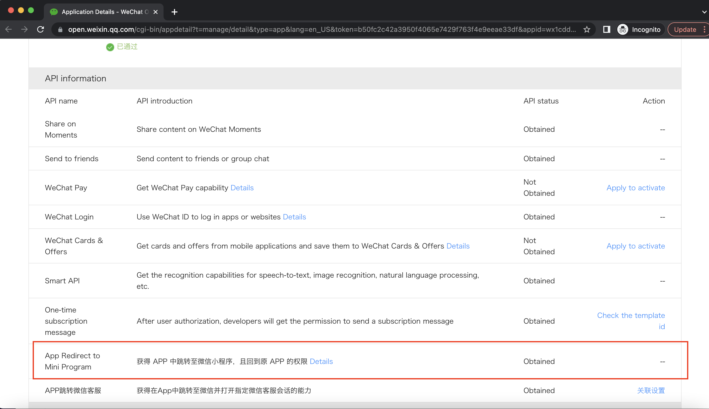

<IntegrationDetailCard title="Step 1: Create a WeChat mobile application on the WeChat open platform">

Please go to [WeChat Open Platform](https://open.weixin.qq.com/cgi-bin/frame?t=home/app_tmpl) to guide you to create a WeChat mobile application, and create a WeChat mobile application on the [WeChat Open Platform](https://www.weixin.com/cgi-bin/frame?t=home/app_tmpl) ://open.weixin.qq.com/) on the **Administration Center-Mobile Application-Application Details-Associated Mini Program Information** page, initiate the associated Mini Program operation for the approved mobile application. Requires an associated applet - `AppID` for **small login** is `wxa0435021fd7a3af2` .

  
</IntegrationDetailCard>
