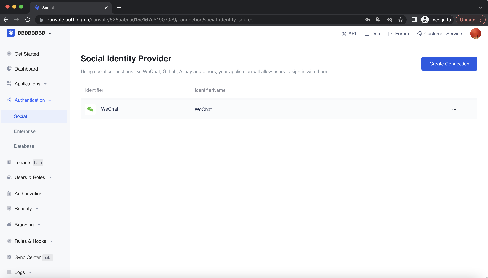

<IntegrationDetailCard :title="`在 ${$localeConfig.brandName} 控制台配置 「App 拉起小程序登录」应用（可选）`">

You need to add the configuration of the app you created in the previous step in {{$localeConfig.brandName}} :

1. In the [{{$localeConfig.brandName}} console](https://console.authing.cn), go to the "Social Identity Source" configuration page, click "Create Social Identity Source" to start selecting and creating.
  
  
  
2. In all social identity source icons, find and enter **App, pull up the applet to log in** social login.
3. In the configuration form, follow the instructions to fill in the following configuration:

- AppID: AppID of the applet, filled in by the user who selects the privatized applet;
- AppSecret: AppSecret of the applet, filled in by users who choose to privatize the applet.

4. After the configuration is complete, click the "Create" button to complete the creation.
</IntegrationDetailCard>
