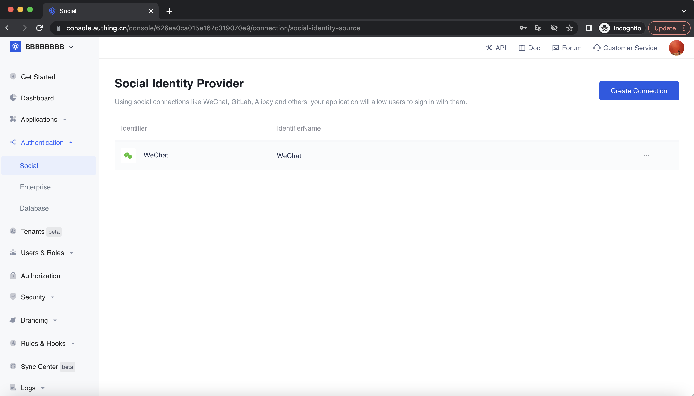

<IntegrationDetailCard :title="`在 ${$localeConfig.brandName} 填入微信小程序配置`">

You need to add the configuration of the app you created in the previous step in {{$localeConfig.brandName}} :

1. In the [{{$localeConfig.brandName}} console](https://console.authing.cn), go to the "Social Identity Source" configuration page, click "Create Social Identity Source" to start selecting and creating.
 
  
2. In all social identity source icons, find and enter **WeChat applet scan code login** social login.
3. In the configuration form, follow the instructions to fill in the following configuration:

- Logo: The uploaded logo will be used as the logo in the center of the QR code of the applet;
- Callback link after login: This link is usually filled with your business address. If this link is configured, after the user completes the login, the browser will jump to this page with the user information;
- AppID: AppID of the applet, filled in by the user who selects the privatized applet;
- AppSecret: AppSecret of the applet, filled in by users who choose to privatize the applet.

4. After the configuration is complete, click the "Create" button to complete the creation.

</IntegrationDetailCard>
