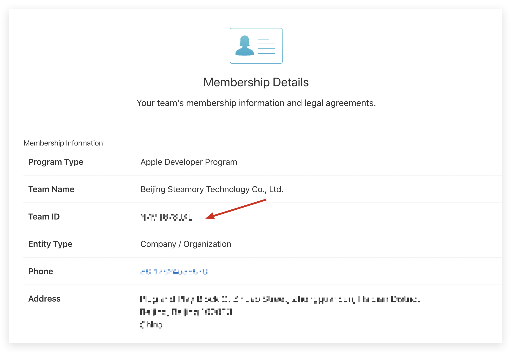
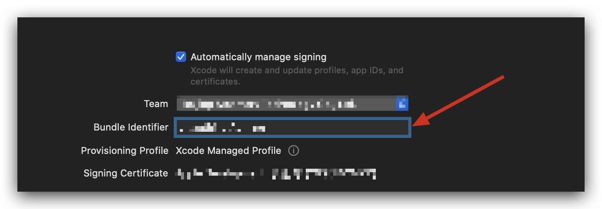
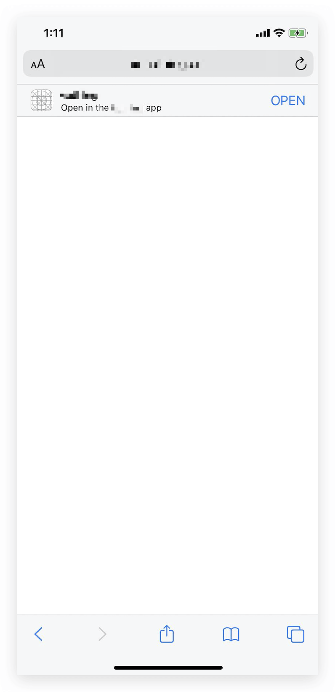

<IntegrationDetailCard title="在微信开放平台创建一个移动应用">

### Configure iOS Universal Links

> Starting from WeChat WechatOpenSDK 1.8.6, iOS mobile applications need to fill in Universal Links information. If you are developing an Android application or have already configured it, you can skip this section. [See Apple's official documentation here](https://developer.apple.com/documentation/uikit/inter-process_communication/allowing_apps_and_websites_to_link_to_your_content/enabling_universal_links).

#### Configure the apple-app-site-association file

Find your Team ID on the **Membership** page of the Apple Developer Console:



Find the Bundle Identifier in Xcode **Targets** -> **Signing & Capabilities**:



Next create the apple-app-site-association file:

Assuming your Team ID is xxxxxxx, Bundle Identifier is com.example.exampleApp, and Path of Universal Link is set to `/native/*`, then apple-app-site-association is as follows:

Assuming your Team ID is xxxxxxx, Bundle Identifier is com.example.exampleApp, and Path of Universal Link is set to `/native/*`, then apple-app-site-association is as follows:

```json
{
  "applinks": {
    "apps": [],
    "details": [
      {
        "appIDs": ["xxxxxxx.com.example.exampleApp"],
        "paths": ["/native/*"]
      }
    ]
  }
}
```

You need to deploy this file to the .well-known/apple-app-site-association link of your domain name, if your domain name is example.com, you need to pass https://example.com/.well-known /apple-app-site-association to access this file. The following points need attention:

- **Must Use https**
- apple-app-site-association needs to be a valid JSON file, but **without the .json suffix**.
- content-type needs to be set to application/json
- For paths, please **Use \* wildcards**, which is required by WeChat.

The following is an example of nginx configuration: (here the apple-app-site-association file is placed under a .well-known folder)

```nginx
server {
  listen 80;
  listen 443 ssl;

  server_name authing.cn;

  ssl_certificate /mnt/cerm/client/1_authing.cn_bundle.crt;
  ssl_certificate_key /mnt/cerm/client/2_authing.cn.key;
  ssl_session_timeout 5m;
  ssl_ciphers ECDHE-RSA-AES128-GCM-SHA256:ECDHE:ECDH:AES:HIGH:!NULL:!aNULL:!MD5:!ADH:!RC4;
  ssl_protocols TLSv1 TLSv1.1 TLSv1.2;
  ssl_prefer_server_ciphers on;


  location /.well-known {
    alias /path/to/your/.well-known/folder;
    try_files $uri $uri/ =404;
  }
}
```

#### Configuring Associated Domains in Xcode

Add that to configure Associated Domains in Xcode. On the Xcode **Targets** -&gt; **Signing & Capabilities** page click on **+Capability** in the upper right corner:


Select Associated Domains:


Assuming your domain name is example.com, fill in `applinks:example.com` :
  


#### Verify that Universal Links work

Suppose your domain name is example.com and Path is `/native/*`. After installing your app on your phone, use Safari browser to visit `https://example.com/native/`, pull the web page online, you You should see your app:



Visit `https://example.com/native/xxx` again, you can still see it.

#### Fill in Universal Links on WeChat Open Platform


</IntegrationDetailCard>
