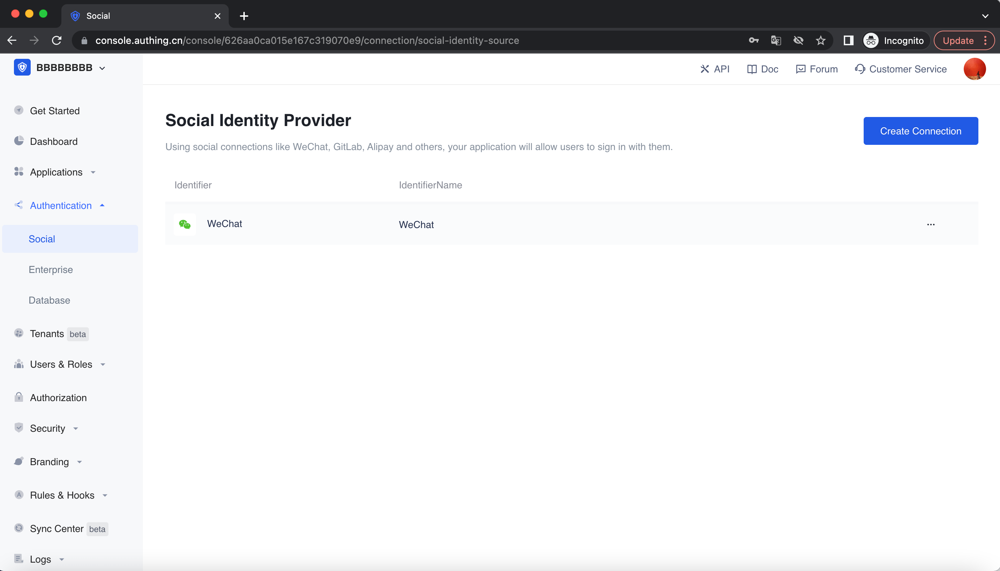

<IntegrationDetailCard :title="`Fill in the WeChat mobile app configuration in ${$localeConfig.brandName}`">

You need to add the configuration of the app you created in the previous step in {{$localeConfig.brandName}} :

1. In the [{{$localeConfig.brandName}} console](https://console.authing.cn), go to the "Social Identity Source" configuration page, click "Create Social Identity Source" to start selecting and creating.
  

  
2. Among all social identity source icons, find and enter **WeChat Mobile App** Social Login.
3. In the configuration form, follow the instructions to fill in the following configuration:
- AppID: WeChat application ID;
- AppSecret: WeChat application key;

  4. After the configuration is complete, click the "Create" button to complete the creation.

</IntegrationDetailCard>
