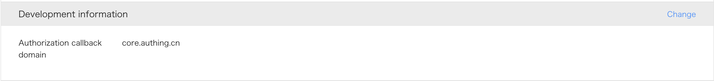

<IntegrationDetailCard title="在微信开放平台创建一个网站应用">

请按照 [微信开发者官方文档](https://open.weixin.qq.com/cgi-bin/frame?t=home/web_tmpl&lang=zh_CN)指引创建一个微信网站应用，你需要记录下该应用的 **App ID** 和 **App Secret**，后面需要用到。

请确保该应用获取到了**微信登录**的权限。

请将授权回调域设置为 `core.authing.cn`:

</IntegrationDetailCard>