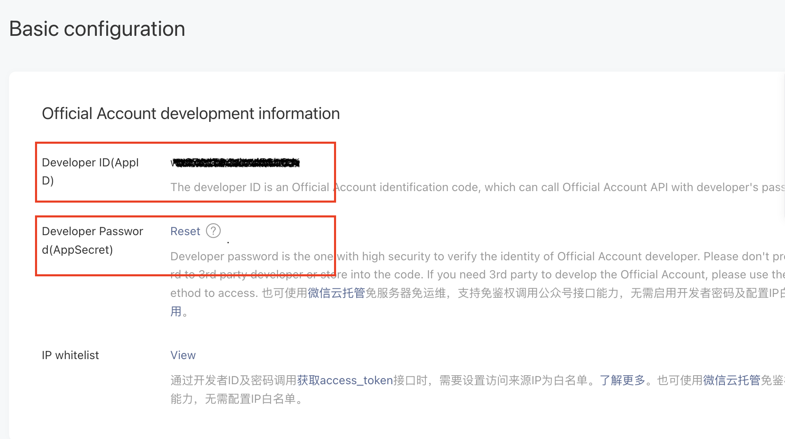
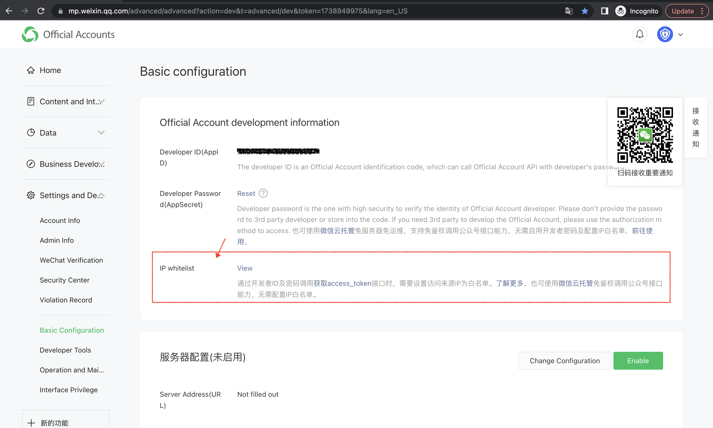
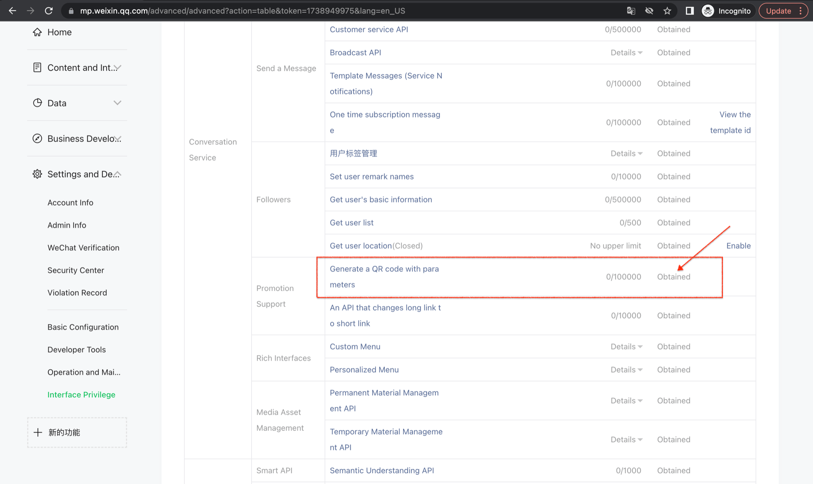
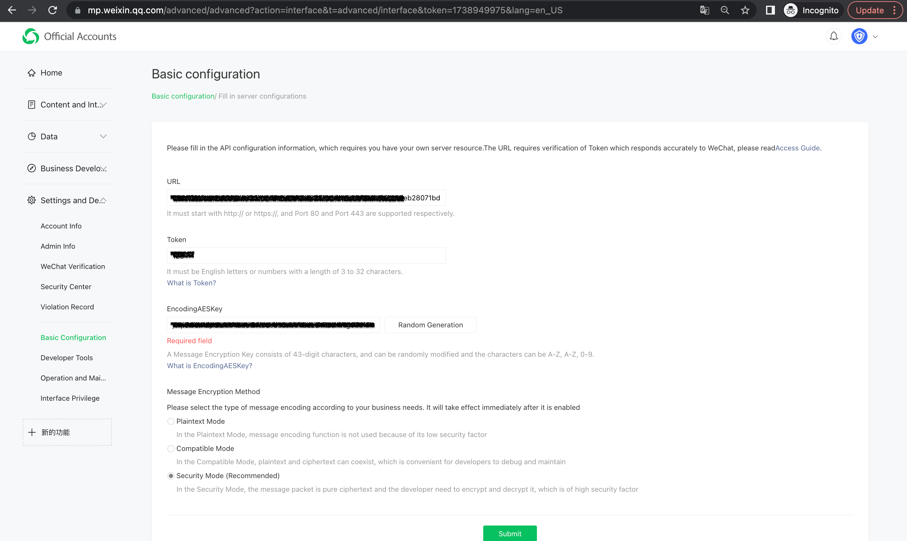

<IntegrationDetailCard title="Note before development">

Restricted by the requirements of WeChat platform, only **Service Type** has [generate QR code with parameters](https://developers.weixin.qq.com/doc/offiaccount/en/Account_Management/Generating_a_Parametric_QR_Code.html) API capability, please make sure your official account is of the **service account** type.
</IntegrationDetailCard>

<IntegrationDetailCard title="Get public account development information">

You can obtain the **Developer ID(AppID)** and **Developer Password(AppSecret)** on the **Development** -> **Basic Configuration** page in the background of the WeChat public platform.

</IntegrationDetailCard>

<IntegrationDetailCard title="Set up IP whitelist">

You need to add the IP of the Authing server to the **IP whitelist** of the WeChat official account, you can [click here](https://core.authing.cn/api/v2/system/public-ips)Get the list of external IPs of the Authing server.

 

</IntegrationDetailCard>

<IntegrationDetailCard title="Add API permissions">

You need to add [Generate QR code with parameters] on the **Settings and Development**-**Interface Permission** page of the WeChat official account platform(https://developers.weixin.qq.com/doc/offiaccount/en/Account_Management/Generating_a_Parametric_QR_Code.html)Interface permissions：

</IntegrationDetailCard>

<IntegrationDetailCard title="Select server configuration mode">

You can open the server configuration on the **Development** -> **Basic Configuration** page in the background of the WeChat public platform. When the user scans the QR code of the official account and follows the official account, Authing can receive the user scan code and Follow the event to complete the login.

Since only one WeChat server configuration can be set, you need to choose two different modes according to your specific scenario:

- **Mode 1**: Set the server address as the endpoint of the Authing server. This mode is the easiest, but all the events of the WeChat official account will be pushed to the Authing server, and you will lose other events except scanning codes and following.

- **Mode 2**: Set the server address as your own server, and then forward the scan code and attention events to the Authing server endpoint. This mode requires a certain amount of development work, but will not lose events, and it is beneficial to use the official account in the future. Events do more extensions.

</IntegrationDetailCard>

<IntegrationDetailCard title="Mode 1: Set the server address as the Authing server endpoint">

- **URL**: set to `https://core.authing.cn/connections/social/<identifier>/<USERPOOL_ID>/events` (replace \<identifier\> with what you have in the Authing console The unique ID entered in the configuration area, and replace \<USERPOOL_ID\> with your [user pool ID](/guides/faqs/get-userpool-id-and-secret.md));
- **Token**: You can set the Token in the WeChat official account to any string, it must be in English or numbers, the length is 3-32 characters, and make sure that the token you configure in the Authing console and the required access The tokens provided by the official account are the same.
- **EncodingAESKey**: The message encryption key consists of 43 characters, which can be modified randomly. The character range is A-Z, a-z, 0-9;
- **Message Encryption and Decryption Method**: Please select it according to your business needs, it is recommended to use **Security Mode**;
Don't click save for now, you need to fill in the above configuration and AppID and AppSecret in the Authing console. Select **WeChat** in **Connect Identity Source** - **Socialized Login**, select **WeChat Official Account Scan Code Follow Login** for connection method, and fill in the above configuration:

Finally click submit and you should be able to see a success message.

Finally don't forget to enable this server configuration:

</IntegrationDetailCard>

<IntegrationDetailCard title="Mode 2: Set the server address to your own server, and then forward the scan code and attention events to the Authing server endpoint">

The configuration process and mode are exactly the same, just set the URL to your own server address. You need to complete interface verification and message forwarding operations on the server endpoint configured by yourself.

For the specific process and sample code, please see this Demo:[https://github.com/Authing/authing-wechat-official-account](https://github.com/Authing/authing-wechat-official-account)。

</IntegrationDetailCard>
