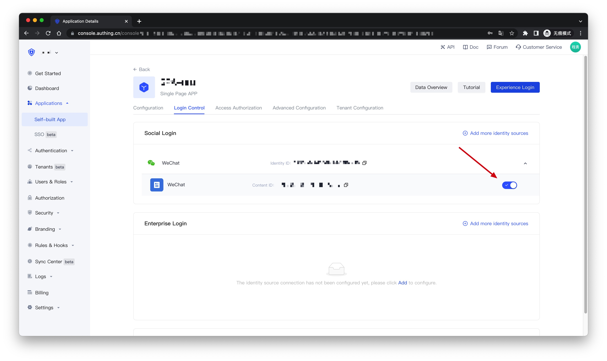

<IntegrationDetailCard :title="`Create an app in ${$localeConfig.brandName}`">

!!!include(en/common/create-an-app.md)!!!

Go to **Application Details** > **Login Control**, Social Login tab, expand WeChat Identity Source, and enable **WeChat Official Account Scan Code Follow Login**

</IntegrationDetailCard>
