<IntegrationDetailCard title="Before creating a proxy development template, you need to become an enterprise WeChat service provider">

Enter Enterprise WeChat [Service Provider Official Website](https://open.work.weixin.qq.com), click to become Enterprise WeChat Service Provider
  
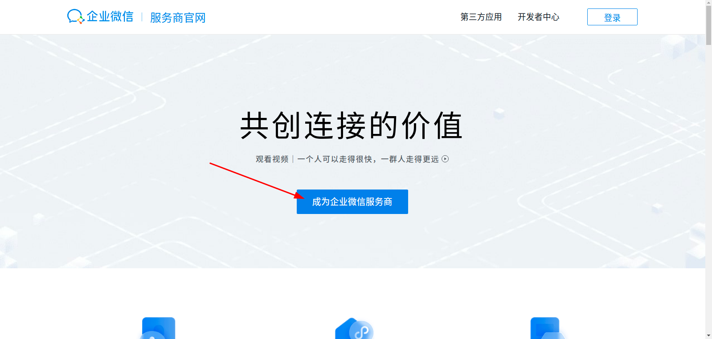

The enterprise WeChat administrator scans the code and confirms to become an enterprise WeChat service provider

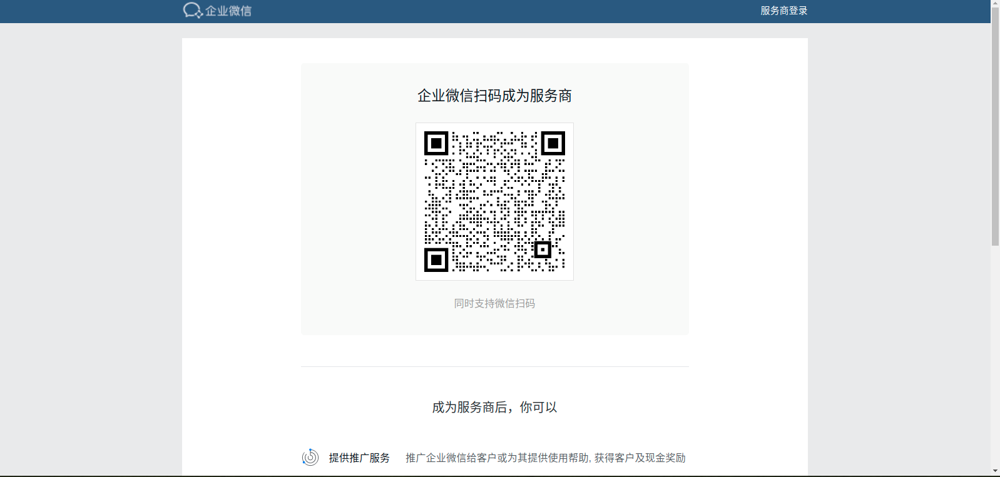

Enter the enterprise [WeChat service provider background] (https://open.work.weixin.qq.com/wwopen/login)

</IntegrationDetailCard>

<IntegrationDetailCard title="Create a Generation Development Template">

Go to Application Management at the top, click Application Development, and click Create Application Template for Generation Development

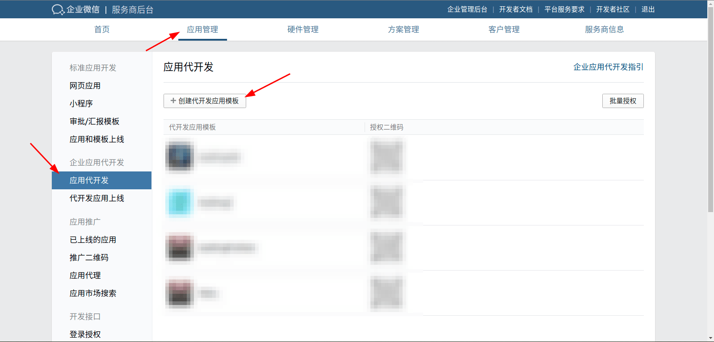
  
Configure the basic information of the proxy development application template

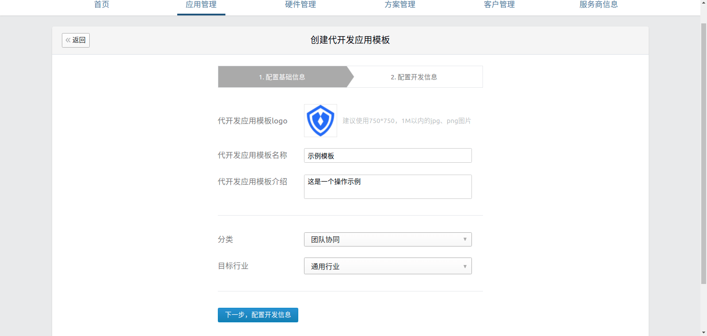

Configure development information

1. Fill in **unique ID** and **display name** in {{$localeConfig.brandName}}

   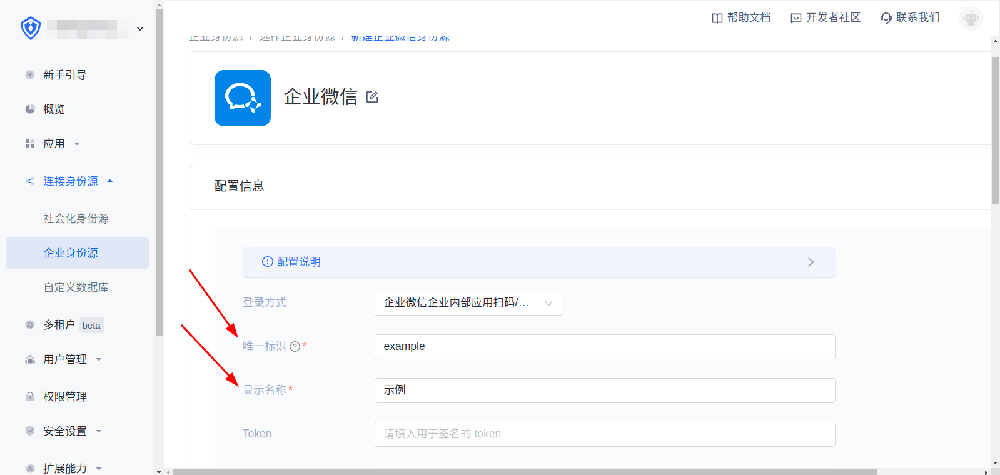

2. Copy the **event address** in {{$localeConfig.brandName}} to the **develop template callback URL**

   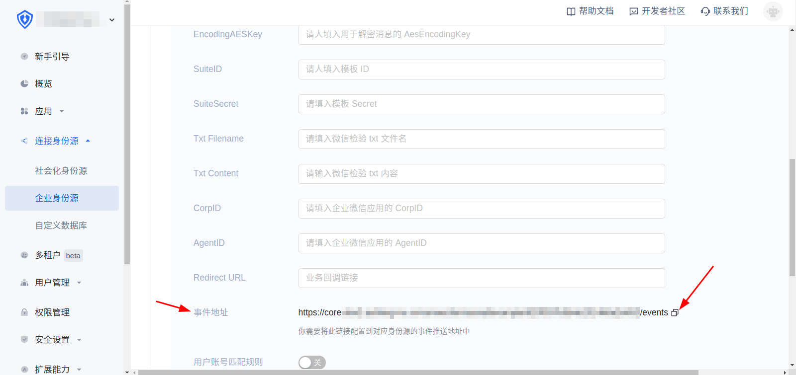

   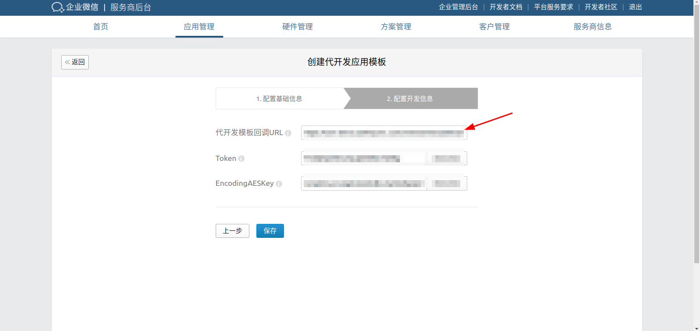

3.Randomly obtain **Token** and **EncodingAESKey** and fill the generated **Token** and **EncodingAES** into **Token** and **EncodingAESKey* in {{$localeConfig.brandName}} *, and finally click Create

   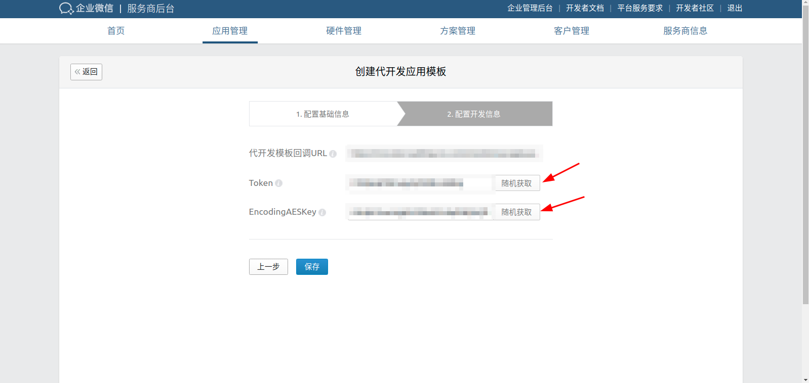

   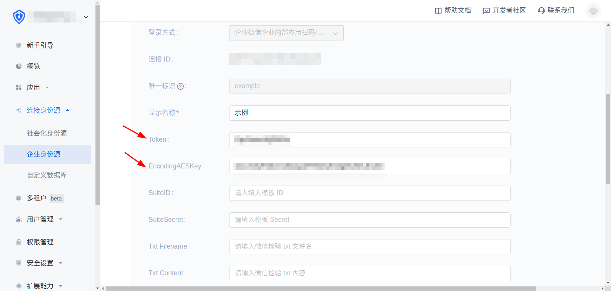

   Click to create

   

4. click save

   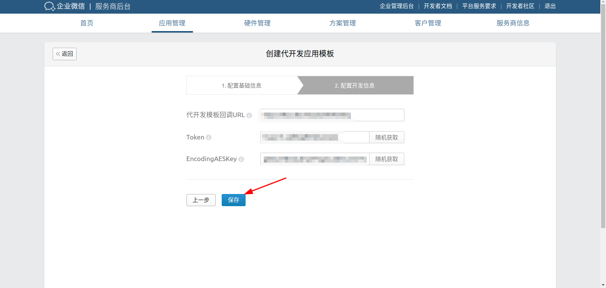

**During this process, the WeChat background of the enterprise will verify whether the callback of the development template is available, please operate in strict order**

</IntegrationDetailCard>

<IntegrationDetailCard title="On-line generation development template">

Under application management, click on behalf of the development of the application online, submit online

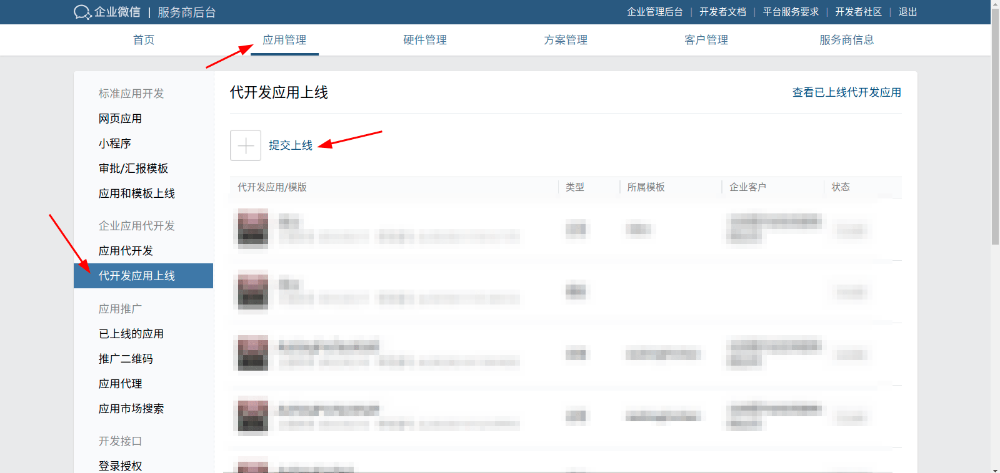

Select the proxy development application template you just created and click OK

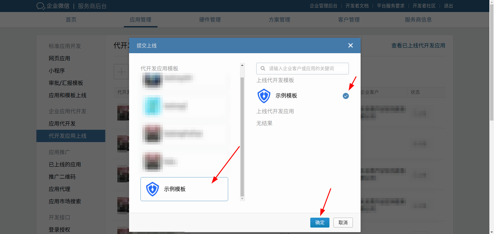

After the review is passed, click on the proxy development application template just submitted for review, and click Submit to go online

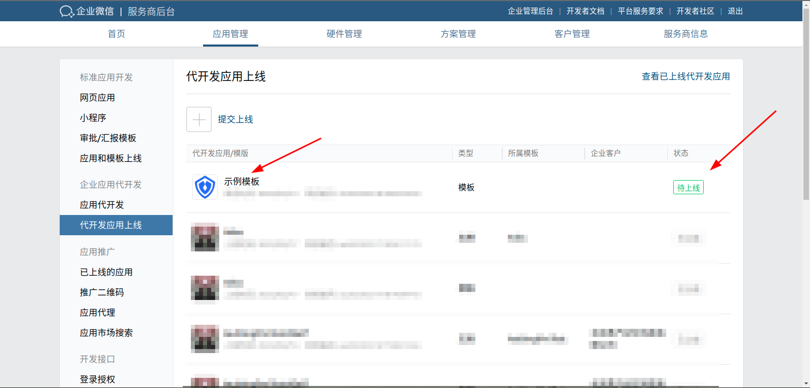

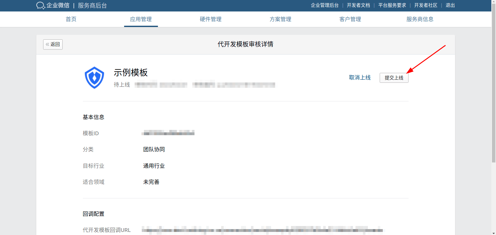

</IntegrationDetailCard>
