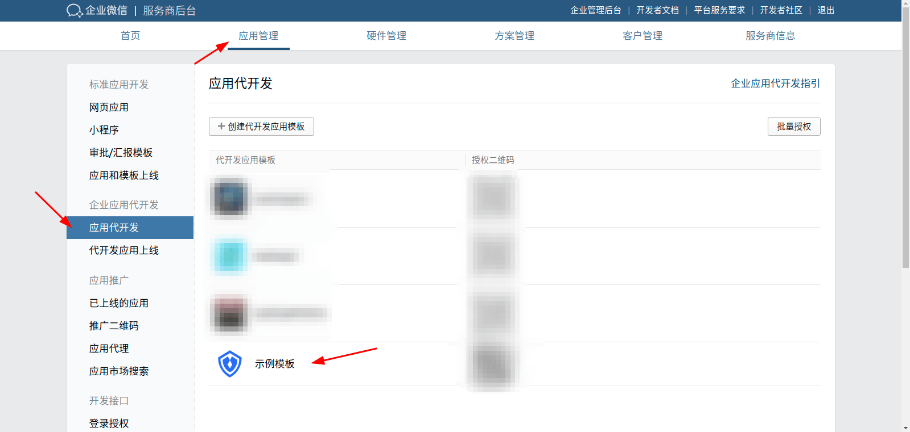
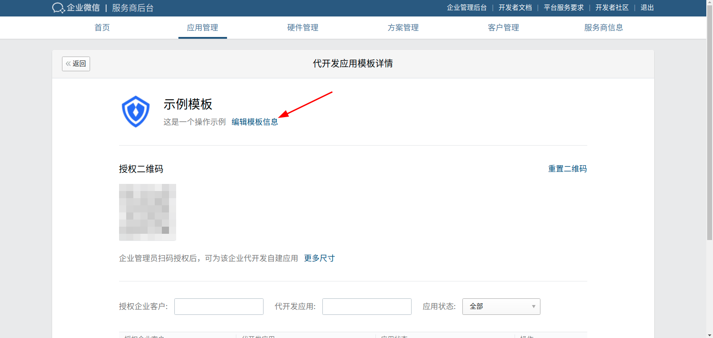
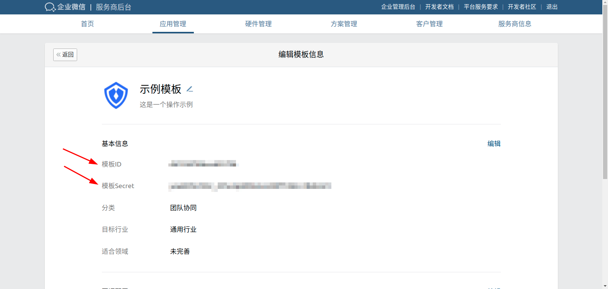
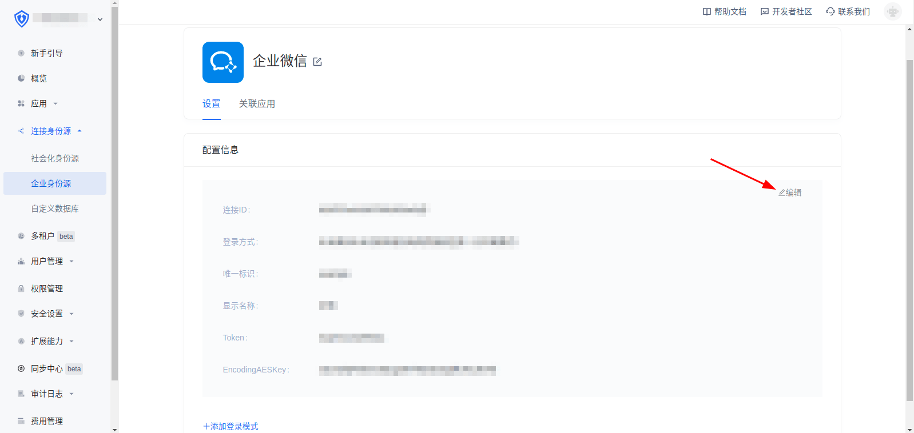
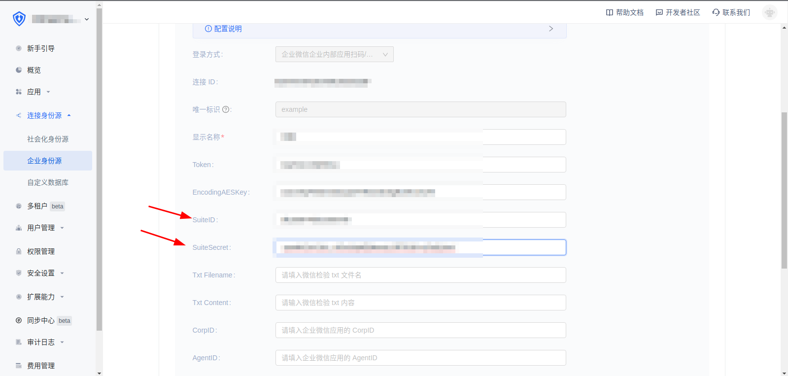

<IntegrationDetailCard title="Fill in the information of the development application template">

Enter the background of the service provider, in the application management, the application development, click the application development template you just created

Click to edit template information

Fill the Template ID and Template Secret into the SuiteID and SuiteSecret in {{$localeConfig.brandName}} and save

</IntegrationDetailCard>
