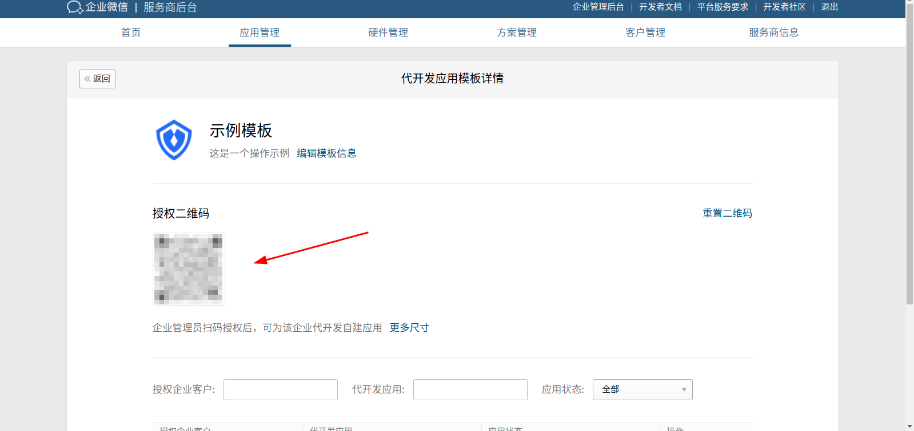
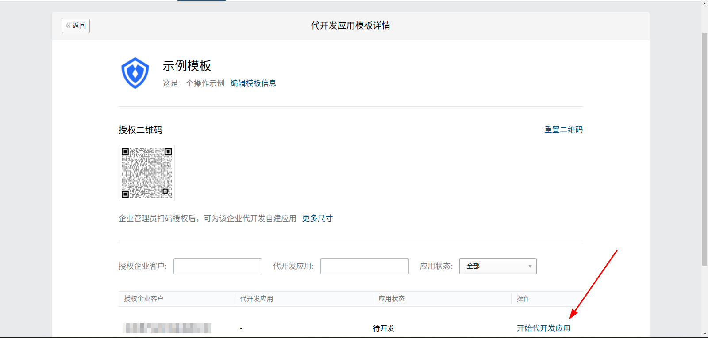
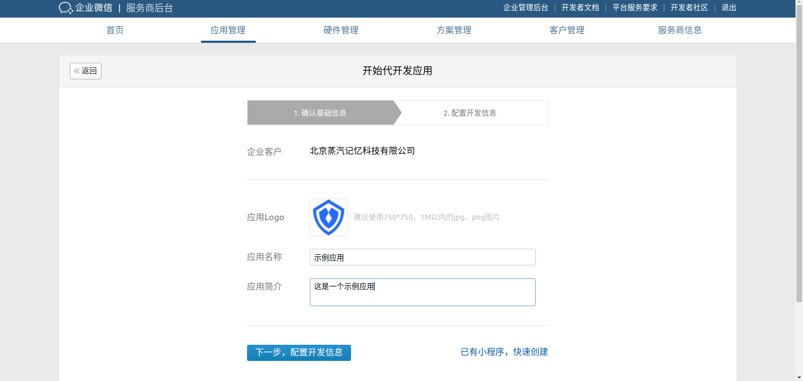
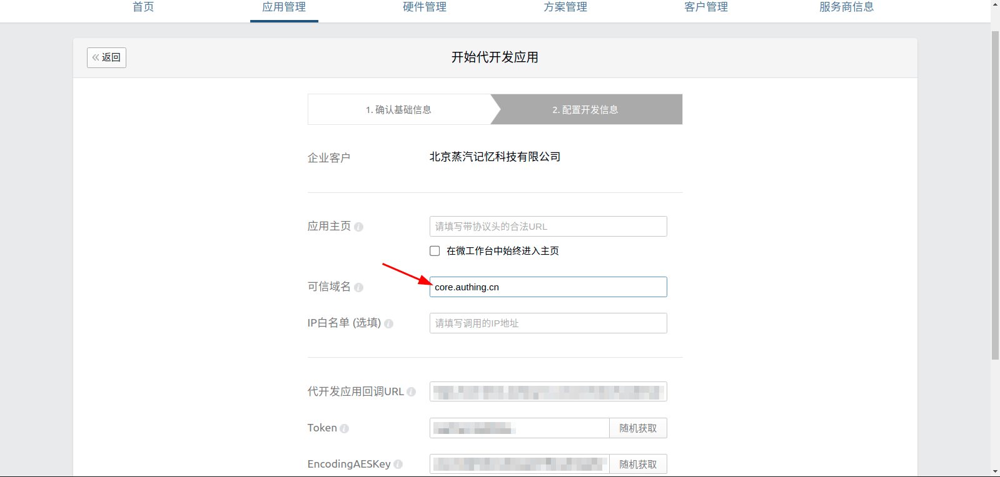

<IntegrationDetailCard title="Start developing applications on behalf of">

In the application generation development, click the application development template just created, and the enterprise administrator scans the authorization QR code

refresh page
  
Under the page, the development application appears, click to start the development application

Confirm basic information

Configure the development information and fill in core.authing.cn in the trusted domain name

click save

</IntegrationDetailCard>
