<IntegrationDetailCard title="Configure and go live on behalf of the development application">

Re-entry into the generation of developing applications

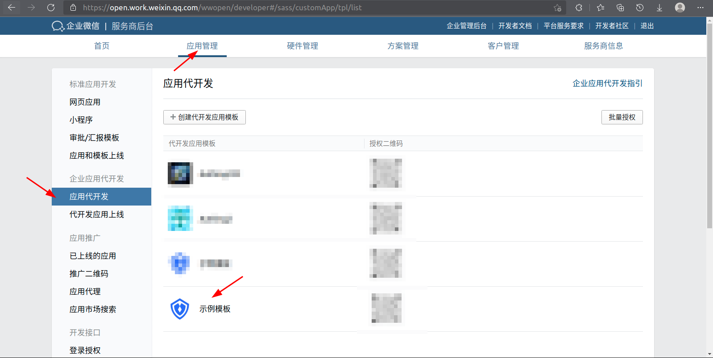

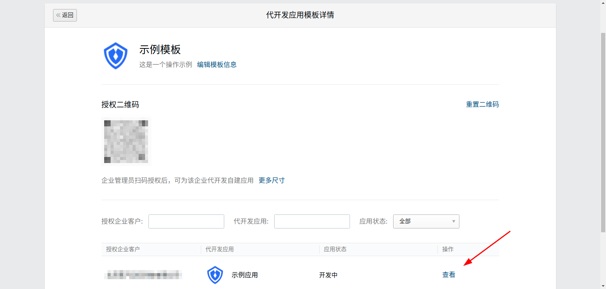

Edit usage configuration

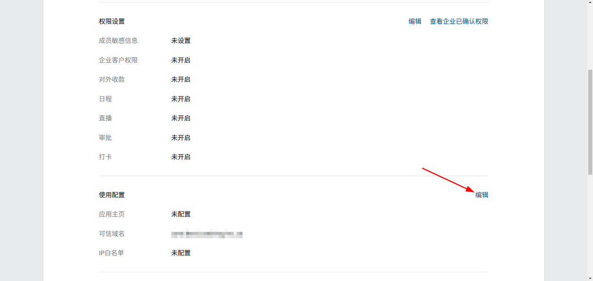

Click to verify trusted domain name attribution

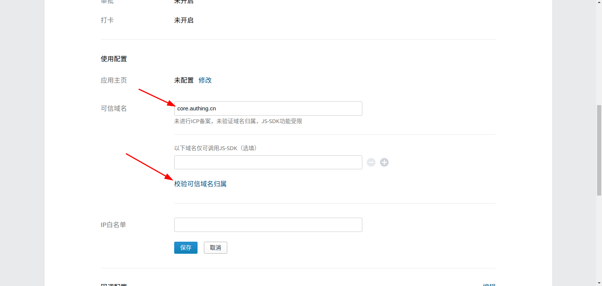

Download file

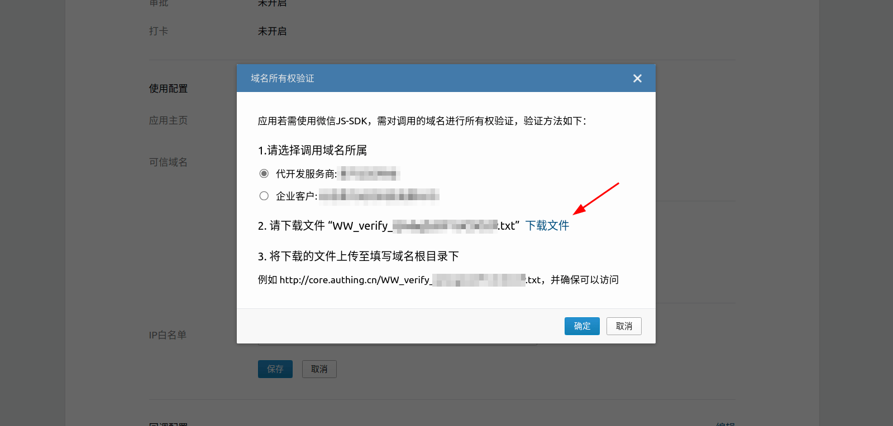

Fill in the file name and content in FileTxt and FileContent of {{$localeConfig.brandName}}, click Save
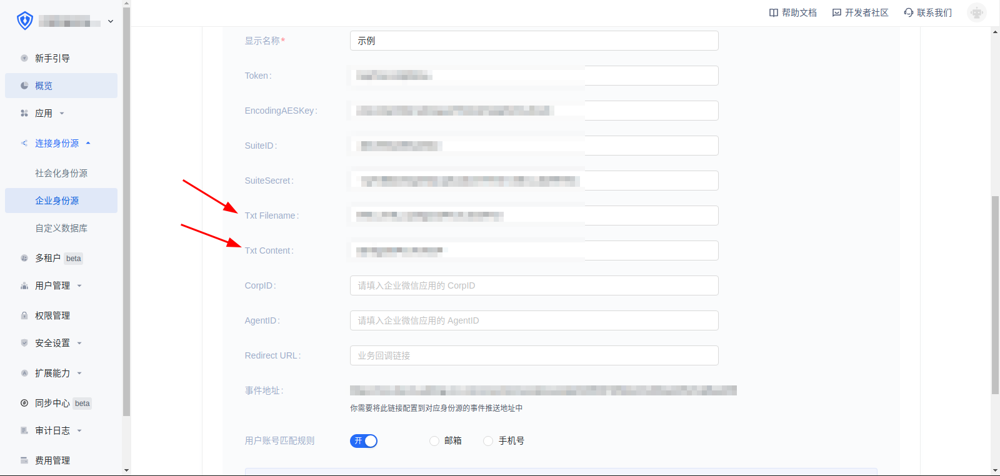

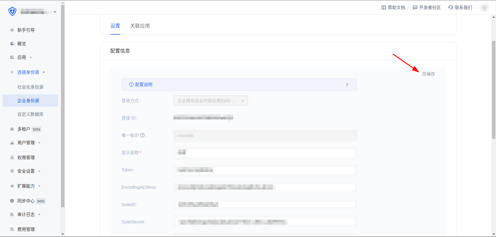

Save the configuration of the enterprise WeChat mid-generation development application
  

Set up enterprise WeChat authorized login

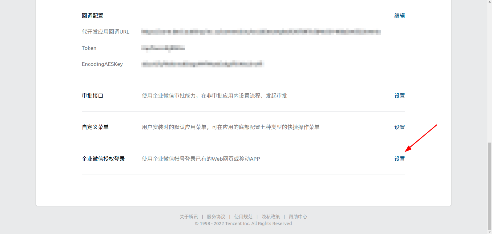

Fill in core.authing.cn in the authorization callback field in the web page

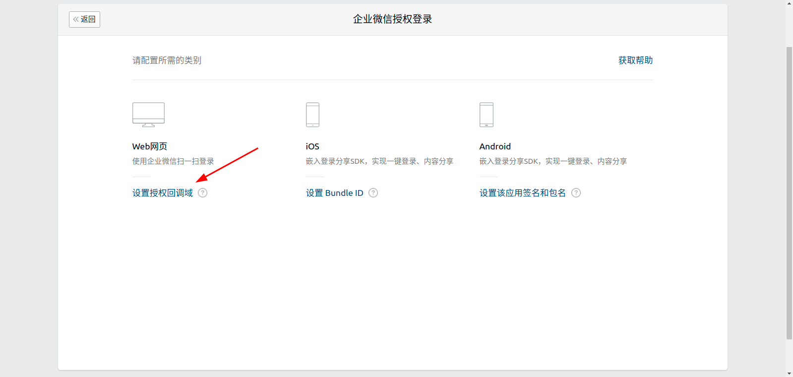

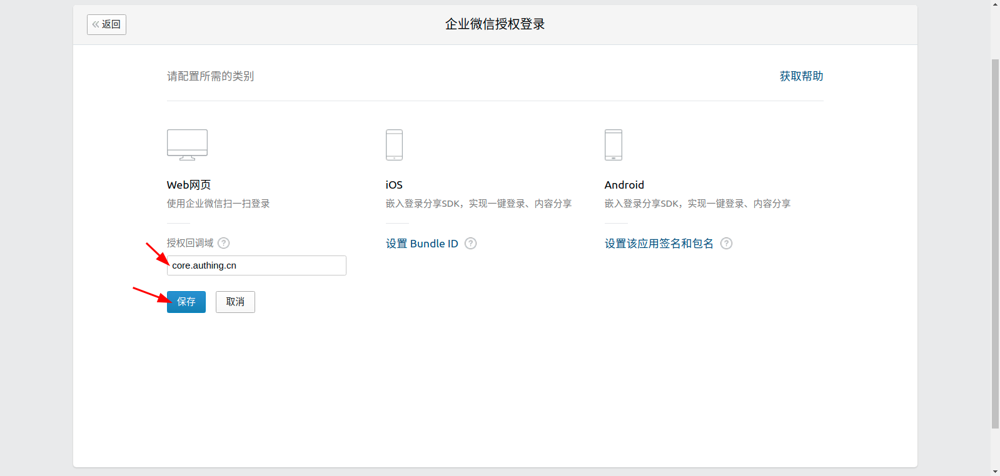

After the configuration is completed, it can be submitted for review

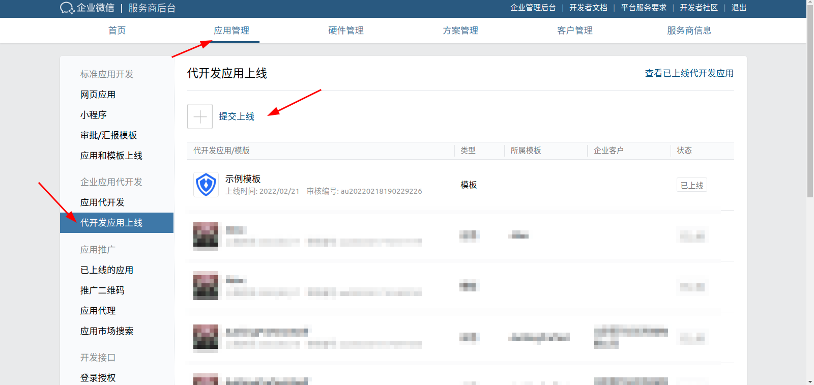

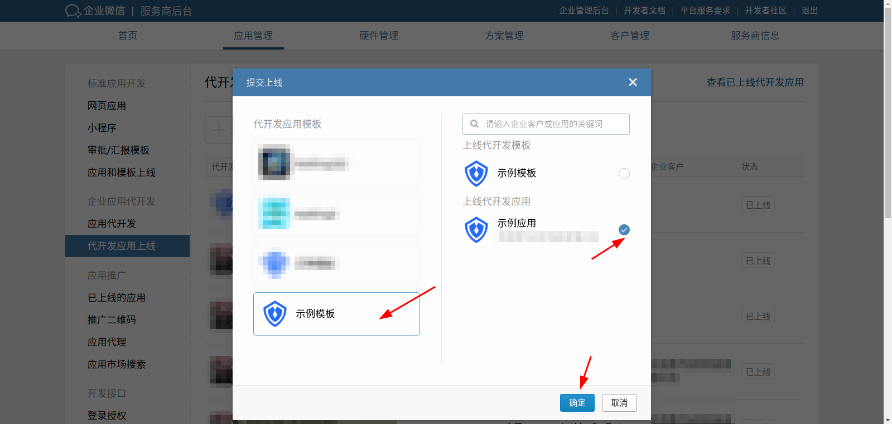

After the review is passed, the status of the development application is changed to pending launch

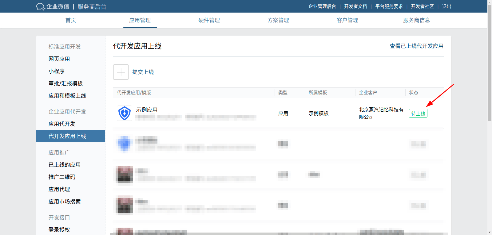

Click to enter the application to be launched and submit it online
  
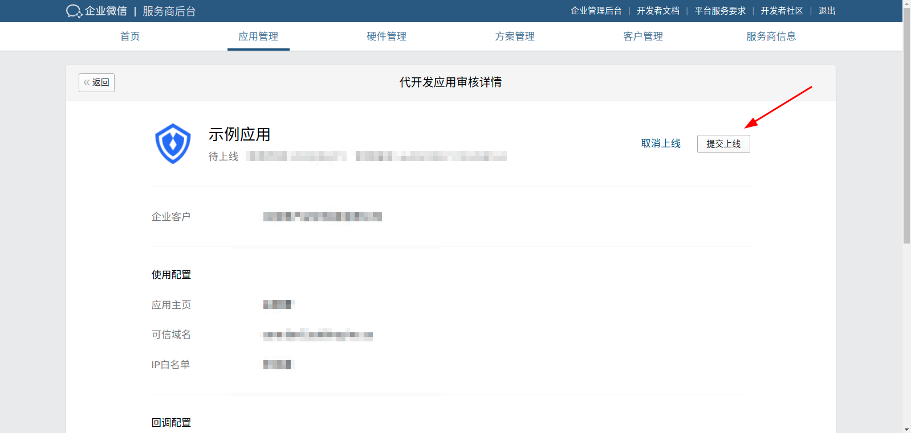

</IntegrationDetailCard>
