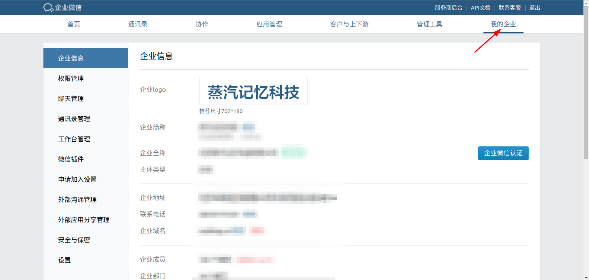
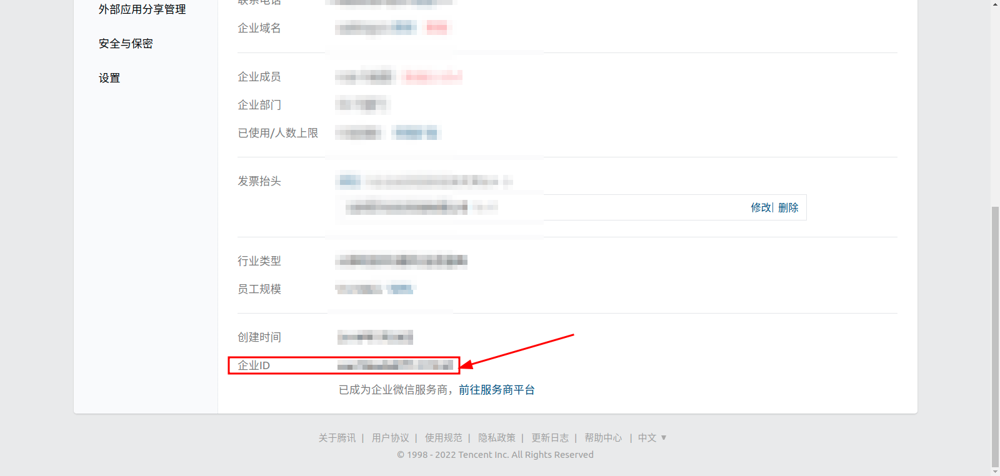
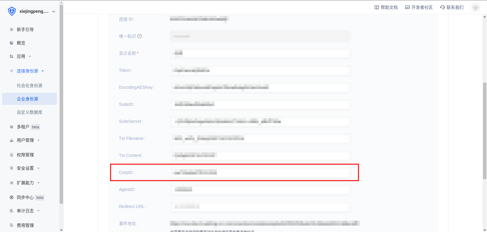
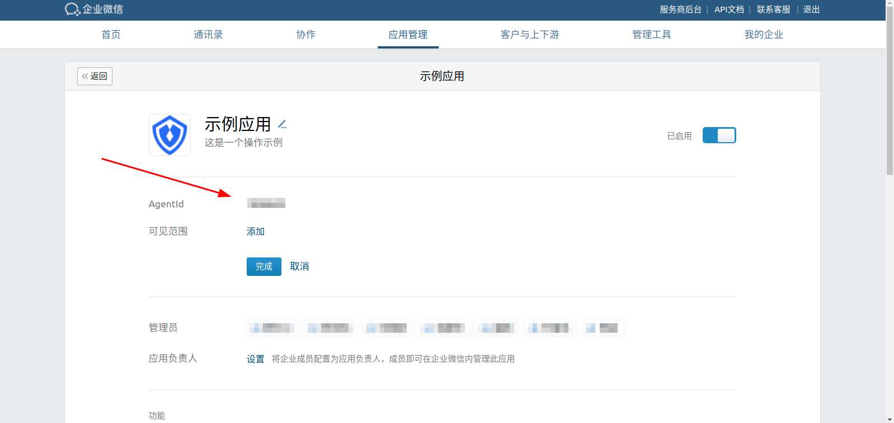
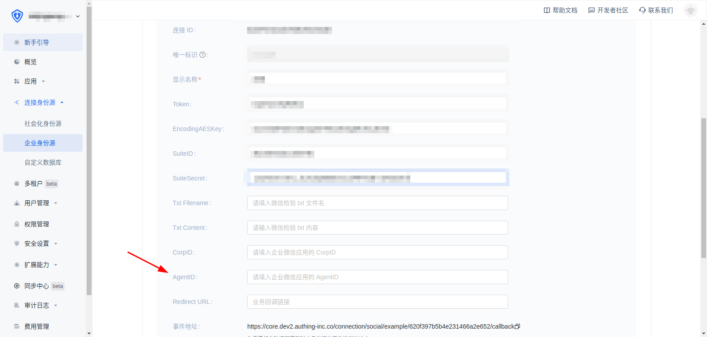
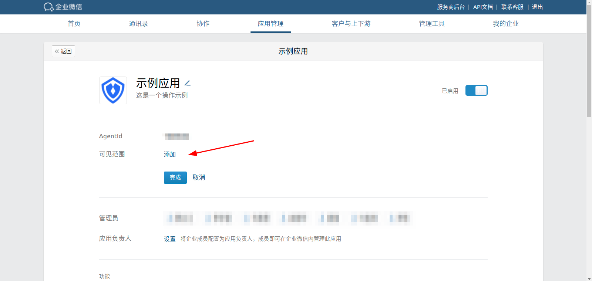
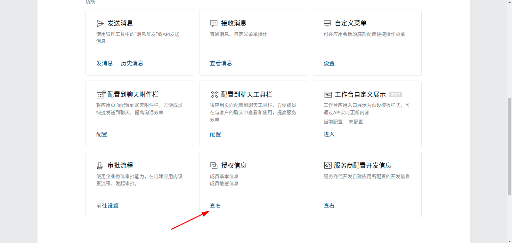
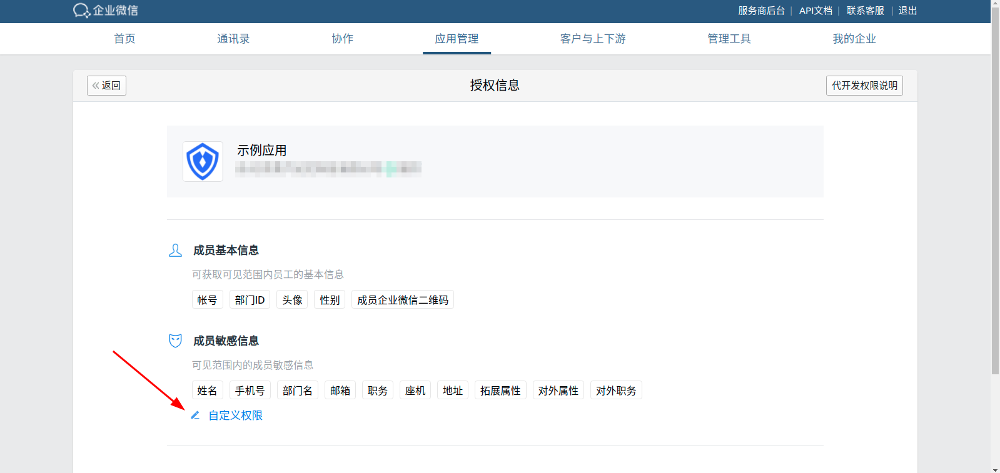
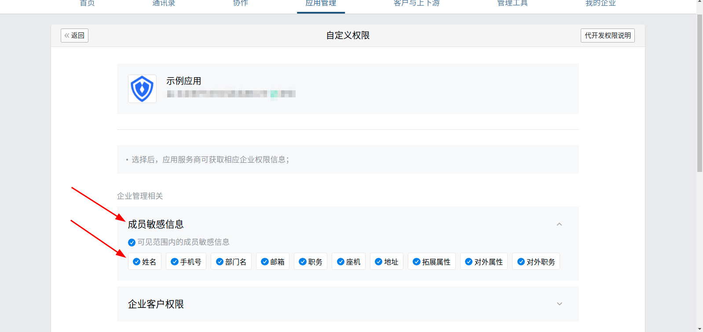

<IntegrationDetailCard title="Configure and launch the agent development application AgentId">

In the enterprise management background, **my enterprise** view **enterprise ID**

Enter **CorpID** in **CorpID** in {{$localeConfig.brandName}}

</IntegrationDetailCard>

<IntegrationDetailCard title="Configure and launch the agent development application AgentId">

In the self-built application of the enterprise management background, fill the AgentId into the AgentId of {{$localeConfig.brandName}}

Click Visible Scope, choose the visible scope, only members of the selected organization can use {{$localeConfig.brandName}} to log in

Click Authorization Information

Select Allowed Member Sensitive Information

</IntegrationDetailCard>
