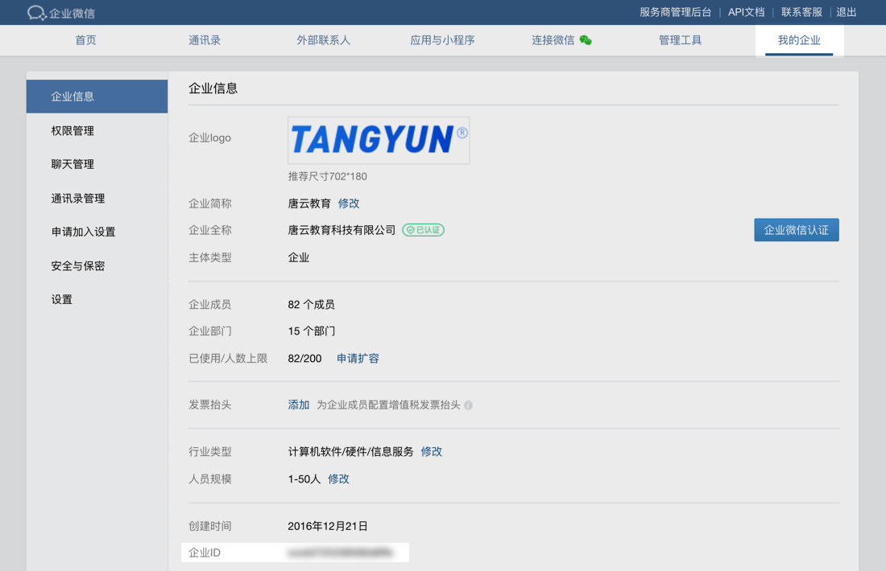
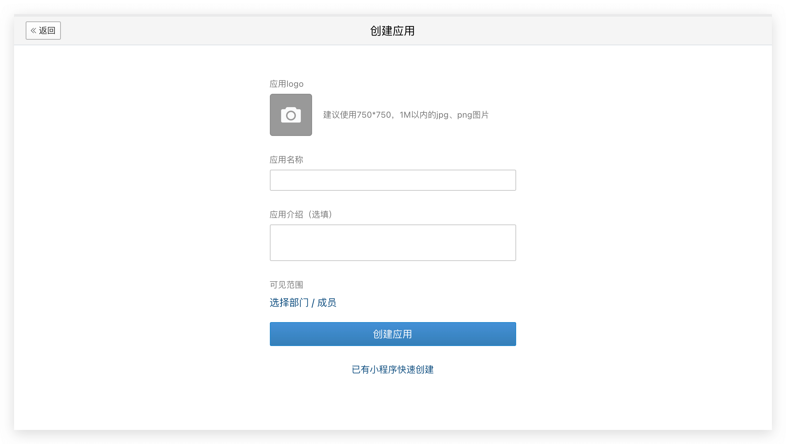
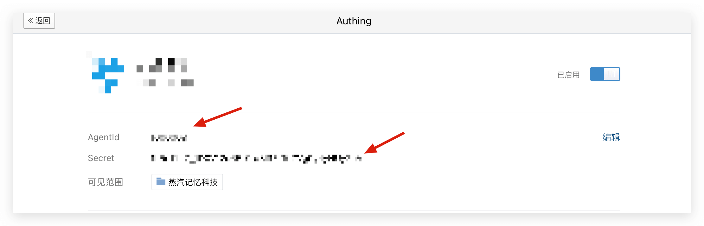
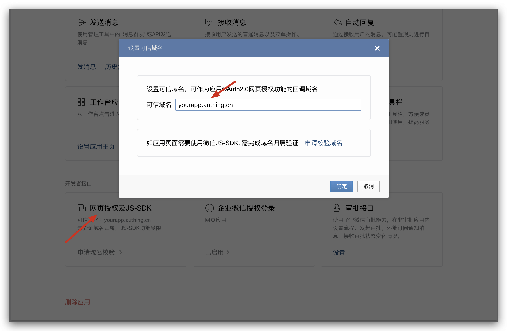

<IntegrationDetailCard title="Create a self-built application in the enterprise WeChat management background">

### Get the corporate ID (CorpID)

In [My Business - Business Information](https://work.weixin.qq.com/wework_admin/frame#profile) page, you can get it.

### Get AgentID and Secret

You need to create a **self-built** application in [Application Management - Application Management](https://work.weixin.qq.com/wework_admin/frame#apps):

After the creation is complete, you can get the **AgentId** and **Secret** of the application:

### Enable enterprise WeChat authorized login

On the application details page, click Set up Enterprise WeChat Authorized Login:

On the newly opened page, set the authorization callback domain to core.authing.cn.

### Add webpage authorization trust domain name

On the application details page, set the webpage authorization and JS-SDK domain name, and fill in the second-level domain name of your OIDC application, such as yourapp.authing.cn.

</IntegrationDetailCard>
