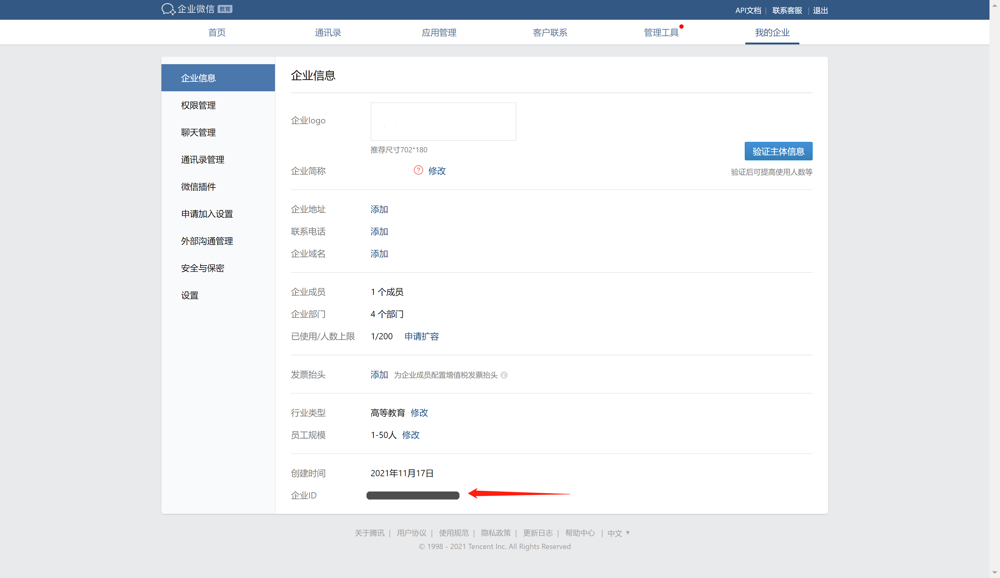
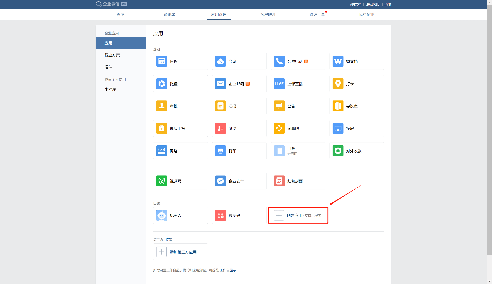
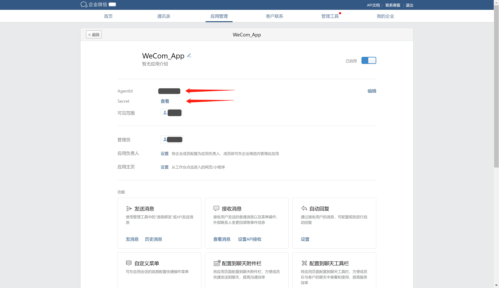
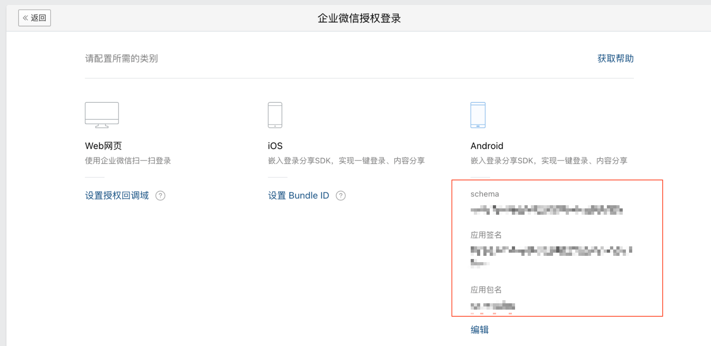
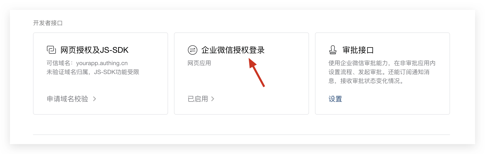

<IntegrationDetailCard title="Get the corporate ID (CorpID)">

Enter the [Enterprise WeChat background] (https://work.weixin.qq.com/wework_admin/frame#profile), on the **My Enterprise** - **Enterprise Information** page, you can get the enterprise ID:

</IntegrationDetailCard>

<IntegrationDetailCard title="Create a self-built application">

On the **Application Management** - **Application** page, create a self-built application:

</IntegrationDetailCard>

<IntegrationDetailCard title="Get AgentID and Secret">

On the application details page, you can get the **AgentId** and **Secret** of the application:

</IntegrationDetailCard>

<IntegrationDetailCard title="Enable enterprise WeChat authorized login, and obtain Schema">

On the application details page, click Set up Enterprise WeChat Authorized Login:

Click the IOS or Android option, get the schema and fill in the app's app signature and package name

</IntegrationDetailCard>
