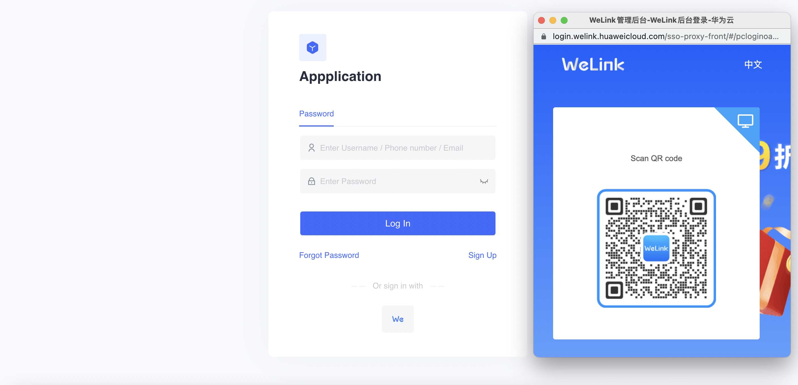
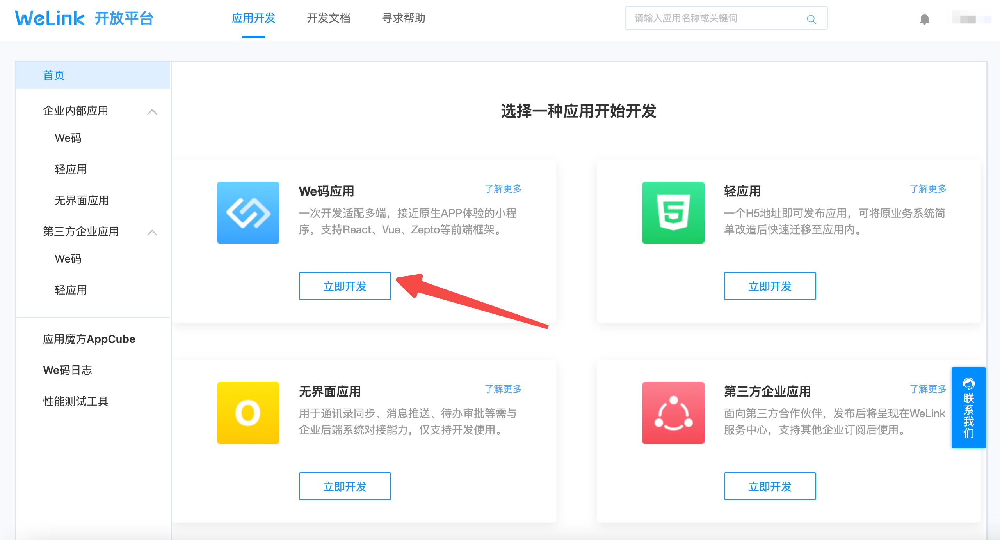
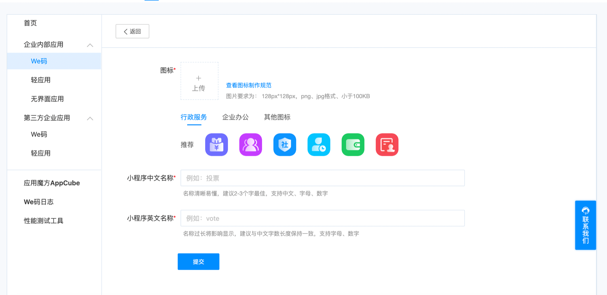
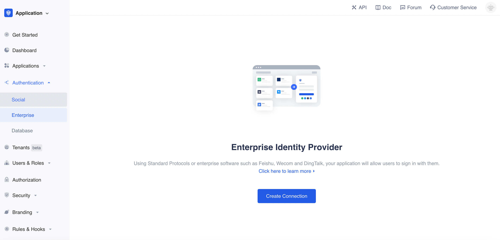
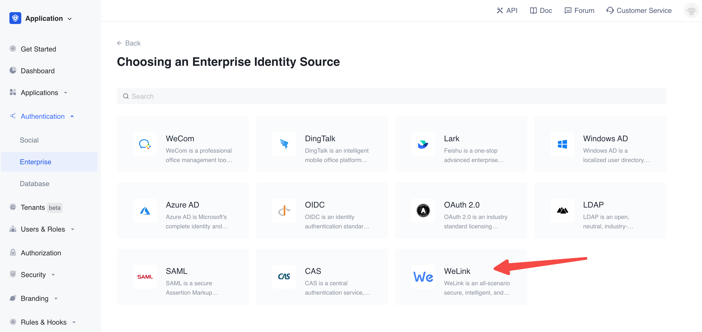
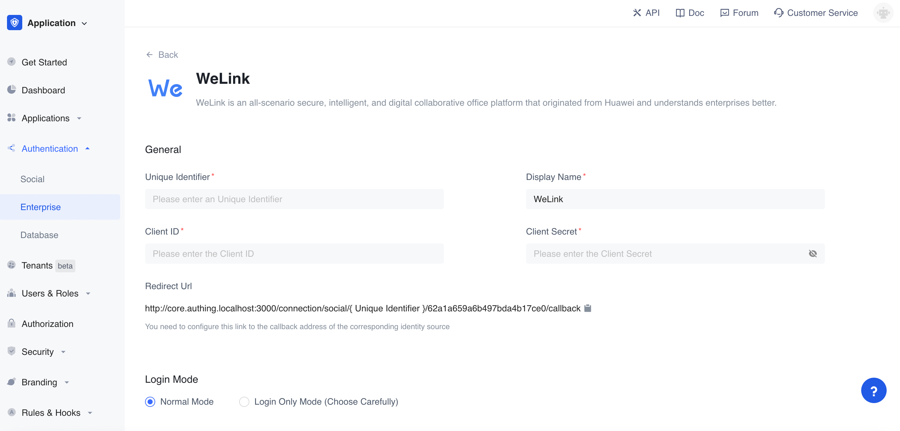
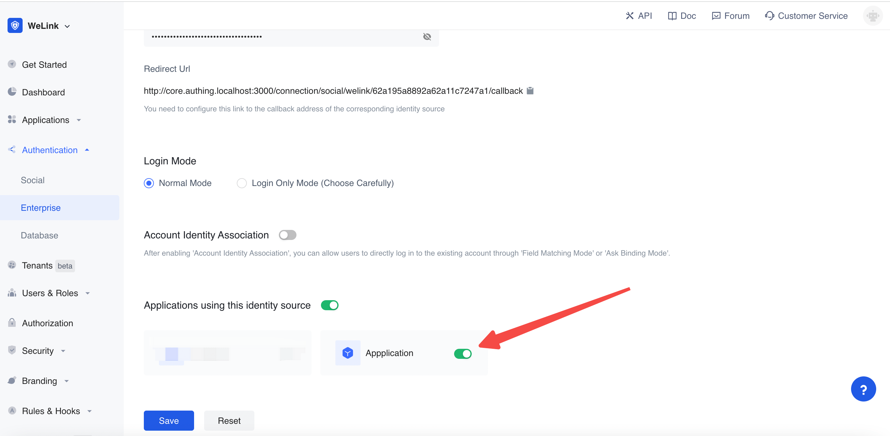
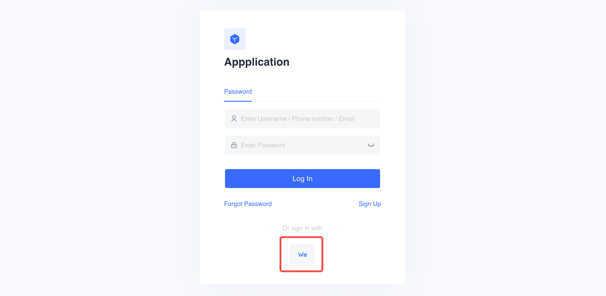

# WeLink Social Login

<LastUpdated/>

## Introduction

- **Overview**：WeLink social login is a secure login for users to third-party applications or websites using WeLink as their identity source. By configuring and enabling WeLink's social login in Authing, you can quickly obtain WeLink's basic open information through Authing and help users achieve password-free login.
- **Application scenarios**: PC Website
- **End-User Preview**:

## Precautions:

- If you do not have an WeLink account, please go to [WeLink Open Platform](https://open.welink.huaweicloud.com/wecode-site/index.html#/home) register a developer account.
- If you do not have an Authing console account, please go to the [Authing Console](https://authing.cn/) to register a developer account;

## Step 1：Create a WeLink app

Go to [WeLink](https://open.welink.huaweicloud.com/wecode-site/index.html#/wecode/guide/guide)，then create a new app.

Fill in the basic application information

## Step 2：Configure WeLink in the Authing console

2.1 On the 「Enterprise」 page of the Authing Console, click the 「Create Connection」button.

2.2 On the 「Select Enterprise Identity」 page of the Authing Console, click the「WeLink」 identity source button to enter the "WeLink Login Mode" page.

2.3 Please configure the relevant field information on the 「Enterprise Identity Sources」 - 「WeLink」 page of the Authing Console.

| Catalog  | Field                    | Description                                                                                                                                                                                                                                                                                                     |
| ----- | ---------------------------- | -------------------------------------------------------------------------------------------------------------------------------------------------------------------------------------------------------------------------------------------------------------------------------------------------------- |
| 2.3.1 | unique identifier            | a. The unique identifier consists of lowercase letters, numbers, and -, and the length is less than 32 digits. b. This is the unique identifier of this connection and cannot be modified after setting.                                                                                                 |
| 2.3.2 | display name                 | This name will be displayed on the button on the end user's login screen.                                                                                                                                                                                                                                |
| 2.3.3 | Client ID           | Client ID，Requires access on WeLink Open Platform                                                                                                                                                                                                                                           |
| 2.3.4 | Client Secret           | Client Secret，Requires access on WeLink Open Platform                                                                                                                                                                                                                                           |
| 2.3.5 | redirect url                 | WeLink valid OAuth redirect URI. This URL needs to be configured on the WeLink Open Platform.                                                                                                                                                                                                      |
| 2.3.6 | login mode                   | After enabling 「Login Only Mode」, you can only log in to an existing account and cannot create a new account. Please choose carefully.                                                                                                                                                                 |
| 2.3.7 | Account identity association | When 「Account Identity Association」is not enabled, a new user is created by default when a user logs in through an identity source. After enabling 「Account Identity Association」, you can allow users to log in to existing accounts directly through 「Field Matching」 or 「Asking for Binding」. |

After the configuration is complete, click the "Create" or "Save" button to complete the creation.

After creating the WeLink identity source on the Authing console, you need to configure the callback address to the **OAuth client authorization settings** in the WeLink app on WeLink open platform.

## Step 3：Development access

- **Recommended development access method**: Use a hosted login page

- **Description of advantages and disadvantages**: The operation and maintenance are simple, and Authing is responsible for the operation and maintenance. Each user pool has an independent second-level domain name; if you need to embed it into your application, you need to use the pop-up mode to log in, that is: after clicking the login button, a window will pop up, the content is the login page hosted by Authing, or the browser redirects to the login page hosted by Authing.

- **Detailed access method**:

3.1 Create an app in the Authing console. For details, see: [How to create an app in Authing](https://docs.authing.cn/v2/guides/app/create-app.html)

3.2 On the created WeLink identity source connection details page, open and associate an app created in the Authing console

3.3 Experience third-party login for WeLink on the login page

