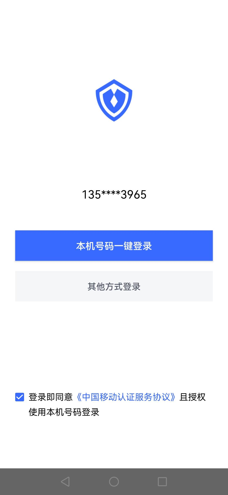
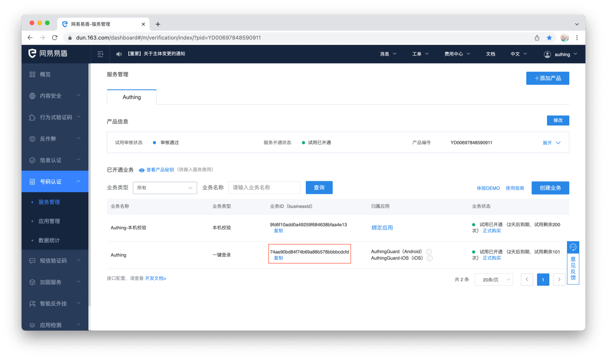
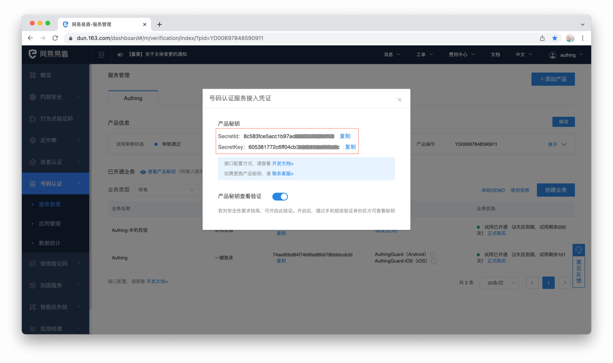
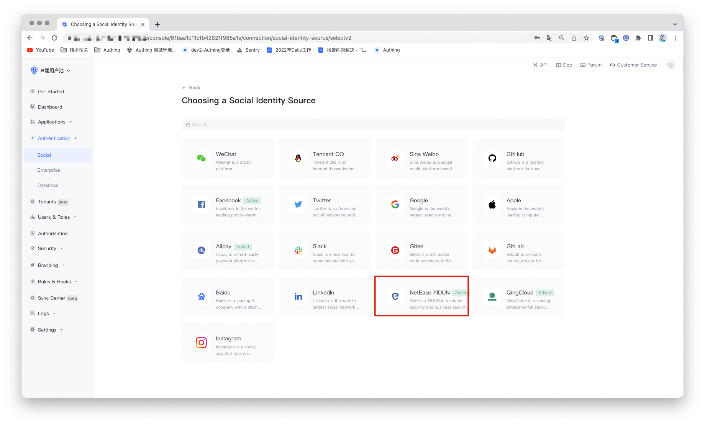
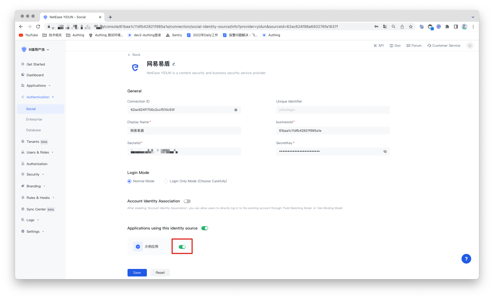

# YiDun Social Login

<LastUpdated/>

## Introduce

- **Overview**：Mobile phone number one-click login is an extremely convenient authentication method provided by the three major operators. Currently, Authing supports access to this capability through NetEase Yidun. Netease Yidun integrates the three major operators' one-click login SDK to provide a unified mobile application interface. You can configure the Yidun identity source on the Authing console, and you can quickly complete the password-free login function through Authing on the mobile phone.
- **Application scenarios**：PC Website
- **End-User Preview**：

## Precautions:

1. Go to [NetEase Yidun](https://dun.163.com/dashboard?v=0116&locale=zh-CN#/login/?referrer=%2F) to register an Alipay open account;
2. Go to [Edun Service Management Background](https://dun.163.com/dashboard#/m/verification/index) and follow the instructions to create a **website application**.
3. If you do not have an Authing console account, please go to the [Authing Console](https://authing.cn/) to register a developer account;

## Step 1: Create the app

Log in to the Yidun service management background to create a business; then log in to the application management background to create an application; finally, perform business binding. For specific and detailed operations of Easy Shield, please refer to the [Easy Shield Number Authentication Console User Guide](https://support.dun.163.com/documents/287305921855672320?docId=424413790996844544).

After creating the application, setting the package name, uploading the signature and other operations, you need to record the business ID (business Id) and the product key SecretId and SecretKey of the number authentication service access credential. This data is required for subsequent configuration of the Yidun identity source in the Authing console.

## Step 2: Configure Yidun in the Authing console

2.1 On the "Social Identity Source" page of the Authing Console, click the "Create Social Identity Source" button to enter the "Select Social Identity Source" page.

2.2 On the "Social Identity Source" - "Select Social Identity Source" page of the Authing Console, click the "Easy Shield" identity source button to enter the "Easy Shield Login Mode" page.

2.3 Please configure the relevant field information on the "Social Identity Source" - "Easy Shield" page of the Authing console.

| No.   | Field/Function               | Description                                                  |
| ----- | ---------------------------- | ------------------------------------------------------------ |
| 2.3.1 | Unique Identifier            | a. The unique identifier consists of lowercase letters, numbers, and -,  and the length is less than 32 digits. b. This is the unique identifier  of this connection and cannot be modified after setting. |
| 2.3.2 | Display Name                 | This name will be displayed on the button on the end user's login screen. |
| 2.3.3 | Business ID                  | Business ID, the business ID (businessId) created on Yidun.  |
| 2.3.4 | SecretId                     | SecretId, the product key SecretId of the number authentication service access credential. |
| 2.3.5 | SecretKey                    | SecretKey, the product key SecretKey of the number authentication service access credential. |
| 2.3.6 | Login Mode                   | After enabling 「Login Only Mode」, you can only log in to an existing  account and cannot create a new account. Please choose carefully. |
| 2.3.7 | Account Identity Association | When 「Account Identity Association」is not enabled, a new user is created by default when a user logs in through an  identity source. After enabling 「Account Identity Association」, you can  allow users to log in to existing accounts directly through 「Field  Matching」 or 「Asking for Binding」. |

After the configuration is complete, click the "Create" or "Save" button to complete the creation.

## Step 3: Development Access

- **Recommended development access method**: SDK integration
- **Description of advantages and disadvantages**: Simple access, only a few lines of code are required. The most customizable.
- **Detailed access method**:

3.1 Create an app in the Authing console. For details, see: [How to create an app in Authing](https://docs.authing.cn/v2/guides/app/create-app.html).

3.2 On the created YiDun identity source connection details page, open and associate an application created in the Authing console.

3.3 Refer to the integration guide provided by Authing, complete the integration work, and then experience the one-click login of the mobile phone number on the mobile terminal.

- [Android Integration Guide](https://github.com/Authing/guard-android/blob/master/doc/topics/oneauth.md)

- [iOS Integration Guide](https://github.com/Authing/guard-ios/blob/main/doc/topics/oneauth.md)

