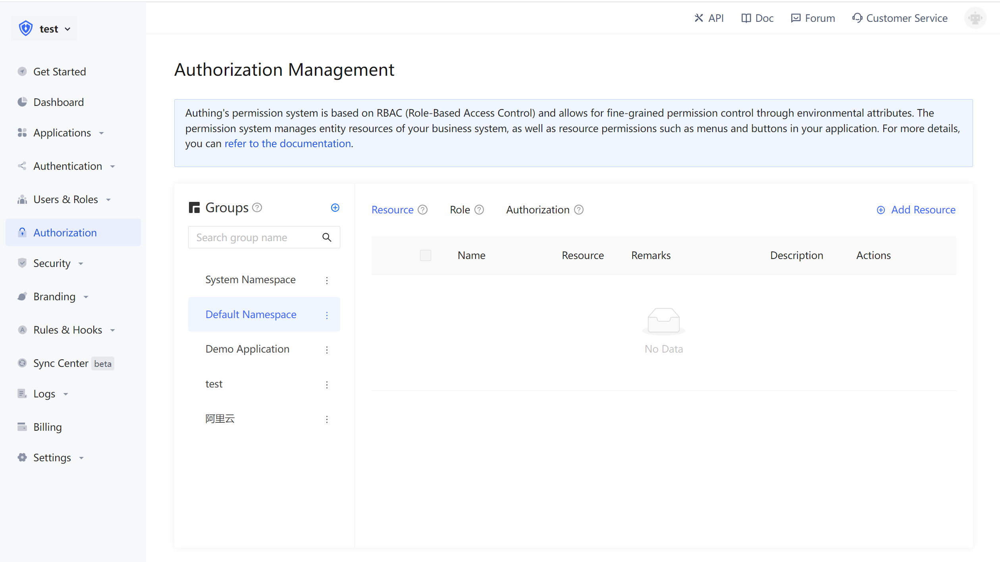

# Choose the suitable permission model

<LastUpdated/>

There are two permission models that are widely used by everyone:[Role-based access control (RBAC) ](#什么是基于角色的访问控制-rbac)and[Attribute-based access control (ABAC)](#什么是基于属性的访问控制-abac). Both have their own advantages and disadvantages: the RBAC model is simpler to construct, but the disadvantage is that it is impossible to achieve fine-grained authorization of resources (both are to authorize a certain type of resource rather than a specific resource); ABAC model construction is relatively complicated, and the learning cost is higher. The advantage is that it is fine-grained and can be dynamically executed according to the context.

## What is role-based access control (RBAC)

Role-based access control (RBAC) refers to authorize related permissions through the user's role, which achieves more flexible access control. RBAC is simpler, more efficient and scalable than directly authorize user permissions.

When using RBAC, by analyzing the actual situation of users, based on common responsibilities and needs, grant them different roles. You can grant users one or more roles, and each role has one or more permissions. This relationship between user-role and role-permission allows us to no longer need to manage a single user separately. The user inherits the required permissions from the granted role.

Take Gitlab's permission system as an example. There are three roles in the user system: Admin, Maintainer, and Operator. These three roles have different permissions. For example, only Admin has the permission to create and delete code repositories. 

We grant a user the role of "Admin", and he has the two permissions of "Create Code Repository" and "Delete Code Repository".

Not directly authorizing users is for future scalability considerations. For example, if there are multiple users with the same permission, and if you want to modify their permission, you must modify them one by one. With a role, we only need to assign different roles to different users after setting the permissions for the role, and then only need to modify the permissions of the role to automatically modify the permissions of all users in the role.

## What is attribute-based access control (ABAC)

Attribute-Based Access Control (ABAC) is a very flexible permission model. Unlike RBAC, ABAC uses various attributes to dynamically determine whether an operation is allowed.

### The main component of ABAC

In ABAC, whether an operation is allowed is determined based on the dynamic calculation of the object, resource, operation and environment information.

- Object: The object is the user who is currently requesting access to the resource. User attributes include ID, personal resources, roles, department and organization memberships, etc.;
- Resources: Resources are assets or objects (such as files, data, servers, and even APIs) that the current user wants to access. Resource attributes include file creation date, file owner, file name and type, data sensitivity, etc.;
- Operation: The operation is the operation that the user tries to perform on the resource. Common operations include "read", "write", "edit", "copy" and "delete";
- Environment: The environment is the context of each access request. Environmental attributes include the time and location of the access attempt, the object's device, communication protocol and encryption strength, etc.

### How ABAC make decision

During the execution of ABAC's decision statement, the decision engine will dynamically calculate the decision result based on the defined decision statement, combined with attributes such as objects, resources, operations, and environment. 

Whenever an access request occurs, the ABAC decision-making system will analyze whether the attribute value matches the established policy. If there is a matching policy, the access request will be allowed.

For example, the policy "When a document belongs to the same department as the user's department, the user can access this document" will be matched by the following attributes:

- The department of the object (user) = the department of the resource;
- Resource = "document";
- Operation = "Access";

The policy "Prohibit people in department A from accessing system B before nine o'clock in the morning;" will be matched by the following attributes:

- Object's department = A department;
- Resource = "B System";
- Operation = "Access";
- Environment = "The time is 9 AM".

### ABAC application scenarios

Under the ABAC permission model, you can easily implement the following permission control logic:

1. Authorize to editor A the book editing permission;
2. When the department of a document is the same as the department of the user, the user can access the document;
3. When the user is the owner of a document and the status of the document is draft, the user can edit the document;
4. Persons from Department A are prohibited from accessing System B before nine o'clock in the morning;
5. It is forbidden to access system A as an administrator in places other than NewYork;

There are several common points in the above logic:

- Specific to a certain resource rather than a certain type of resource;
- Specific to a certain operation;
- The strategy can be dynamically executed through the requested context (such as time, geographic location, resource tag);

Condensed to one sentence, **you can grant fine-grained authorization under what circumstances to have a specific permission for a certain resource.**

## Approw's permission model

There are several concepts in Approw:
- User: End user;
- Role: A role is a logical collection. You can authorize certain operation permissions of a role, and then grant the role to a user, and the user will inherit all the permissions in the role;
- Resources: You can define the entity objects in your application system as resources, such as orders, commodities, documents, books, etc.. Each resource can define multiple operations, such as reading, editing, and deleting documents;
- Authorization: Authorize certain operations of a certain type of resources to roles or users.

In Approw's permission system, we have implemented the role permission inheritance of the RBAC model through the two objects of users and roles. Above this, we can also dynamically and fine-grained authorization around attributes, to achieve the ABAC permission model. At the same time, in order to meet the design requirements of complex organizational structures in large-scale systems, we combine resources, roles, and authorizations into a single [authorization group ](./resource-group.md)which is convenient for developers to manage.

## How do I choose permission model

The size of the organization is a crucial factor. Due to the difficulty of the initial design and implementation of ABAC, it may be too complicated for small businesses to consider.

For small and medium enterprises, RBAC is a simple alternative to ABAC. Each user has a unique role and has corresponding permissions and restrictions. When a user is transferred to a new role, its permissions will be changed to the permissions of the new position. This means that in a hierarchy of clearly defined roles, internal and external users can be easily managed.

However, if new roles must be manually established, it is not efficient for large organizations. Once the attributes and rules are defined, ABAC's strategy is easier to apply for large number of users and stakeholders, and it also reduces security risks.

Please choose ABAC if the following conditions are met:

- You are in a large organization with many users;
- You need specific access control functions;
- You have time to invest in long-distance models;
- You need to ensure privacy and security compliance;

However, please consider RBAC if the following conditions are met:

- You are in a small or medium size enterprise;
- Your access control strategy is extensive;
- You have few external users, and your organizational role is clearly defined;

## Next step

Next, you can learn how to[integrate the RBAC permission model into your application system ](./rbac.md)or[integrate the ABAC permission model into your application system.](./abac.md)。
