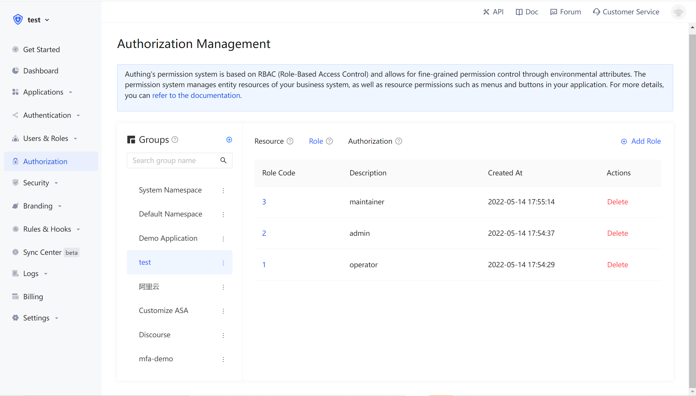
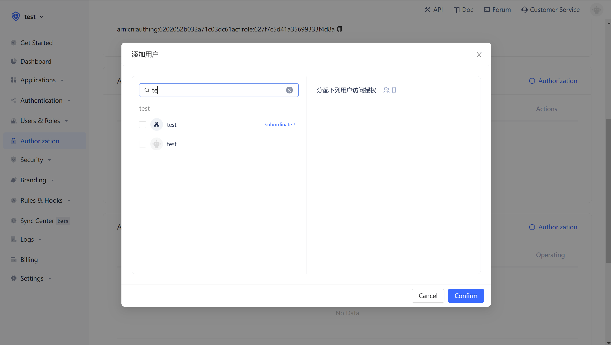
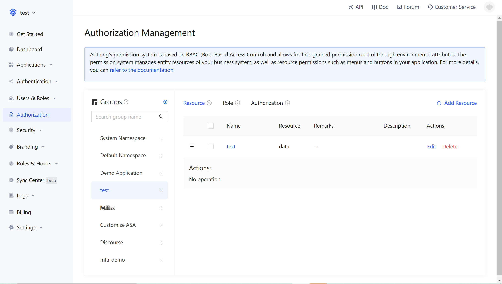
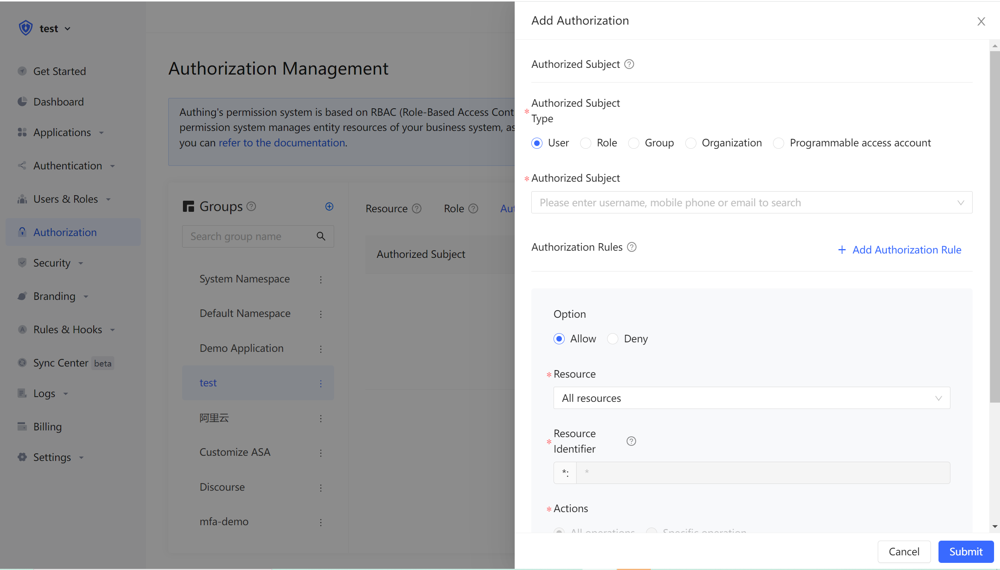

# Integrate RBAC permission model into your application system

<LastUpdated/>

[Previously](./README.md#什么是基于角色的访问控制-rbac) we introduced what role-based access control (RBAC) is, and then this document describes how to quickly integrate the RBAC permission model into your system based on Authing.

First, we need to understand a few core concepts in Authing:

- User: End user;
- Role: A role is a logical collection. You can authorize certain operation permissions of a role, and then grant the role to a user, and the user will inherit all the permissions in the role;
- Resources: You can define the entity objects in your application system as resources, such as orders, commodities, documents, books, etc.. Each resource can define multiple operations, such as reading, editing, and deleting documents
- Authorization: Authorize certain operations of a certain type of resources to roles or users.

With the combination of users, roles, resources, and authorizations, we can get a flexible and fine-grained permission model.

## Add roles

You can use the Authing console to create roles: In **Privilege Management** - **Role Management** Click **Add Role**:

- Role code: The unique id of the role. It only allowed to contain English letters, numbers, underscore \_ and hyphen -. Here we fill in `admin`。
- Role description: the description of the role, here we fill in the`administrator`。

Add three roles:



You can also use API & SDK to create roles. For details, see[Role Management SDK](/reference/sdk-for-node/management/RolesManagementClient.md)。

## Grant user a role

On the role details page, you can grant this role to users. You can search for users by username, phone number, email or nickname:



After selecting the user, click OK, and you can view the list of users granted for this role.

You can also use API & SDK to grant roles to users. For details, see[Role Management SDK](/reference/sdk-for-node/management/RolesManagementClient.md)。

## Control privileges through user roles on the backend

After the user is successfully authenticated and the Token is obtained, you can get the current user ID, and then you can use the API & SDK provided by us to get the role granted to the user on the backend. Here, take Node.js as an example:

> Here we take Node SDK as an example. We also support SDKs in Python, Java, C#, PHP, etc. For details, please click[Here](/reference/)。

First, we need to get a list of all the roles that the user has been granted:

```javascript
import { ManagementClient } from "authing-js-sdk";

const managementClient = new ManagementClient({
  userPoolId: "YOUR_USERPOOL_ID",
  secret: "YOUR_USERPOOL_SECRET"
});
const { totalCount, list } = await managementClient.users.listRoles("USER_ID");
```

After getting all the roles of the user, we can know whether the user has the `devops` role.

```javascript
if (!list.map(role => role.code).includes("devops")) {
  throw new Error("无权限操作！");
}
```

## Create resources

In the previous step, we do privilege management based on whether the user has a certain role. This privilege management is relatively coarse-grained, because it only judges whether the user has a certain role, but does not judge whether it has a specific permission. Based on the role-based access control model (RBAC), Authing can also perform more fine-grained authorization in resources.

You can abstract some objects of the system as resources, and some operations can be defined on these resources. For example, in the scenario of this document, Repository, Tag, PR, Release Notes are all resources, and these resources have corresponding operations:

- Repository: create, delete, etc.
- PR: Open, comment, merge, etc.
- Tag: create, delete, etc.
- Release Notes: Create, read, edit, delete, etc.

We create these resources in Authing:



## Authorized role to operate resource

Authing also supports authorization to users and roles at the same time. If the user is in a role, he will also inherit the authorized permissions of this role. Therefore, Authing can not only implement the standard RBAC permission model, but also perform more fine-grained and more dynamic permission control.

In the following example, we authorize the Create and Delete permissions of the repository resource to the admin role:



## Determine whether the user has permission on the backend

In the previous step, through resource authorization, we authorized a user (role) to have specific operation permissions on a specific resource. When we perform interface authentication on the backend, we can make more fine-grained judgments:

> Here we take Node SDK as an example. We also support SDKs in Python, Java, C#, PHP, etc. For details, please click [here](/reference/)。

Call the `managementClient.acl.isAllowed` the three parameters are:

- userId: User ID, the user can be directly authorized to operate on a specific resource, or can inherit the authorized permissions of the role.
- resource: Resource id. For example, `repository:123` represents a code repository with ID 123, and`repository:*` represents a type of resource such as a code repository.
- action: A specific operation, such as `repository:Delete` means deleting the code warehouse.

```javascript
import { ManagementClient } from "authing-js-sdk";

const managementClient = new ManagementClient({
  userPoolId: "YOUR_USERPOOL_ID",
  secret: "YOUR_USERPOOL_SECRET"
});
const { totalCount, list } = await managementClient.acl.isAllowed(
  "USER_ID",
  "repository:123",
  "repository:Delete"
);
```

The Authing policy engine will dynamically execute the policy according to the permission policy you configured, and return true or false. You only need to determine whether the user has the operation privilege based on the return value.

## Next step

You can learn how to[Authorize users based on the ABAC permission model.](./abac.md)。
