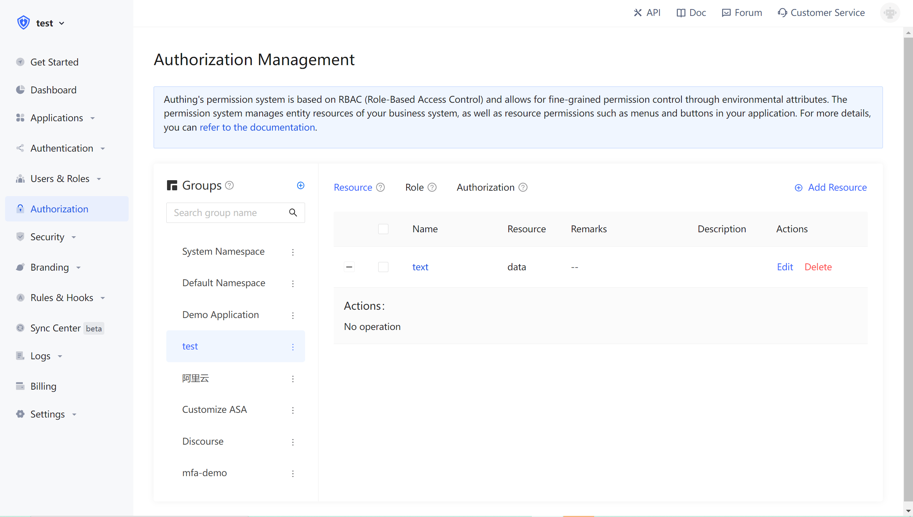
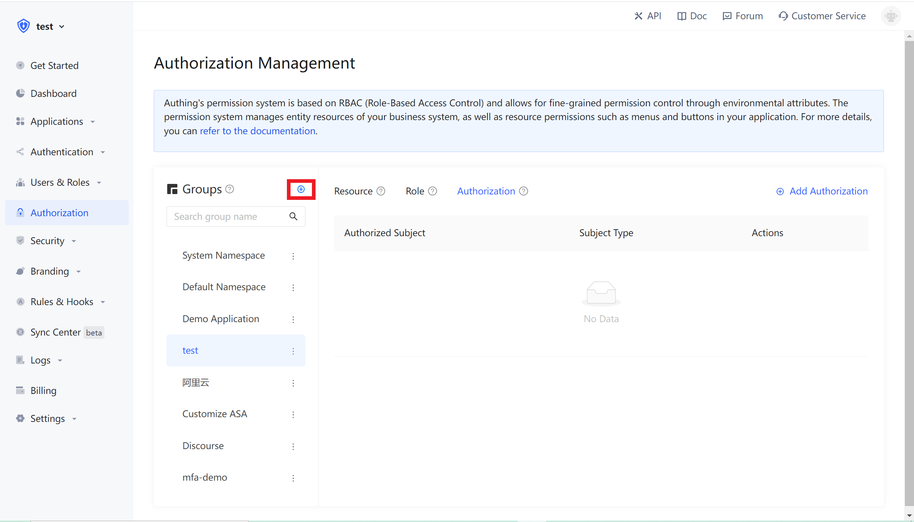
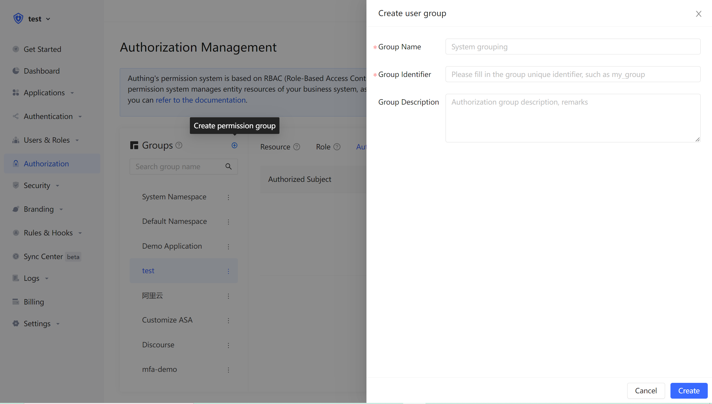

---
{
  meta:
    [
      {
        name: "description",
        content: "Use privilege grouping to manage privilege resources",
      },
    ],
}
---

# Use privilege grouping to manage privilege resources

<LastUpdated/>

Privilege grouping can be understood as a namespace of privileges. The roles and resources in different privilege groups are independent of each other, and they will not conflict even if they have the same name.



## Create privilege group

Click the Add button in the privilege grouping menu of **Privilege Management** :


Fill in the group name and group id in the pop-up window. The id is used as a unique id to identify the authority group in the later authentication.



In the created privilege group, you can use the ABAC or RBAC permission model to independently manage privilege resources.

## How to use privilege groups to determine privileges

```javascript
import { ManagementClient } from "authing-js-sdk";

const managementClient = new ManagementClient({
  userPoolId: "YOUR_USERPOOL_ID",
  secret: "YOUR_USERPOOL_SECRET"
});
const { totalCount, list } = await managementClient.acl.isAllowed(
  "USER_ID",
  "资源",
  "操作",
  "权限分组标识符"
);
```

## The relationship between privilege groups and applications

When each application is created, Authing will create a privilege group for you. The automatically created privilege group is named as application name, and the id is the application ID, which cannot be modified. Authing will also create a default privilege group for each user pool. When your privilege resources are relatively simple and do not need to be managed separately at the application level, you can just use the default privilege group. When one of your applications is more complicated or has conflicting roles or resources exist, you can manually create privilege groups by yourself to isolate and manage privilege resources.
