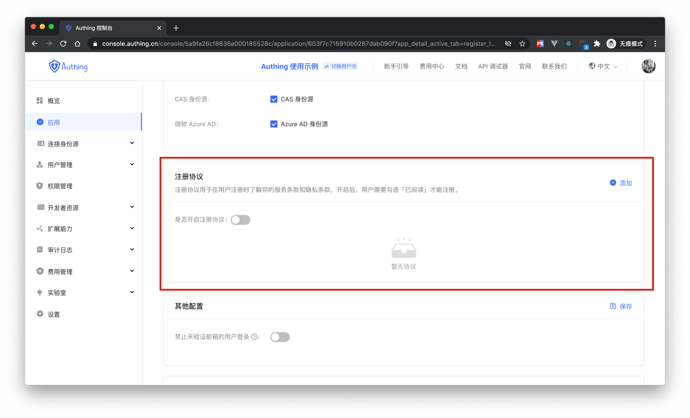
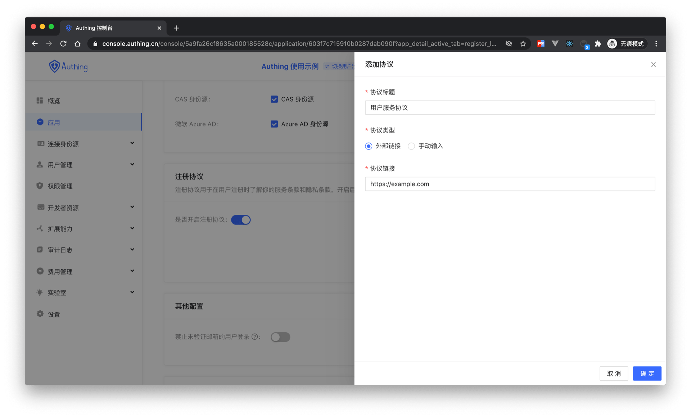

# Registration Agreement

<LastUpdated/>

When user register, you have to ensure that they read and understand the Agreement. You can configure the agreement in application detail under Register and Login tab.

## Customize Registration Agreement

Enable Registration Terms. Then click add.
- Agreement Title are present in Login UI
- Agreement Type 
  - Link: Type in URL of your Agreement.
  - Text: Type in your Agreement in Text Editor.

After configuration, Login UI should looks like:

