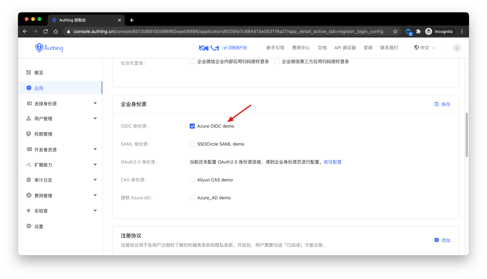
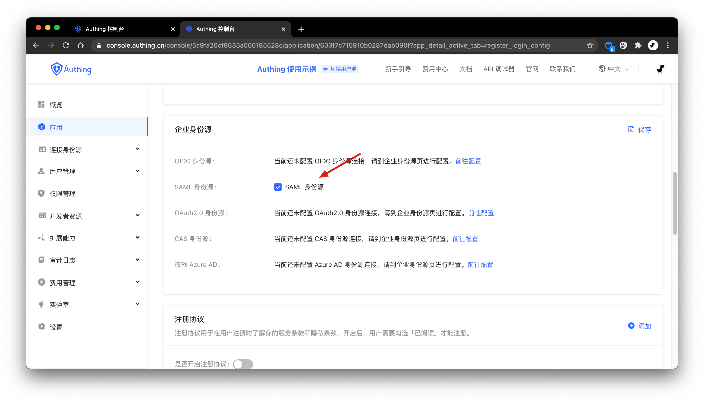
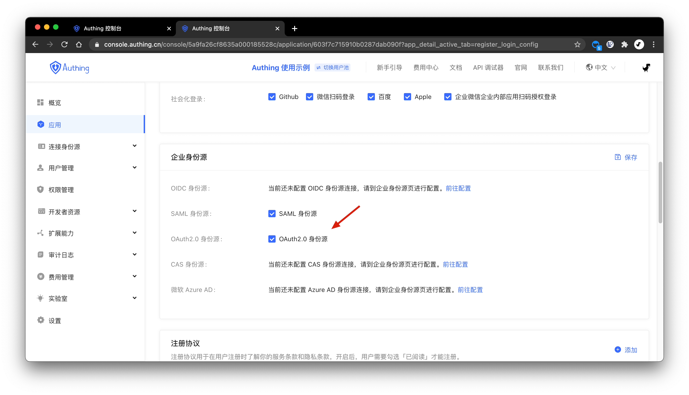
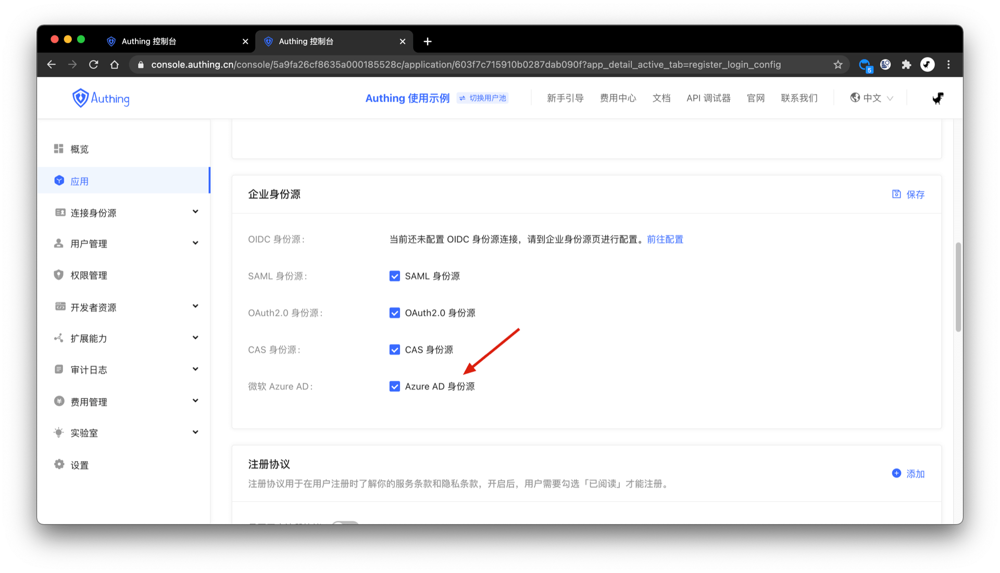
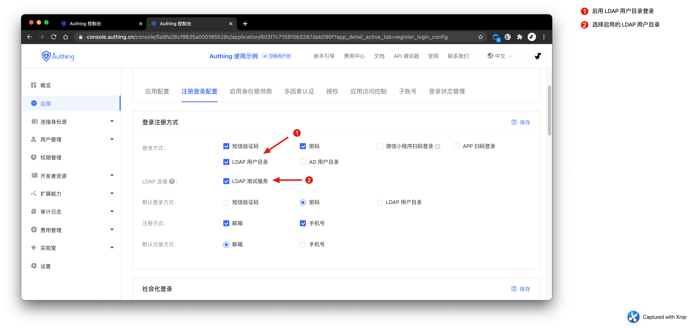
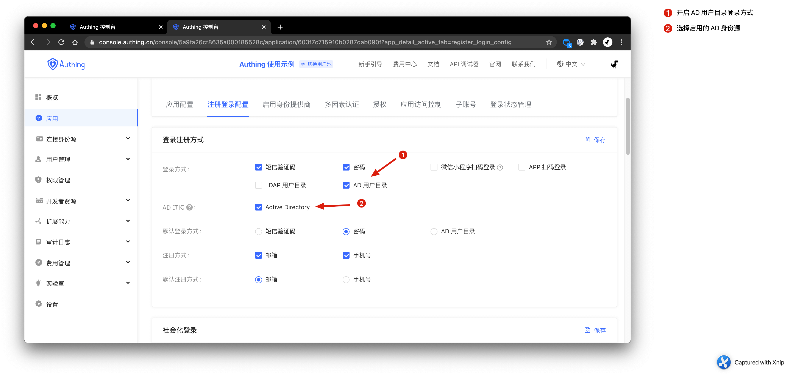

# Configuring Login Method

<LastUpdated/>

By default, your applicaiton only include basic Login method: OTP Login, Username/Password Login, Email/Password Login and PhoneNumber/Password Login.

Beside basic login method, Authing support:

- Social Registration
- Identity Source Login
  - [OIDC](#添加-oidc-身份源登录)
  - [SAML](#添加-saml-身份源登录)
  - [OAuth2.0](#添加-oauth20-身份源登录)
  - [CAS](#添加-cas-身份源登录)
  - [Azure AD](#添加-微软-azure-ad-登录)
  - [LDAP](#添加-ldap-用户目录登录)
  - [Windows AD](#添加-windows-ad-用户目录登录)

## Social Registration

{{$localeConfig.brandName}} support:

| Social Identity Provider     | Base       | Configuration Manual                |
| ---------------------------- | ---------- | ----------------------------------- |
| GitHub                       | Web        | GitHub Configuration Manual         |
| Google                       | Web        | Google Configuration Manual         |
| Sign in with Apple（Web）    | Web        | Apple Configuration Manual (Web)    |
| Sign in with Apple（Mobile） | Mobile APP | Apple Configuration Manual (Mobile) |

### Configuring customized Social Registration

{{$localeConfig.brandName}} allow Identity Provider with customized OAuth2.0, Please refer to <router-link to="/connections/custom-social-provider/" target="_blank">Configuring customized Social Registration</router-link>.

## Enterprise Identity Source

{{$localeConfig.brandName}} support Identity Source as LDAP, Windows AD. User information will synchronize automatically to Authing User Directory after successful login via Identity Source.

### Configuring OIDC Identity Source Login

Please refer to [Configuring OIDC Identity Source](/connections/oidc/) for steps. After configuration, you have to enable this login method in **Applications** tab.

### Configuring SAML Identity Source Login

Please refer to [Configuring SAML Identity Source Login](/connections/oidc/) for steps. After configuration, you have to enable this login method in **Applications** tab.

### Configuring OAuth2.0 Identity Source Login

Please refer to [Configuring OAuth2.0 Identity Source Login](/connections/oidc/) for steps. After configuration, you have to enable this login method in **Applications** tab.

### Configuring CAS Identity Source Login

Please refer to [Configuring CAS Identity Source Login](/connections/oidc/) for steps. After configuration, you have to enable this login method in **Applications** tab.

### Configuring Azure AD Identity Source Login

Please refer to [Configuring Azure AD Identity Source Login](/connections/oidc/) for steps. After configuration, you have to enable this login method in **Applications** tab.

### Configuring LDAP Identity Source Login

Please refer to [Configuring LDAP Identity Source Login](/connections/oidc/) for steps. After configuration, you have to enable this login method in **Applications** tab.

### Configuring Windows AD Identity Source Login

Please refer to [Configuring Windows AD Identity Source Login](/connections/oidc/) for steps. After configuration, you have to enable this login method in **Applications** tab.

