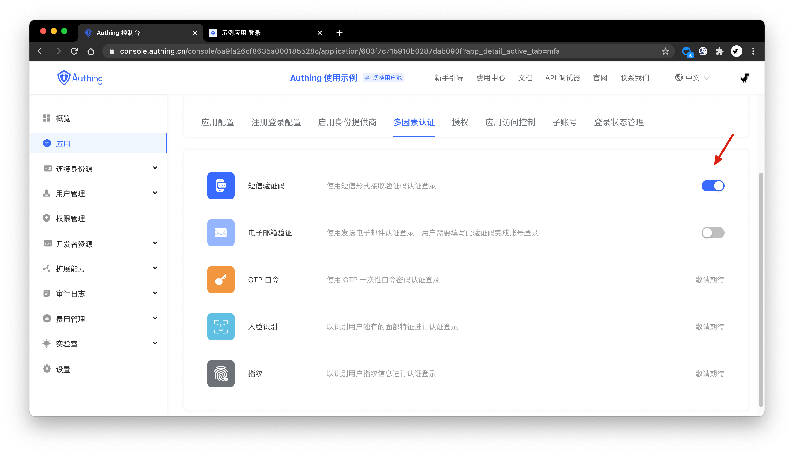
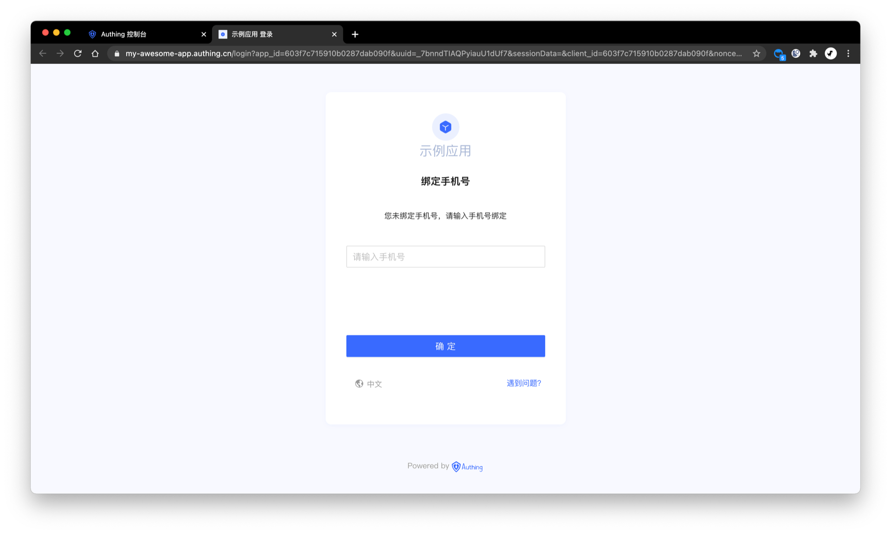

# Enable Multi-factor Authentication

<LastUpdated/>

Multi-factor Authentication (MFA) is a very simple safety practice method. It can add an extra layer of protection in addition to username and password. After enabling multi-factor authentication, when users do operations, in addition to provide username and password (the first identity authentication), the second identity authentication is also required. The combination of multi-factor authentication will provide a higher level of security protection for your account and resources. You can learn more about MFA-related concepts in [here](/concepts/mfa.md).

You can enable multi-factor authentication for your applications here:

## Adaptive MFA:

The multi-factor authentication of Approw is self-adaptive, which means dynamic authentication bases on authentication methods user-owned.

- If the user binds the phone number and the application has enabled the SMS verification code MFA, the mobile phone number verification code will be used as the MFA authentication method.
- If the user binds the phone number and the application has enabled the Email MFA, the email verification code will be used as the MFA authentication method.
- If the user does not bind a phone number or email, the user will be asked to bind a phone number first.

For more specific access procedures, see [setup Multi-factor authentication for users](/guides/authentication/mfa/).

