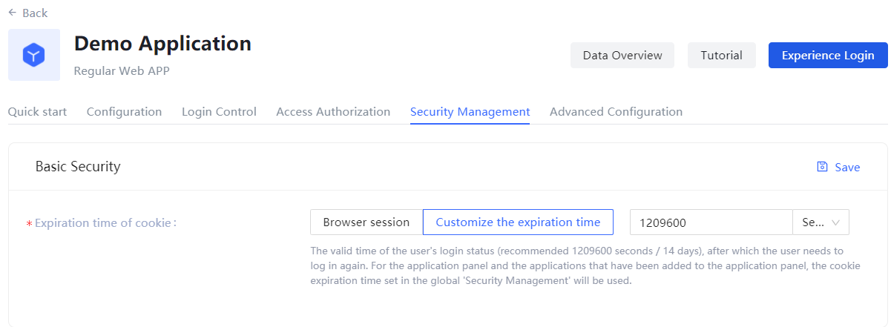
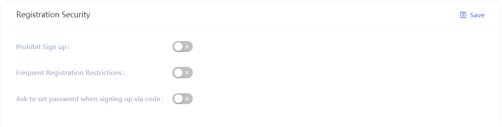
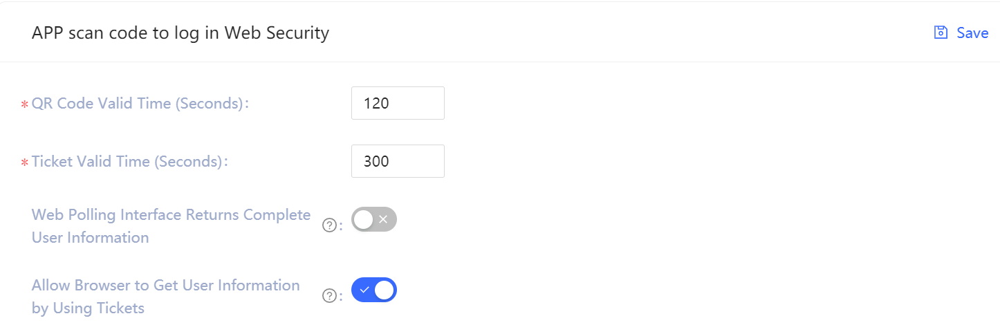
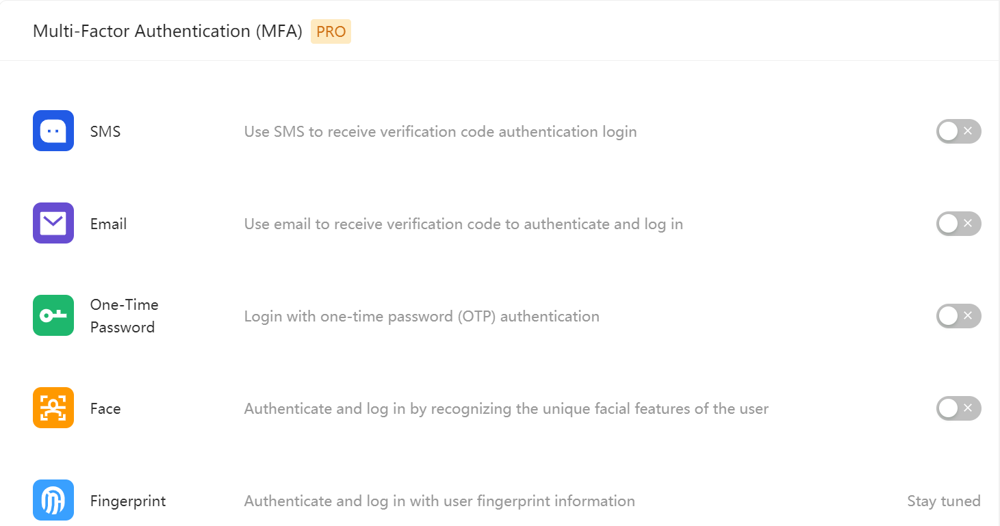

# Security Management

<LastUpdated/>

Path: **Application->Customized Application->Application Details->Security Management**

This section describes security-related configurations such as cookie expiration time, registration security, login security, Security configuration for web-login via scanning QR code, and MFA.

::: hint-info
* **Security Management** tab in **Application** is unavailable by default. In this case, configuration of application security management follows that of global security management. To configure separate security for an application, you can enable the **Customize security rules for the application** in **Advanced Settings->Customize Configurations**.
* When the **Customize security rules for the application** switch is turned on, security rules of the current application inherit those configured for global security management (in **Security Settings**). Meanwhile, security rules of the current application will be independent of the configuration in the global security rules (including **General Security**, **Password Security**, and **MFA**).
:::

When the **Customize security rules for the application** switch is turned on, you can configure the following features for the application.

## Basic Security Configuration

The user can specify the login valid time (i.e. when the cookie expires) in this module.

|Option|Description|
|----|----|
|Browser session|The current browser expires immediately after you close it. You need to log in to it again next time.|
|Customize the expiration time|Specify the expire time in the input box on the right (recommended 1209600 seconds, i.e. 14 days), after which the user needs to log in again. **Note**: For the application panel and the applications that have been added to the application panel, the cookie expiration time set in the global **Security Management** will be used.|

## Registration Security

|Switch|Description|
|----|----|
|Limit to frequent registrations|Administrator can limit the number of registrations for the same IP in a given number of seconds by specifying the **Limited Period** and the **Limited Frequency within the Period**. |
|No Registeration|When this switch is turned on, common users will not be able to register on official website or by API, and only administrator can create accounts manually.|

## Brute-Force Protection

{{$localeConfig.brandName}} provides login security policies for both **Account Lock** and **Verification code** scenarios.

### Account Lock

|Switch|Description|
|----|----|
|Limitation of Failed Logins|When a user tries to log in with an incorrect password, the corresponding policy is triggered according to the login security policy rules. By turning on the switch of **Limitation of Failed Logins**, admin limits the number of password entry errors for the same account within a certain number of seconds by specifying the **Limited Period** and the **Limited Frequency within the Period**. If the number of times is exceeded within the specified period, the user needs to enter the graphical verification code when logging in again.|
|Send verification email when unverified email is logged in|Once the switch is turned on, if a user logs in with an unverified email, {{$localeConfig.brandName}} will send an verification email to that email address and the user needs to click on the authentication link in the email to log in.|

### Verification code

Besides the above two policies for the **Account lock** scenario, **Verification code** can also specify **Limitation of Failed Logins**: When a user tries to log in with an incorrect password, the corresponding policy is triggered according to the login security policy rules. By turning on the switch of **Limitation of Failed Logins**, admin limits the number of password entry errors for the same account within a certain number of seconds by specifying the **Limited Period** and the **Limited Frequency within the Period**. If the number of times is exceeded within the specified period, the user needs to enter the graphical verification code when logging in again.

## Security configuration for web-login via scanning QR code

{{$localeConfig.brandName}} has always been committed to bringing developers a good experience in flexible customization. Therefore, we provide the following customization options so that developers can balance security and convenience according to your business needs.

|Field / Switch |Description|
|----|----|
|QR Code Valid Time|120s by default|
|Ticket Valid Time|300s by default|
|Web Polling Interface Returns Complete User Information|Not return info by default. Since polling QR-Code Status interface does not have privilege check, this means that directly returning user information (including access_token) on this interface has security risks. So we recommend developers to follow the best practice: the Polling QR-Code Status interface only returns user nickname and profile picture, and uses ticket to exchange user information.|
|Allow Browser to Get User Information by Using Tickets|Not allowed by default and need to be called on the server, that is, after initialization with the Userpool Secret. [Check how to initialize backend SDK](/en/reference/sdk-for-node/README.md). A typical use scenario is that the user scans the QR code and agrees with the authorization; the developer gets the ticket, sends it to his own backend, uses the backend SDK to exchange the user information, and then redirects to the login page and writes the user information to localStroage.|

## Multi-Factor Authentication

Multi-Factor Authentication (MFA) is a simple method for security practice. It provides additional protection based on the account and password. After enabling MFA, the user needs to pass the sencond-time authentication when logs in, following the account and password authentication (first-time authentication). Integrated MFA offers stronger security protection to your accounts and resources. You can learn more about [MFA](/en/concepts/mfa.md).
 
You can enable MFA for your application as shown in the following:

For more details, please check [About Multi-Factor Authentication](/en/guides/authentication/mfa/).
