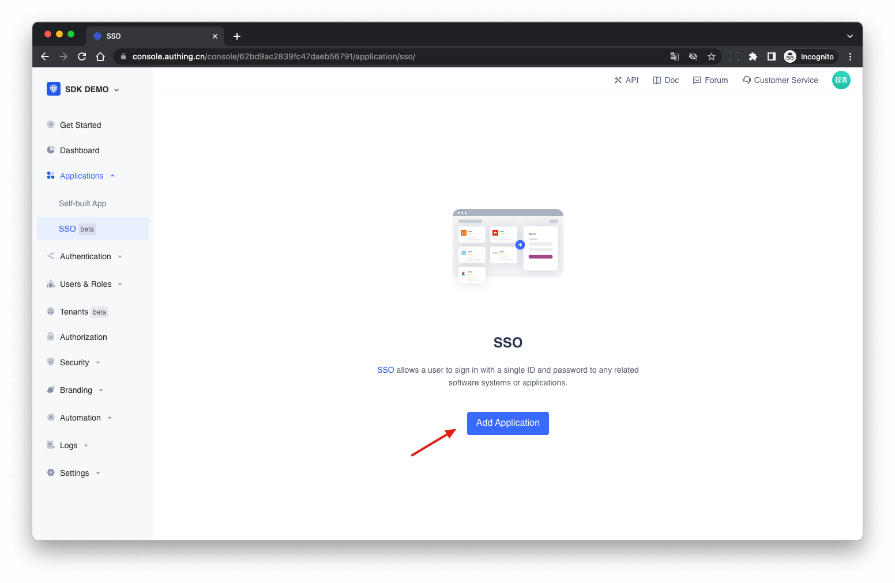
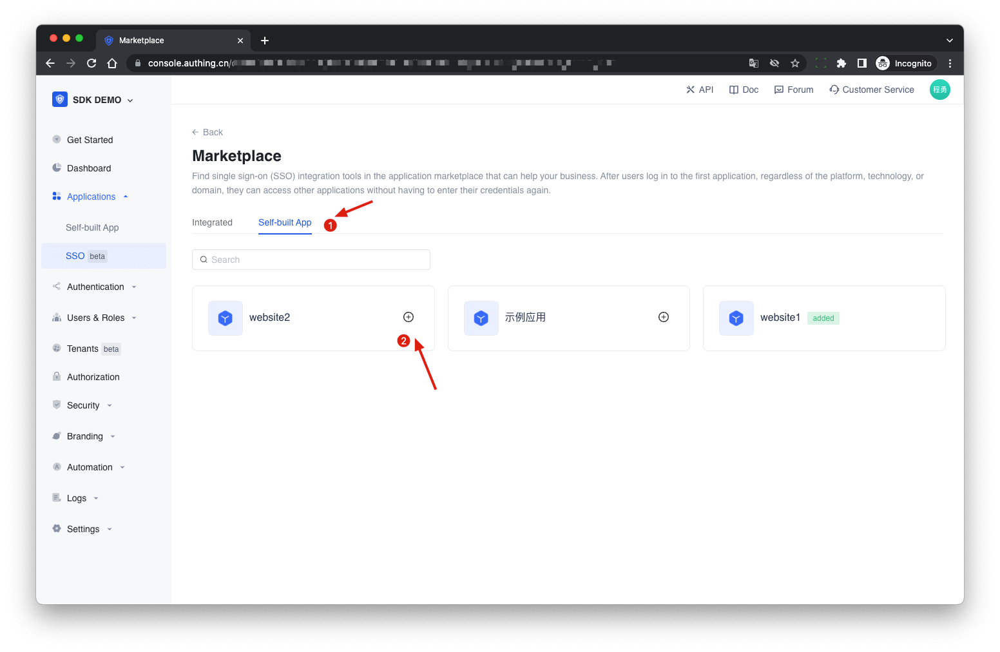
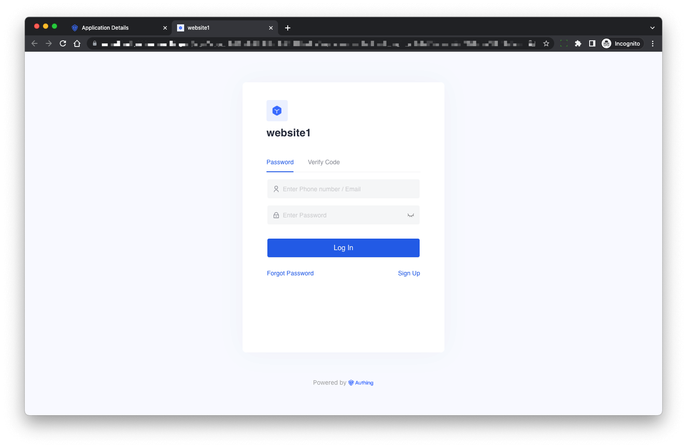
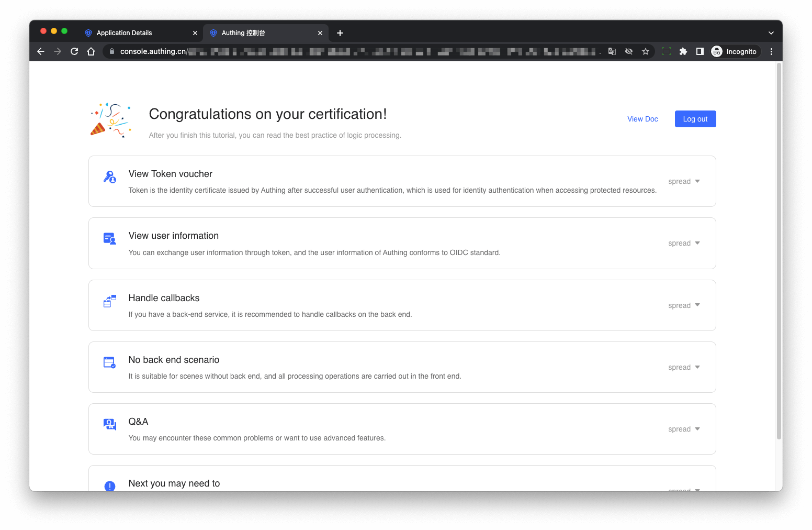
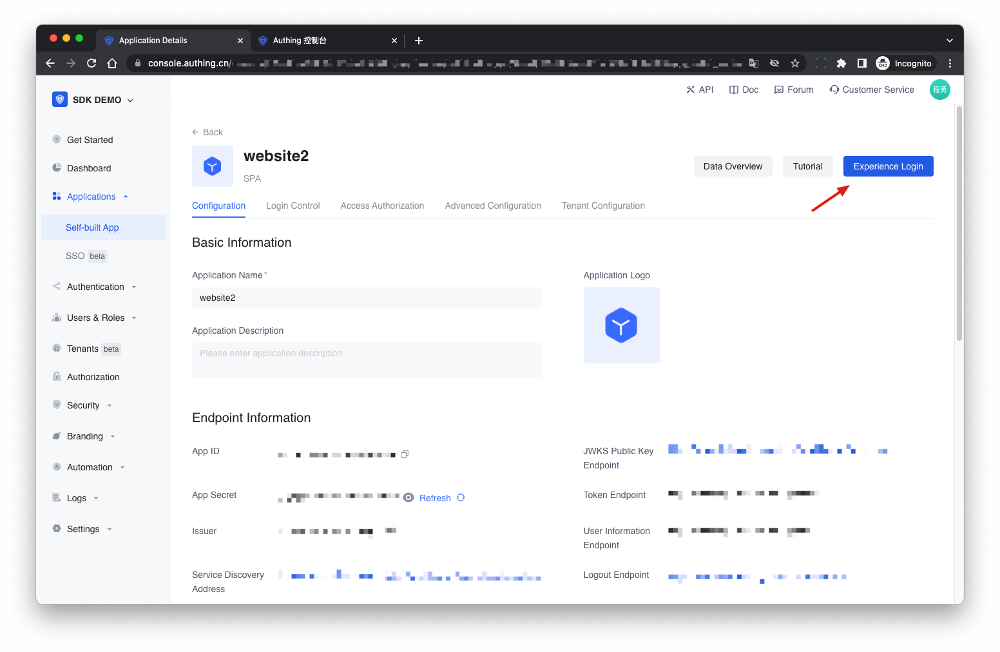

# Implement Single Sign-on Between Mutiple Applications

<LastUpdated/>

After enabling single sign-on between applications, the login status between different applications under the same user pool will be connected

## Create Two Applications

At first you can create two applications follow the [guidelines](./create-app.md).

## Configure SSO

Go to the menu **Applications** > **SSO**, click **Add Application** in the upper left corner, then select **Self-built App**, find the application you just created in the list below, click **+**, the configuration of multi-application SSO is completed.

## Experience the Single Sign-on

Enter the **SSO** app list page, select an app, and click **Experience Login**

Finish login on the login page:

After login success, it will redirect to the application callback address:

Next click another application’s login button:

The user doesn’t need to enter the password again, the user can directly enter the application callback address:

## Using SDK for Single Sign-on

For the detailed access procedure, please refer to the [Single Sign-On (SSO)](/en/reference/sdk-for-sso.md) document.