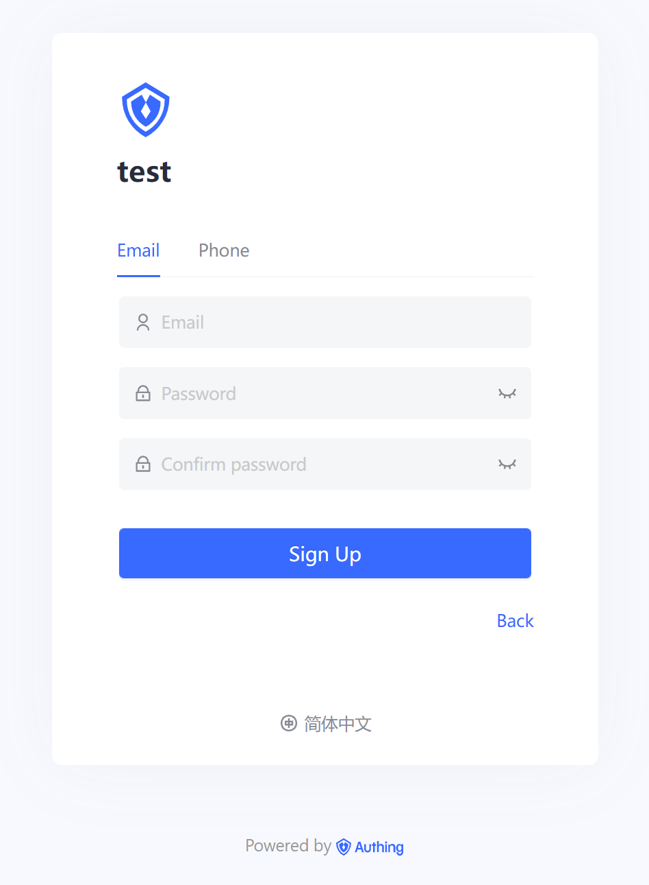
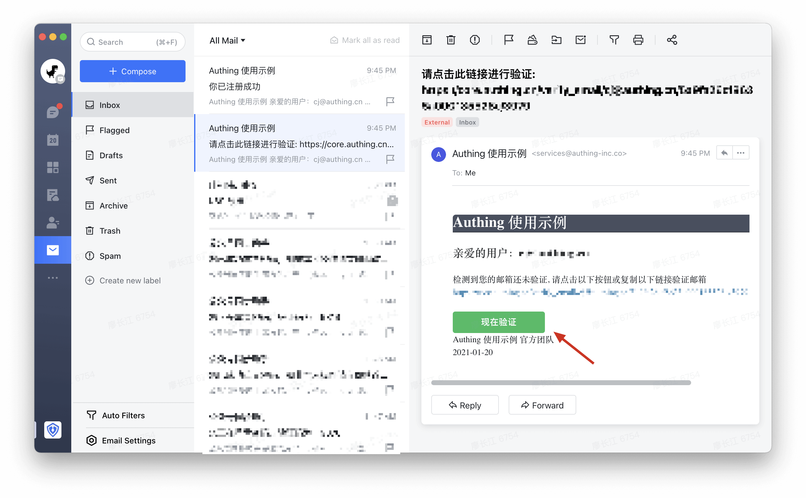
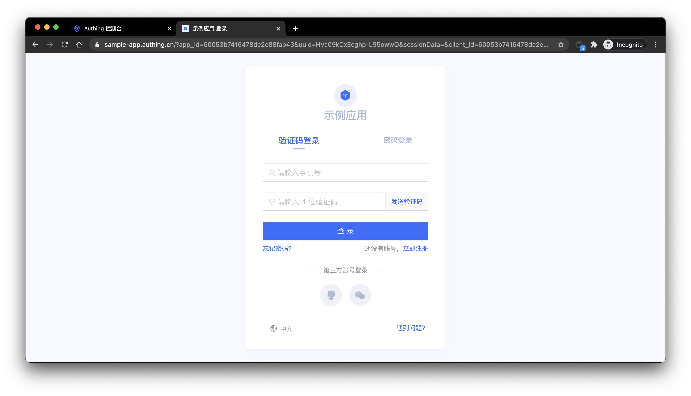
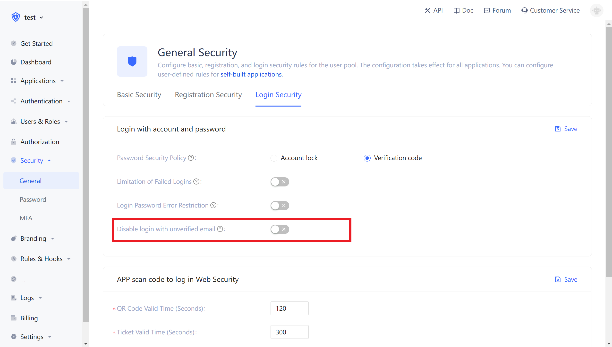
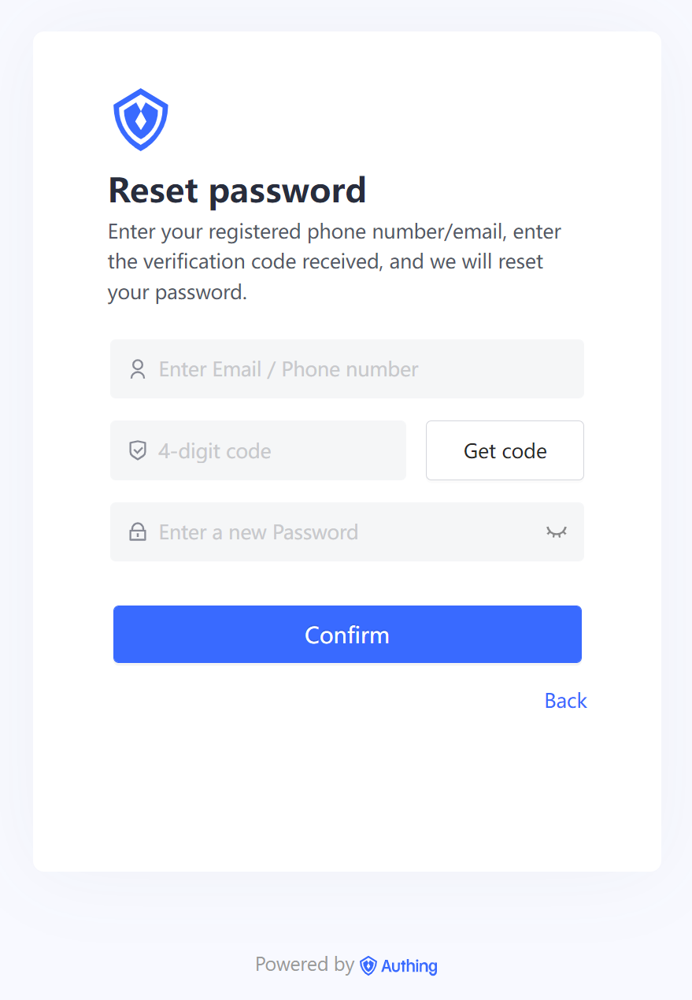
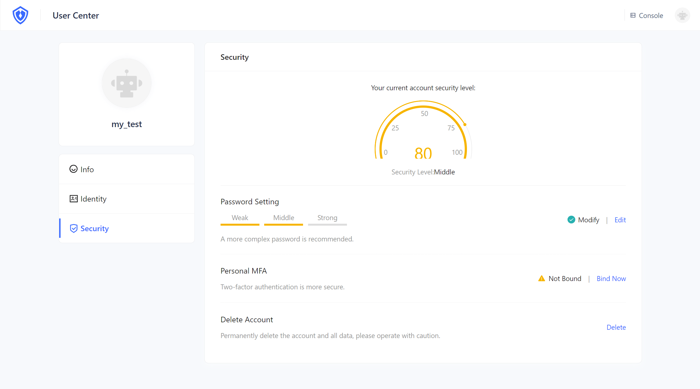

# Use Account & Password to Authenticate

<LastUpdated/>

In Authing, account passwords are divided into the following three forms:

1. Email + password login
2. Username + password login
3. Phone number + password login

When providing users with account and password authentication methods, as an IT system administrator or developer, you also need to implement the following functions:

1. Password reset: the password can be retrieved by email verification code or SMS verification code;
2. Modify the password: You can reset the password with the existing password.
   To use Authing to achieve these functions, we provide three different integrate methods:

3. [Use {{$localeConfig.brandName}} Hosting landing page](#Use Hosting landing page)，Without a line of code, you can {{$themeConfig.sampleAppDomain}} experience。
4. [Use {{$localeConfig.brandName}} Embedded login component provided](#Use Embedded login component provided)，It can be integrated into your web and mobile projects. You don't need to implement the login form UI yourself.
5. [Use API & SDK](#Use -api-sdk)，{{$localeConfig.brandName}} It provides restful and graphql APIs and SDKs in more than 10 languages or frameworks. You can customize the UI and authentication process based on this.

6. Use Authing hosted login page. No coding work needed. You can experience it through sample-sso.authing.cn.
7. Using the embedded login component provided by Authing. It can be integrated into your web and mobile projects. You don't need to implement the login form UI yourself.
8. Use API & SDK. Authing provides APIs in two forms, RESTFul and GraphQL, and SDKs in more than 10 languages or frameworks. You can customize the UI and authentication process based on this.

## Use hosted login page

### Registration

After the user has successfully registered, the system will send a welcome email to the user's mailbox:

> You can turn off the option of registering to send welcome email in the console settings > security information > user pool security configuration, and you can also modify the default welcome email template in the console settings > message service.

After the user has successfully registered, Authing will send a verification email to the user's mailbox:

The user can verify the mailbox by clicking the verify button.

### Login

By default, accounts with unverified mailboxes can log in. You can also modify this configuration in the application details:

After the user logs in successfully, it will call back to the callback link you configured. You can get user information here. For details, please see: Use Authing hosted login page to authenticate.

### Modify password

Users can modify password in the personal center.

## Use embedded login component

The embedded login component and the online hosting login page are basically the same in style and interaction. The difference is that the online hosting login page is fully managed and maintained by Authing, which is completely independent of your application. The embedded login component can be integrated in your application.
For detailed usage, please see: [Use the embedded login component to authenticate]().

。

## Use API & SDK

### Register

<StackSelector snippet="register-by-email-password" selectLabel="Language" :order="['java', 'javascript', 'python', 'csharp']"/>

### Login

<StackSelector snippet="login-by-email-password" selectLabel="Language" :order="['java', 'javascript', 'python', 'csharp']"/>

### Reset password

<StackSelector snippet="reset-password" selectLabel="Language" :order="['java', 'javascript', 'python', 'csharp']"/>

### Modify password

<StackSelector snippet="update-password" selectLabel="Language" :order="['java', 'javascript', 'python', 'csharp']"/>
