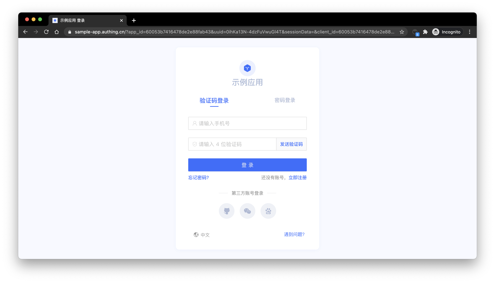
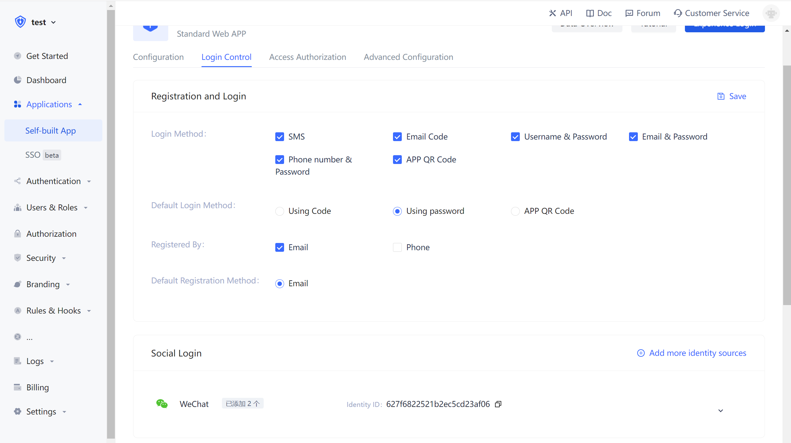
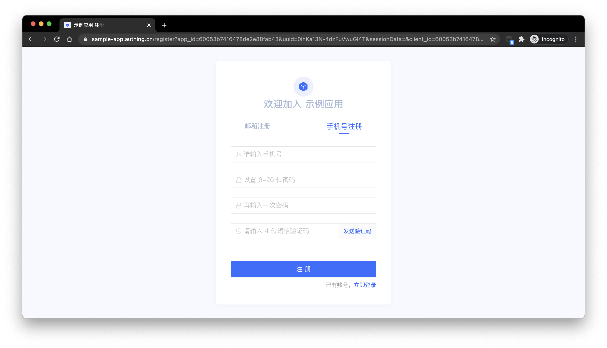
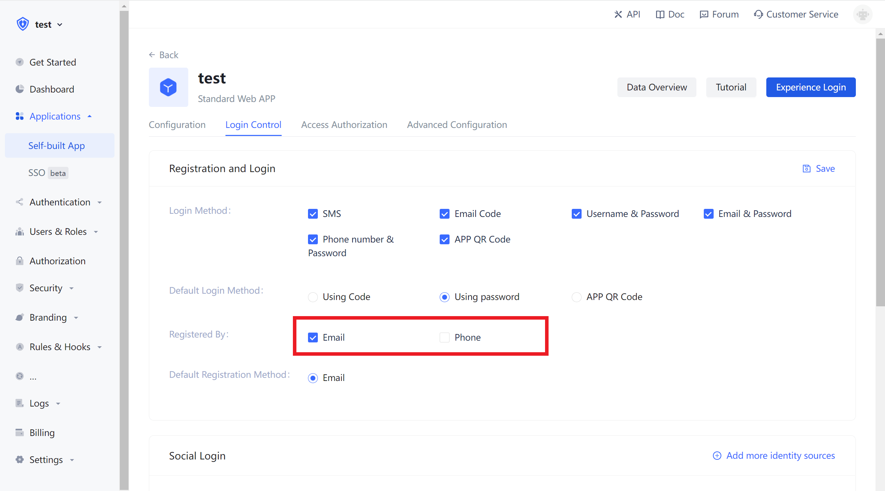

# Use SMS Verification Code to Authenticate

<LastUpdated/>

Developers can use the standard login components and API & SDK provided by Authing to quickly implement a mobile phone number-based user system. You can also configure the white list of mobile phone numbers in Console > user management > registration white list, so that only mobile phone numbers in the white list can be registered and logged in.
The verification code SMS will use Authing's unified SMS template by default. If you want to customize the SMS template, you can configure the custom SMS template in console > settings > Message Service.

## Use hosted login page

### Login

> Mobile phone number password login mode, it will automatically create an account if user does not exist.

The default login method of the application is username and password login. You can modify in the application configuration:

### Registration

The default registration method of the application is password login. You can modify in the application configuration:

## Use embedded login component

The embedded login component and the online hosting login page are basically the same in style and interaction. The difference is that the online hosting login page is fully managed by Authing, which is completely independent from your application, while the embedded login component can be embedded in your application. For detailed usage, please see: [Use the embedded login component to authenticate]().

## Use API & SDK

### Send SMS verification code

<StackSelector snippet="send-sms-code" selectLabel="Language" :order="['java', 'javascript', 'python', 'csharp']"/>

### Login

<StackSelector snippet="login-by-phone-code" selectLabel="Language" :order="['java', 'javascript', 'python', 'csharp']"/>

### Registration

<StackSelector snippet="register-by-phone-code" selectLabel="Language" :order="['java', 'javascript', 'python', 'csharp']"/>
