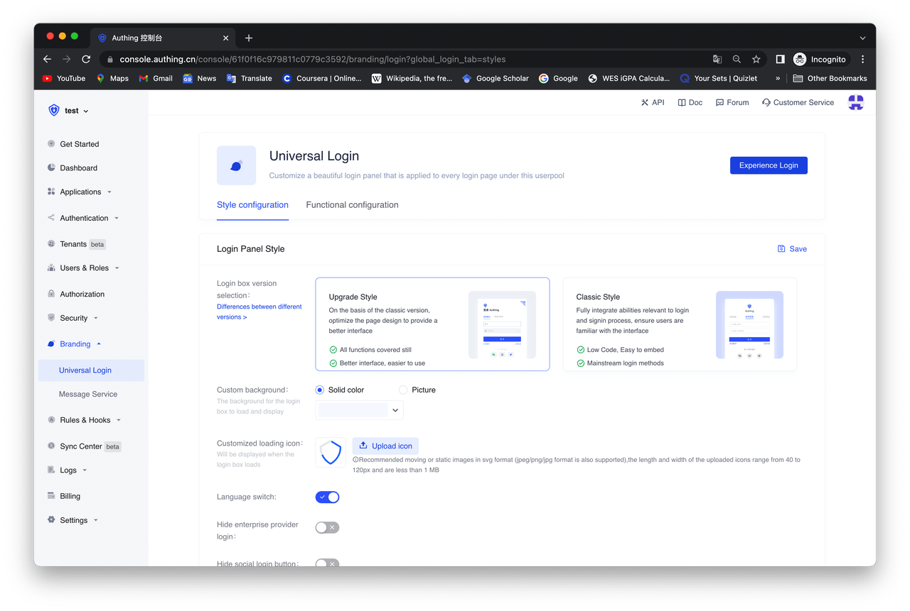
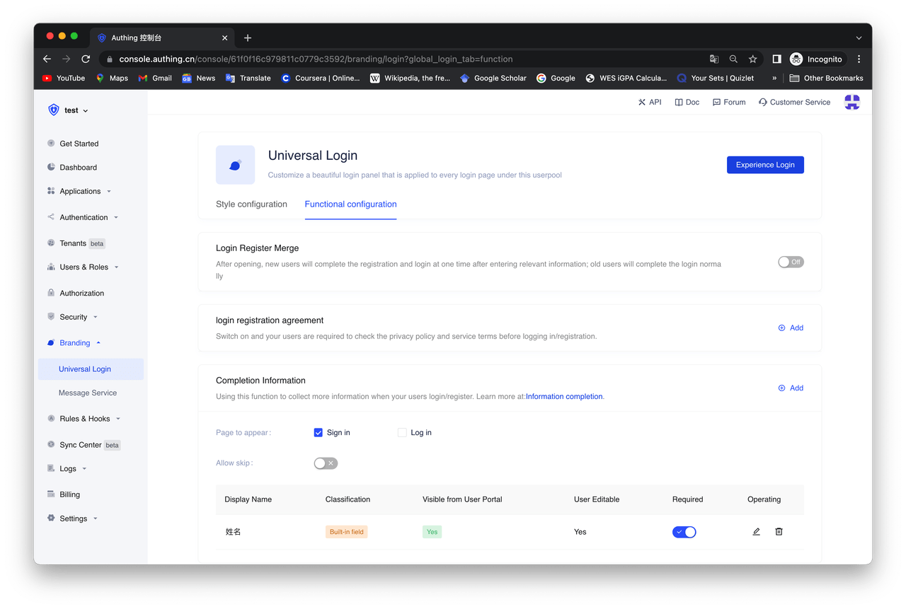
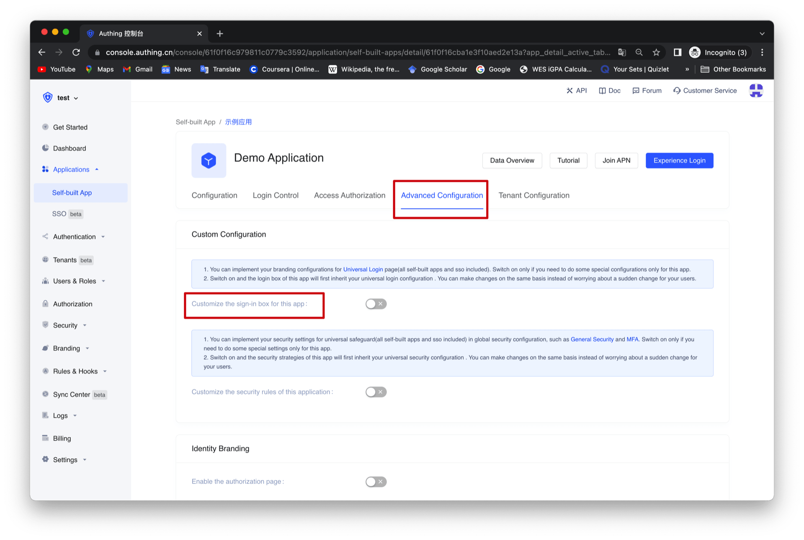
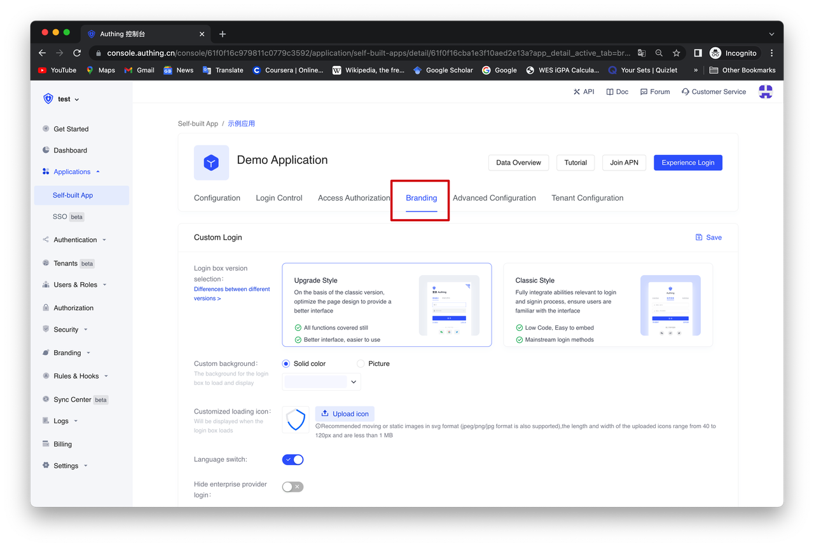

# Personalize the guard

<LastUpdated/>

In the Branding block of Authing console, you can personalize the login boxes of your entire user pool, including the login boxes of SSO and all self-built apps in your user pool.

In the "Global Login Box", you can make relevant `style configuration` and `function configuration`. Specific functions include:

## Style configuration

- Choose your login box version:[How to upgrade to a new version login box | Authing Docs](/reference/guard/console-migrate.md)
- Custom background: change the background of the login box
- Custom loading icon: change the loading icon of the login box
- Show/hide "Switch Language" button
- Show/hide enterprise IDP
- Show/hide social IDP
- Show/hide Forgot Password
- Custom CSS
  

## Function configuration

- Merge login&signup: After switching on, new users will sign-up and login by entering relevant information at once; existing users will log in as usual.
- User consent: After switching on, users need to check the service terms and privacy terms of your configuration before logging in/ signing up.
- More information collections: After switching on, users will be required to complete the information after logging in/signing up. More details: [More customized fields](/guides/users/user-defined-field/)
  

If you would like to make unique configurations for a single login box, follow this:

First, find Advanced Configurations, switch on Customize the sign-in box for this app.
While switching on, your login box configurations will first be inherited by the one you set in Branding-Universal Login. You can make changes based on it, and do not worry about the sudden change to your users when applying new configurations.

While switching on, you can make unique configurations under Branding tab of this area.

