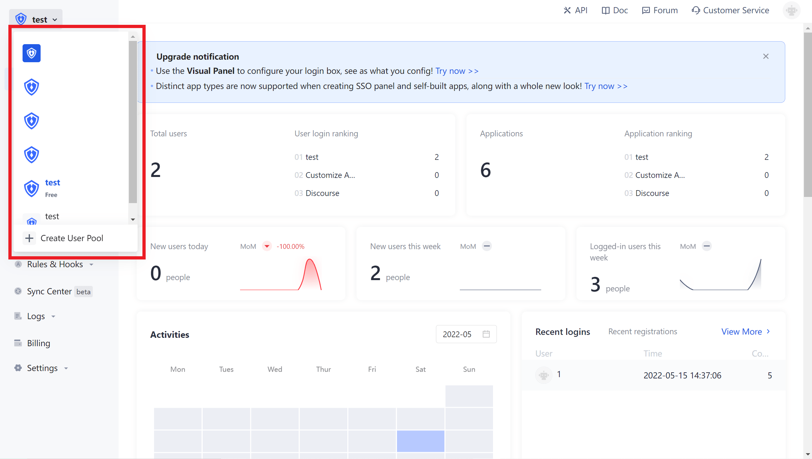
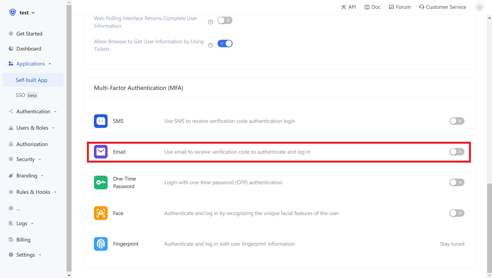
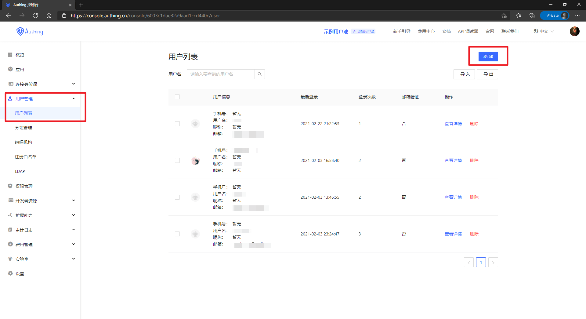
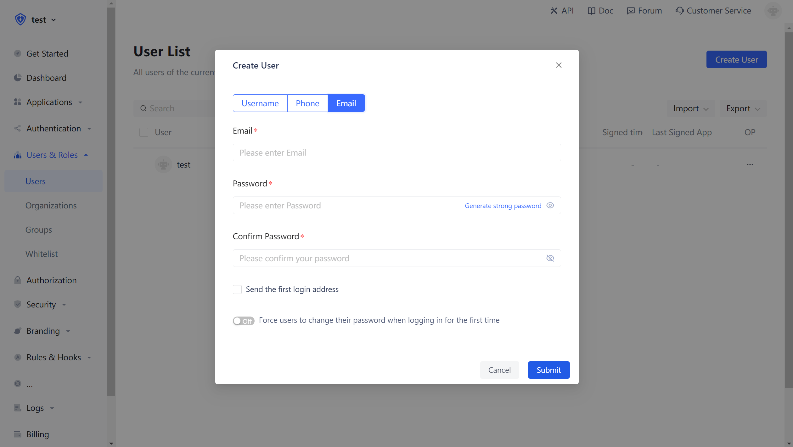
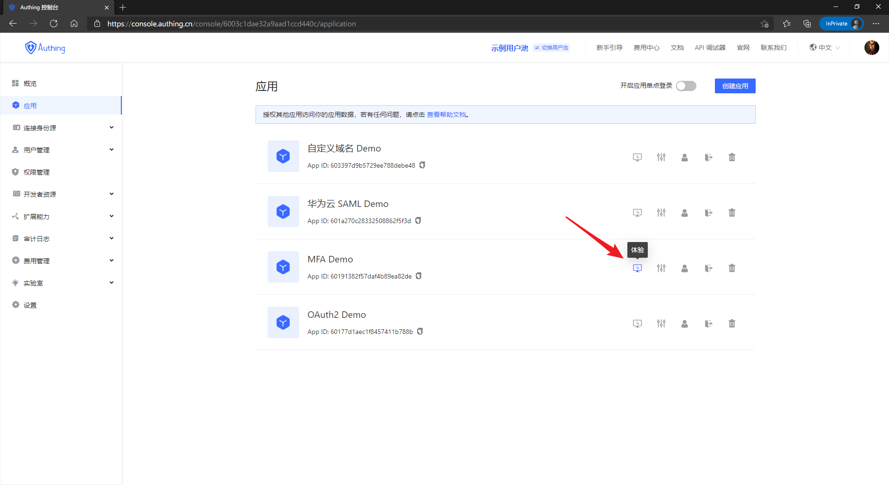
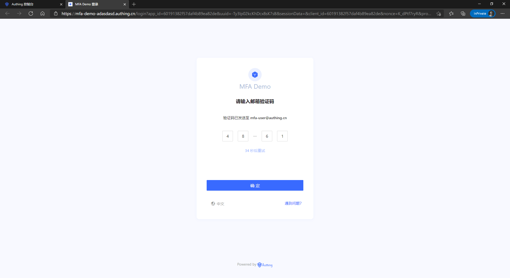

# Configure Email Authentication (MFA)

<LastUpdated/>

## Overview

MFA is a security system that is a secondary identity verification for verifying the legitimacy of an operation. For example, remote login requires email verification. This article introduces the multi-factor authentication method based on email verification code.

## Prerequisite

1. <a :href="`${$themeConfig.consoleDomain}`">Register a new {{$localeConfig.brandName}} Account</a>
2. [Complete the creation of the user pool and application](/guides/basics/authenticate-first-user/use-hosted-login-page.md)

## Enable Email-based MFA

**1.Enter the selected user pool and select the application that needs to enable Email MFA**

::: img-description
Select User Pool
:::

::: img-description
Select Application
:::

**2.Click MFA, then enable Email Verification**

**3.Enter  Users and create a user for email-based MFA login.**

## Use Email-based MFA Login

**1. Click Login, login with the user created above.**

::: img-description
Click Login
:::

::: img-description
Login with email and password
:::

**2. Click Send, and enter the verification code to complete the Email-based MFA verification process.**

::: img-description
Second authentication succeeded
:::

## Disable Email-based MFA

**1. Enter the Application Details and disable the Email verification  option.**

