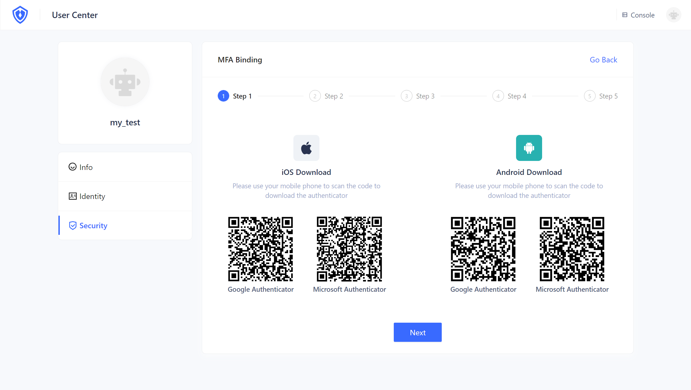
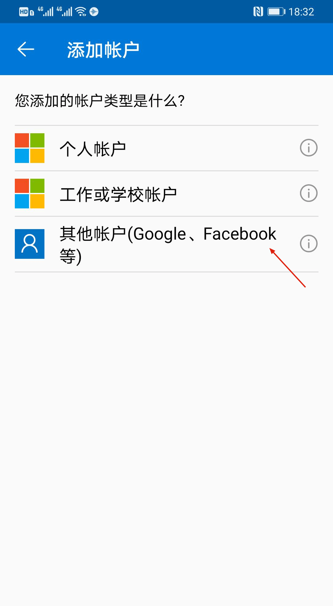
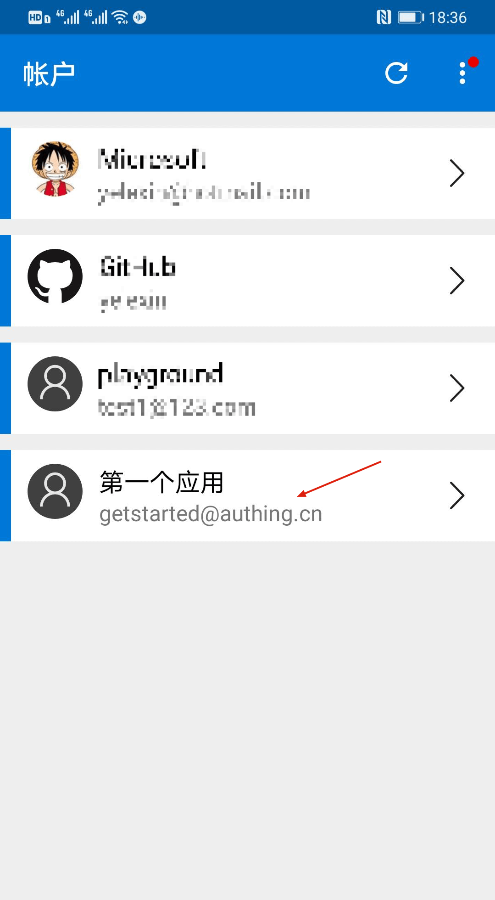
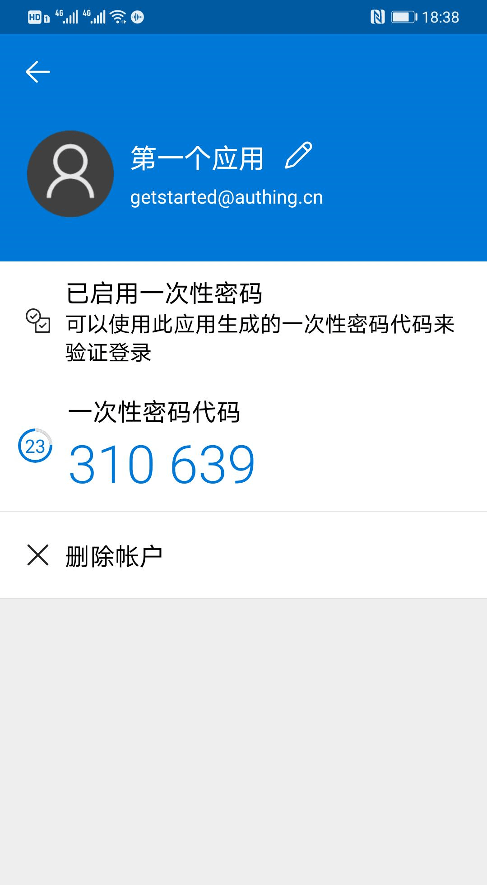
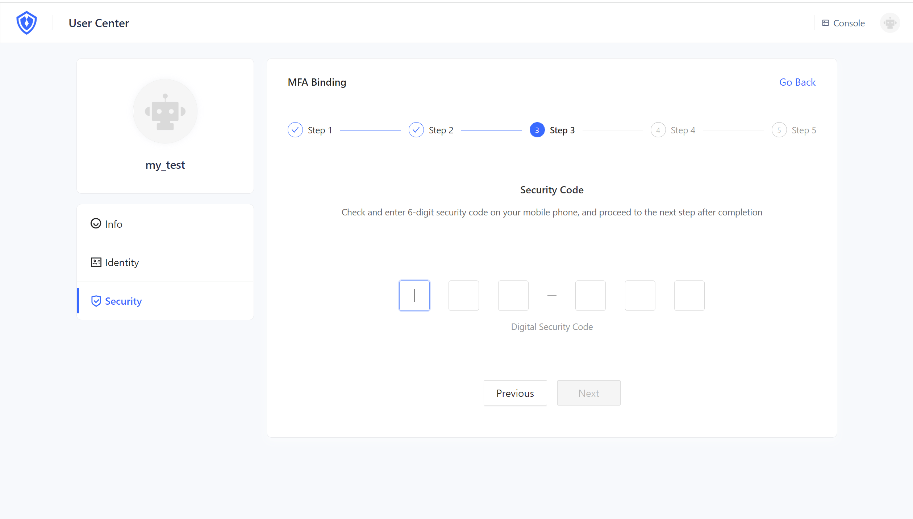
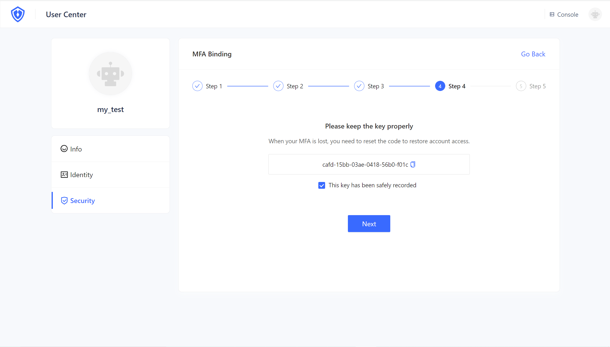
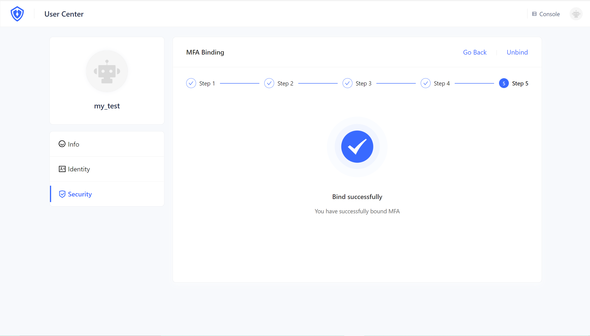
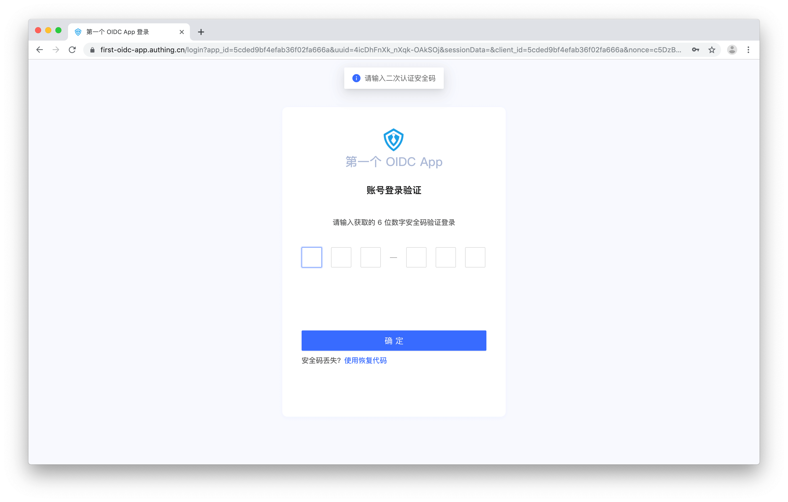
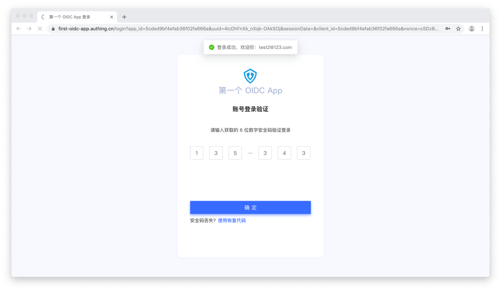
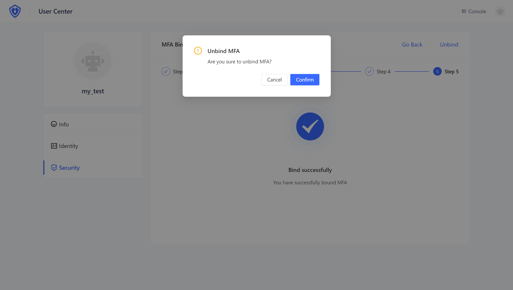

# MFA: Time-Based One-time Password (TOTP) Authentication 

## Summary 

Multi-factor authentication (MFA) is a security system that is a secondary identity verification for verifying the legitimacy of an operation. For example, remote login requires mobile phone SMS verification. Time-Based One-time Password (TOTP) authentication is a way of MFA that constantly generates a new 6-digit password based on a time interval by device.

## Before the start

1. <a :href="`${$themeConfig.consoleDomain}`">Register an {{$localeConfig.brandName}} account</a>
2. [Complete the creation of the user pool and application](/guides/basics/authenticate-first-user/use-hosted-login-page.md)

## Set up a new MFA

**1. Login in to `https://<your_url>.{{$themeConfig.officeSiteDomain}}`. Then access User Center `https://<your_url>.{{$themeConfig.officeSiteDomain}}/u`**

**2. Click Set up new MFA, then scan the QR code to add MFA with Google Authenticator/Microsoft Authenticator. Here is a sample with Microsoft Authenticator.**

::: img-description
Choose another account
:::

**3. Add MFA after scanning the code automatically, you can view the MFA just added in the list**

**4.Click "Next" in the user center, enter the dynamic password displayed on the newly added MFA, complete the confirmation binding, and click "Next"**

::: img-description
View MFA password on mobile
:::

::: img-description
Enter the MFA password on the binding page
:::

**5.Be sure to keep the recovery code shown here safely. If you lose your MFA in the future, you can use this recovery code to restore account access. Click "Next".**

::: img-description
Success
:::

## Login in with MFA

**1. Please sign out: `https://<your_url>.{{$themeConfig.officeSiteDomain}}/oidc/session/end`. Then access `https://<your_url>.{{$themeConfig.officeSiteDomain}}`. You can log in with the account that has just been bound to MFA, and you will be prompted to enter the security password for secondary authentication.**

**2. Please enter the correct 6-digit password, complete the secondary authentication, and log in.**

::: img-description
MFA is successfull
:::

## Remove MFA

**1. Click "Unbind" to remove MFA**

::: img-description
Remove MFA successfully
:::