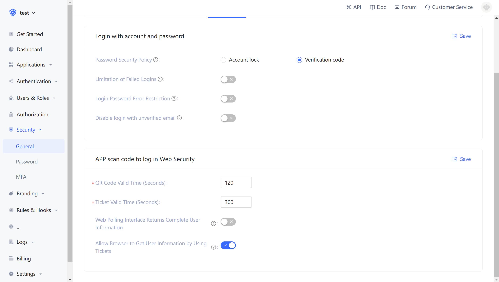

# Custom configuration items

{{$localeConfig.brandName}} has always been devoting to bring developers a highly customized development experience. Therefore, we provide the following custom configuration items. Developers can balance security and convenience according to their business needs. Developers can customize the configuration in the [{{$localeConfig.brandName}} console](https://console.authing.cn/console/userpool) **Settings** -&gt; **Security Information** -&gt; **App Scan Code Login Web Custom Configuration**.

## QR code valid time

The default 120 s.

## Whether to query the QR code status interface to return complete user information

It does not return by default. Since the query QR code status interface does not have permission verification, it means that there is a security risk to directly return user information (including the login credential token) on this interface, so we recommend that developers follow the best practice: query QR code The status interface only returns the user's nickname and avatar, and uses the ticket to get user information.

## ticket valid time

The default is 300 s.

## Whether getting user information by ticket in the browser is allowed

It is not allowed by default, it needs to be called on the server side, after the user pool key is initialized. [Click to learn how to initialize the back-end SDK](/en/reference/sdk-for-node/README.md).

A typical usage scenario is: after the user scans the QR code to agree to authorization, and the developer obtains the ticket, sends to backend, and gets user information by backend SDK, then redirects to the logged-in page, and writes the user information into localStroage at the same time.
