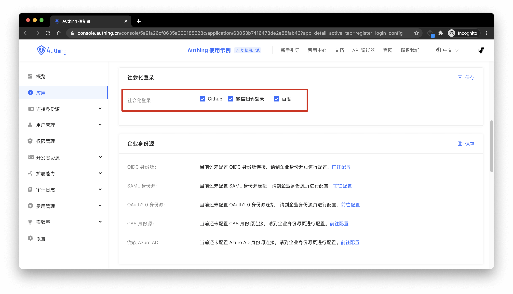
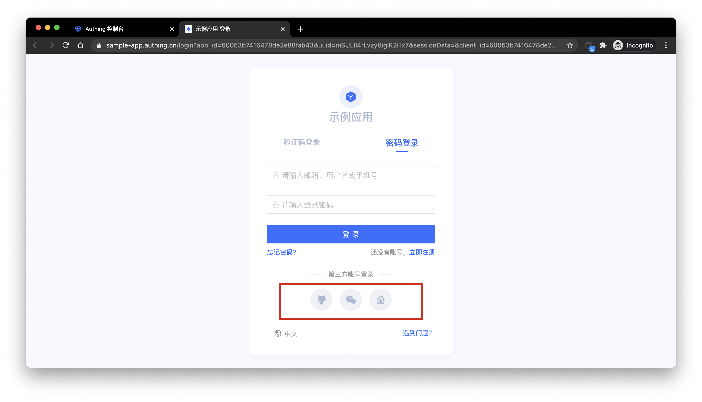

You can configure the social login enabled by the application in the social login item of the registration login configuration of the application details:

Click Save, the login page will only display the social logins that have been turned on:

