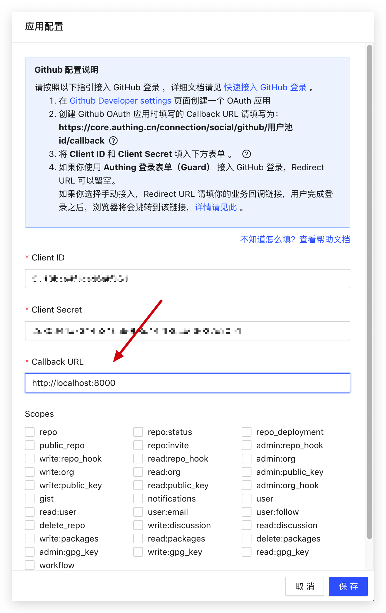

You need to set a callback link (Callback URL) on the configuration page of social login, and the user will be redirected to the callback address after logging in:



### Direct users to redirect to the social login authorization page

This method is only applicable to social login on the Web page. If you need to initiate a social login in the mobile App, please read the documentation of the relevant social login service provider.

This operation should be done in the browser. You can set a  button or Logo link on the Web page to the link above so that users can click to log in.

You need to stitch the following links in the following format, YOUR_APP_ID is your application ID (it is not the user pool ID):

`https://core.authing.cn/connection/social/<IDENTIFIER>?app_id=<YOUR_APP_ID>`

### Process {$localeConfig.brandName}} callback request

After the user agrees to the authorization in the previous step, it will redirect to the {{$localeConfig.brandName}} server first, and then {{$localeConfig.brandName}} will redirect to the business callback link configured by the developer in the {{$localeConfig.brandName}} console with the user information, with the following Get request parameters:

| Parameter                  | Description                                      | Disadvantages                                                | Recommend   |
|------------------------|-------------------------------------------|-----------------------------------------------------|------------|
| code                   | 200: success
other: failure |                                                     | Yes   |
| message                | Success or error message                            |                                                     | Yes   |
| data                   | userInfo, this parameter is not returned if code is not 200   | Cannot be embedded in your app                                | Yes   |

Some browsers and Web Servers may have a 404 when the URL is too long, such as ASP.NET. At this time, you need to modify the configuration. For details, [please refer to this StackOverflow answer](https://stackoverflow.com/questions/28681366/in-asp-net-mvc-would-a-querystring-too-long-result-in-404-file-not-found-error/28681600). 
The following is the code to get user data from URL parameters using JavaScript.

```javascript
// Get URL parameters
function getQueryString(name) {
  var reg = new RegExp("(^|&)" + name + "=([^&]*)(&|$)", "i");
  var r = window.location.search.substr(1).match(reg);
  if (r != null) {
    return unescape(r[2]);
  }
  return null;
}

// Convert Code to Int type to facilitate judgment
const code = parseInt(getQueryString("code"));

if (code !== 200) {
  // error
  const errorMsg = getQueryString("message");
  // Show errorMsg to users or perform other business...
} else {
  const userInfo = getQueryString("data");

  // Store token to localStorage
  // It is recommended to attach the Token to subsequent requests, and verify the validity of the Token by the backend
  localStorage.setItem("token", userInfo.token);
}
```
