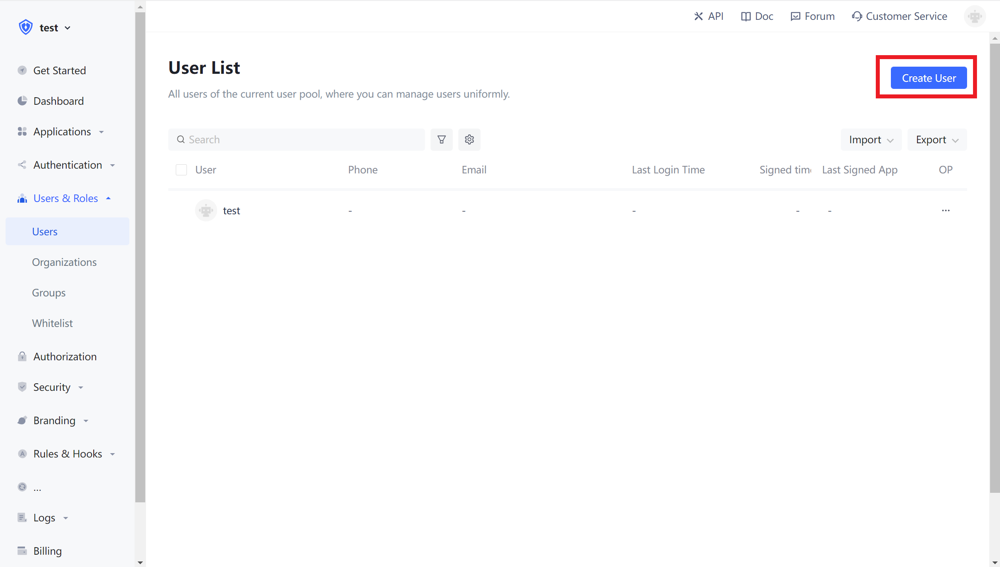
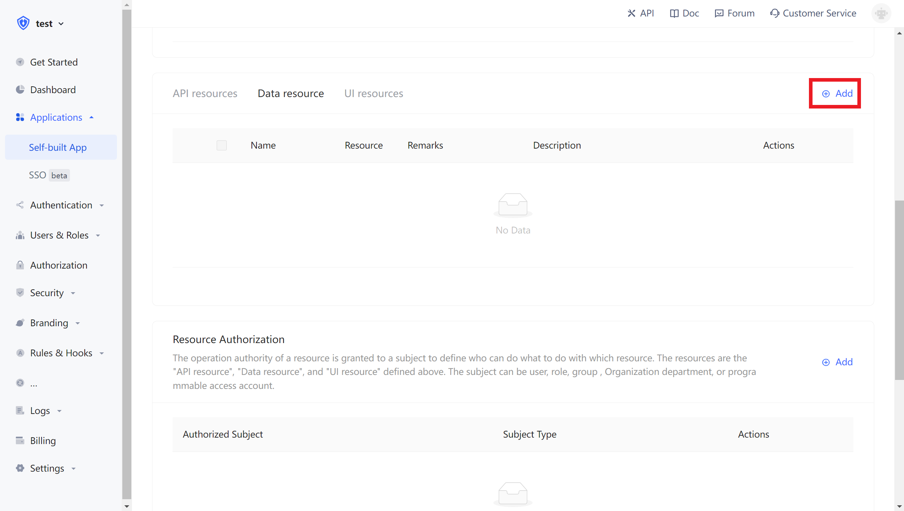
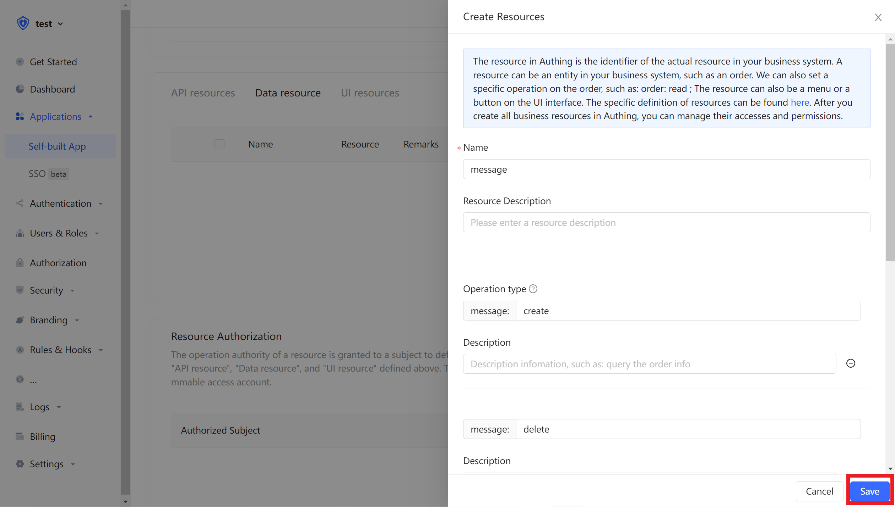
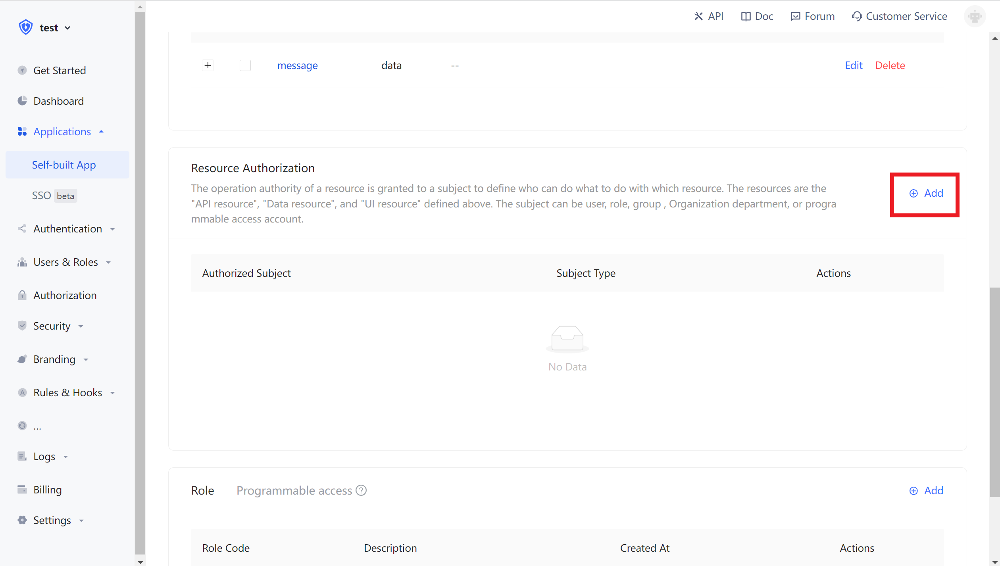
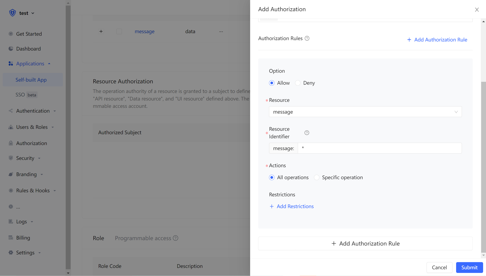
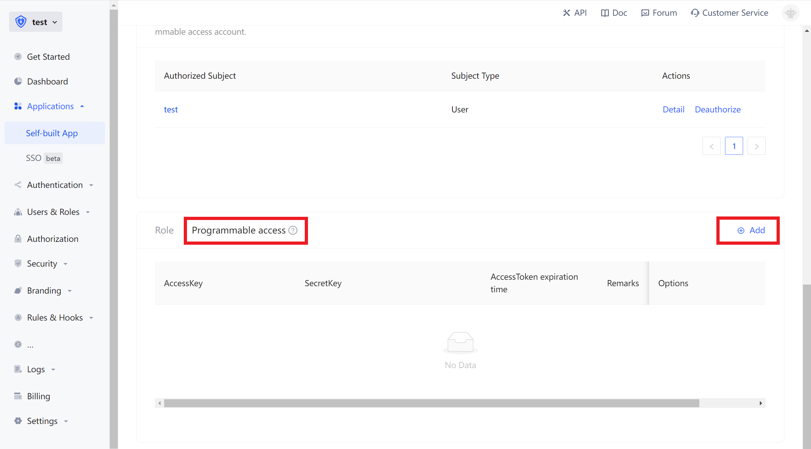
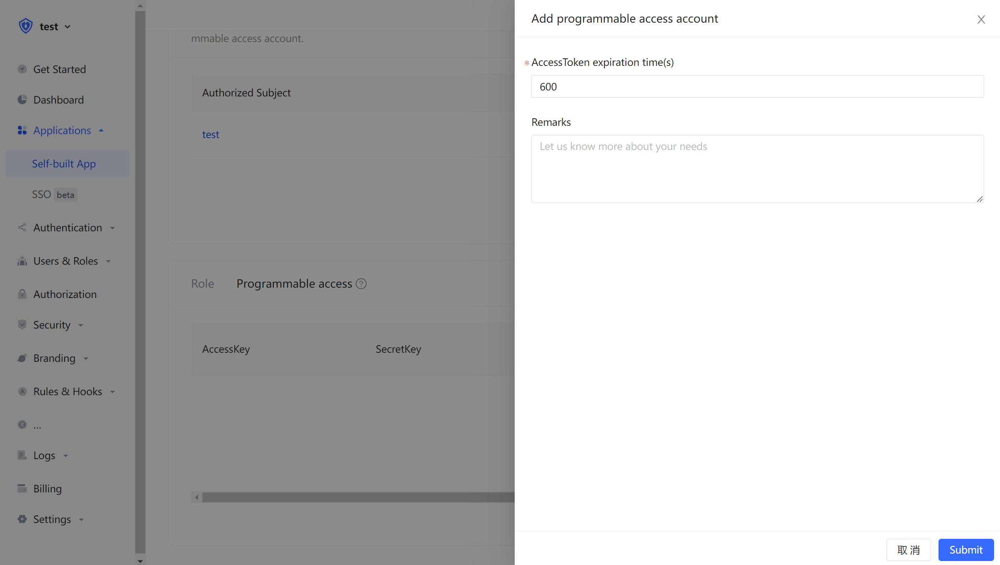
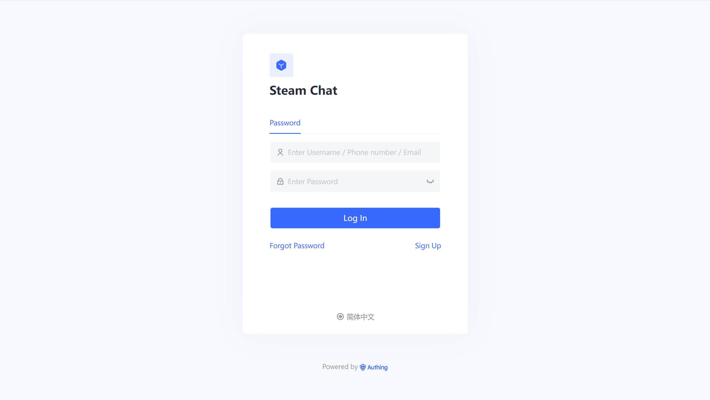
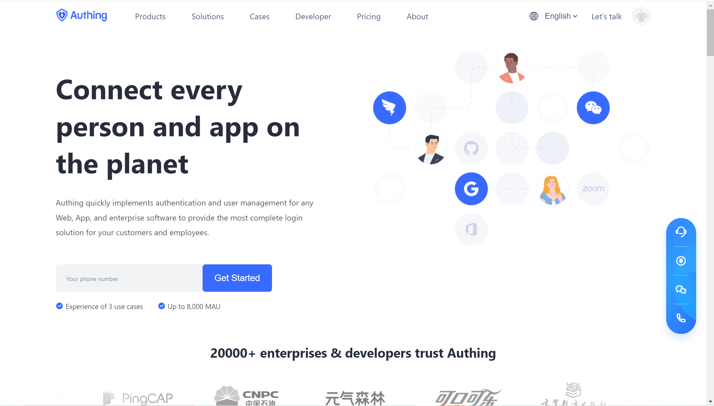

# User-consent, Inter-application Authorization

<LastUpdated/>

Assume your company is responsible for social communication business, and now another company wants to develop a tool for organizing and exporting chat records by calling your business API, and also has signed a contract with your company. Now that you want to authorize user information to this company safely, what you expect as follows:

11. API are only open to partner companies.
12. Different partners have different access rights, and the business APIs they can access are also different.
13. The partner company must **obtain the user's consent** before obtaining its own company's user data from the business API.
14. If the cooperation is finished in the future, or any changes occur, the certain data permissions can be withdrawn or disabled completely.

## Privilege Management and Distribution

Firstly, create two users in Authing, which are user1@123.com and user2@123.com respectively



Create an application in Authing. Suppose our social software is called "Steam Chat", then the application name is called "Steam Chat".


In the application details, click the Authorization tab, switch to the Data Resources tab, and then click Add.

> There are essentially no differences among API resources, data resources, and UI resources. The types are only used for distinction on the management level. Creating a good resource classification can improve administrators ' ability to quickly focus on different resources.



We create a chat data resource, define several operations for CURD (create, update, read, update), and finally click Save.



Then add authorization rules in **resource authorization**.



The **authorized subject** selects user1@123.com and user2@123.com, and selects chat data in the **resource type**, and then click OK.



Then we create a **programmable access account**, which will be handed over to the caller in the future.





If the programmable access account is deleted, the caller will lose the ability to obtain user authorization.

### AccessToken Expiration Time

When you create a programmable access account, you need to specify the AccessToken expiration time. Authing uses the RS256 signature algorithm to sign when issuing the AccessToken to ensure that the AccessToken will not be tampered with.

> Token signature is a part of JWT. For more information, please refer to [JWT Interpretation and Usage](/concepts/jwt-token.md).

RS256 is an asymmetric signature algorithm. Authing holds the private key to sign the Token, and consumers of JWT use the public key to verify the signature. RS256 signature algorithm has the following benefits:

1. Anyone can use the application public key to verify the signature, and the signing party must be Authing.
2. There is no risk of private key leakage. If you use HS256 but leak the application key, you need to refresh the key and redeploy all APIs. For more details on signature issues, please refer to [Verification Token](/guides/faqs/how-to-validate-user-token.md).

Next, we add resource permissions for users. On the **resource authorization** card, click Add.


Then we add all operation permissions for all message data for users user1@123.com and user2@123.com, and finally click OK.
At this point, the administrator's privileges management operations are all finished.

## Obtain a AccessToken with Permission

The caller needs to obtain resource authorization from the resource party through the **OIDC authorization code mode**. The user of the resource party will participate in the authorization process. After the user's authorization, Authing will issue an AccessToken with the authority scope and the subject is the resource holder. First, you need to splice the **authorization link**:

```http
https://{应用域名}.authing.cn/oidc/auth?client_id={应用ID}&response_type=code&scope=openid email message&redirect_uri={调用方业务地址}&state={随机字符串}
```

The parameter of scope can be filled with the **resources** and the **corresponding operations** defined in the above steps . The specific format is as follows.

### Scope Specification for Permission Term

Authing's scope permission terms are **separated by spaces**, and the format of each item is `resource identifier: resource operation`.

The following are all scope formats supported by Authing:

`book:1:read` Read permission for book resource number 1

`book:*:read`Read permissions for all book resources

`book:read` Read permissions for all book resources

`book:*:*` All operation permissions for all book resources

`book:*` All operation permissions for all book resources

`book` All operation permissions for all book resources

`*:*:*` All operation permissions for all resources

`*:*` All operation permissions for all resources

`*` All operation permissions for all resources

For example, the `message` resource and the `create` operation of the `message` resource are defined above, so `message:create` can be filled in the scope here.

The caller should guide the user to click on this link. After the user clicks, it will jump to the authentication page.



After the user logs in, he/she will jump to the business address of the caller, and carry the **authorization code** parameter in the URL.



Next, use the authorization code and the Key and Secret of the programmable access account to exchange for the user's AccessToken and IdToken. For more information about the OIDC authorization code mode, please check the [documentation](/authentication/oidc/oidc-authorization.md#Use 授权码模式-authorization-code-flow).


You can see that the user's AccessToken has the message permission scope. The **audience** (aud) of token is the **programmable access account Key**. The meaning of AccessToken is that the **caller** aud has the scope **permission** of the **resource owner** sub, and the **issuer** is iss. The resource party can perform permission verification based on the information in the AccessToken.


## Add Authentication Interceptor

After Authing defines the API, you need to add an **API authentication interceptor** to your actual business API interface. For protected resources, only visitors who carry a legal AccessToken and have the required permissions are allowed. The code example is as follows:

```javascript
var express = require("express");
var app = express();
var jwt = require("express-jwt");
var jwks = require("jwks-rsa");
var port = process.env.PORT || 8080;
var jwtCheck = jwt({
  secret: jwks.expressJwtSecret({
    cache: true,
    rateLimit: true,
    jwksRequestsPerMinute: 5,
    jwksUri: "https://{应用域名}.authing.cn/oidc/.well-known/jwks.json"
  }),
  audience: "{编程访问账号 ID}",
  issuer: "https://{应用域名}.authing.cn/oidc",
  algorithms: ["RS256"]
});
// 检验 AccessToken 合法性
app.use(jwtCheck);

app.post("/article", function(req, res) {
  // 检验 AccessToken 是否具备所需要的权限项目
  if (!req.user.scope.split(" ").incldues("write:article")) {
    return res.status(401).json({ code: 401, message: "Unauthorized" });
  }
  res.send("Secured Resource");
});

app.listen(port);
```

For other content about Token verification, please refer to [Verification Token](/guides/faqs/how-to-validate-user-token.md).
