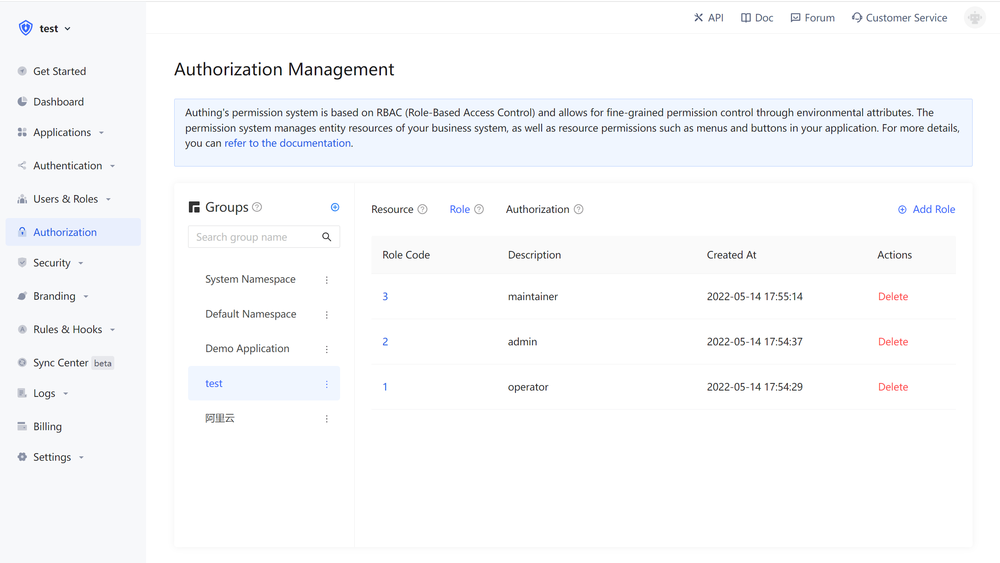
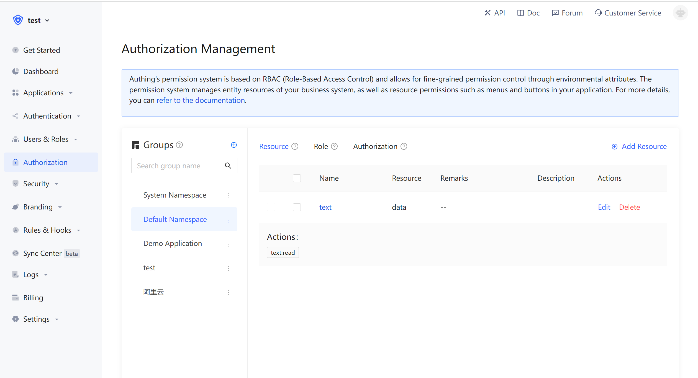
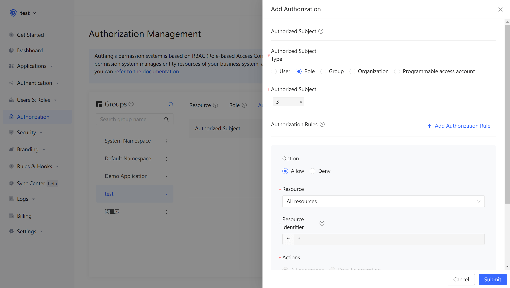

# How to implement access control

<LastUpdated/>

When you have built a user system, at some point your API needs to determine whether the current user can access the current resource. At this time you need to build your own access/privilege management system. A very important concept in this system is authorization. Authorization refers to the process of judging which privilege a user has. Authorization and authentication are two completely different concepts.

Currently, the two privilege models widely used by everyone are: role-based access control (RBAC) and attribute-based access control (ABAC). Both have their own advantages and disadvantages: The RBAC model is simpler to construct, but the disadvantage is that it is unable to authorize resources at a fine-grained level (authorize a certain type of resource instead of authorizing a specific resource). The construction of the ABAC model is relatively complicated and the learning cost is relatively high. The advantage lies in the fine-grained and dynamic execution according to the context.

In {{$localeConfig.brandName}} privilege system, we have implemented the role permission inheritance of the RBAC model through two objects: users and roles.On top of this, we can also dynamically and fine-grained authorization around attributes, thus realizing the ABAC permission model.At the same time, in order to meet the design requirements of complex organizational structures in large-scale systems, we combine resources, roles, and authorizations into one authorization group:


Based on {{$localeConfig.brandName}} powerful and flexible privilege system, you can quickly build a privilege model suitable for your business scenarios. Let's take a simple scenario in reality as an example.

## Privilege model introduction

### What is Role-based access control (RBAC)

Role-based access control (RBAC) refers to the authorizing related privilege through a user's Role. Simply speaking, this is more flexible, efficient, and extensible than directly granting user privileges.


When using RBAC, by analyzing the actual situation of system users, based on common responsibilities and needs, they are granted different roles. You can grant users one or more roles, and each role has one or more privileges. This relationship between user-role and role-privilege allows us to no longer need to manage every single user separately, and the user inherits the required privileges from the granted role.

Take a simple scenario (Gitlab's privilege system) as an example. There are three roles in the user system: Admin, Maintainer, and Operator. These three roles have different privileges. For example, only Admin has the privilege to create code warehouses and delete code warehouses. Other roles do not.


Not authorizing the users directly is for future extensibility consideration. For example, if there are multiple users with the same privilege, they must be assigned with the same privilege at first, and the privilege of these users must be modified one by one when modifying. With a role, we only need to assign different roles to different users after setting the privileges for the role, and then only need to modify the privileges of the roles to automatically modify the privileges of all users in the role.

### What is Attribute-Based Access Control (ABAC)

Attribute-Based Access Control (ABAC) is a flexible authorization model that uses one or a group of attributes to control whether there is authority to operate objects.ABAC attributes are generally divided into four categories: user attributes (such as user age), environment attributes (such as current time), operational attributes (such as READ) and object attributes (such as an article, also known as resource attributes), so theoretically it is possible to achieve very flexible privilege control:


Under the ABAC authorization model, you can easily implement the following privilege control logic:
1. Authorize (a user) the editing privilege to edit a specific book.
2. When the department of a document belongs to is the same as the department of a user, the user can access the document.
3. If the user is the owner of a document and the status of the document is draft, the user can edit the document.
4. Persons from Department A are prohibited from accessing System B before nine o'clock in the morning.
5. It is forbidden to access system A as an administrator in places other than Shanghai.

There are several common points in the above logic:
1. Specific to a certain resource rather than a certain type of resource.
2. Specific to a certain operation.
3. Dynamically executed the policy through the requested context (such as time, geographic location, resource tag).

In one word, **you can fine-grained authorization under which circumstances have a specific authority to a certain resource**.

## Authorization model introduction

{{$localeConfig.brandName}} supports two authorization modes:
1. Through the [authorization code mode](/v2/concepts/oidc/choose-flow#授权码模式) based on the OAuth 2.0 process.
2. Authorize and manage users through the privilege API.

## Implement the privilege model with the help of {{$localeConfig.brandName}} 

Let's take the mode of calling the privilege API as an example.

### Create roles

You can use the {{$localeConfig.brandName}}  console to create roles: In Privilege Management - Role Management, click the Add Role button:
- Role code: The unique identifier of the role, only allowed to use English letters, numbers, underscore _, dash -, here we fill in "admin".
- Role description: the description of the role, here we fill in "administrator".

Create three roles:



You can also use API & SDK to create roles. For details, see [Role Management SDK](/reference/sdk-for-node/management/RolesManagementClient.md).

### Grant role to users

On the role details page, you can grant this role to users. You can search for users by username, mobile phone number, email, or nickname:


After selecting a user, click OK, and you can view the list of users granted with this role.

You can also use API & SDK to grant roles to users. For details, see [Role Management SDK](/reference/sdk-for-node/management/RolesManagementClient.md).

### User-role management on the backend in back-end

After the user is successfully authenticated and the Token is obtained, you can parse the current user ID, and then you can use the API & SDK provided by us to get the role granted to the user on the backend. Here is an example with Node.js:

First get a list of all the roles that the user has been granted:

```javascript
import { ManagementClient } from "approw-js-sdk";

const managementClient = new ManagementClient({
  userPoolId: "YOUR_USERPOOL_ID",
  secret: "YOUR_USERPOOL_SECRET",
});
const { totalCount, list } = await managementClient.users.listRoles("USER_ID");
```

 After getting all the roles of the user, we can determine whether the user has the role of "devops":

```javascript
if (!list.map((role) => role.code).includes("devops")) {
  throw new Error("not authorized");
}
```

### Create resources

In the previous step, we managed privileges based on whether the user has a certain role. This privilege management is relatively coarse-grained, because it only judges whether the user has a certain role, but does not judge whether it has a specific privilege. Based on the role-based access control model (RBAC), {{$localeConfig.brandName}} can also perform more fine-grained authorization around resources.

You can abstract some objects of the system as resources, and some operations can be defined using these resources. For example, in the scenario of this article, Repository, Tag, PR, Release Notes are all resources, and these resources have corresponding operations:

- Repository: create, delete, etc. 
- PR: Enable, comment, merge, etc. 
- Tag: create, delete, etc. Release 
- Notes: Create, read, edit, delete, etc.

We can create these resources in {{$localeConfig.brandName}}:



### Grant roles privileges to operate resources

And {{$localeConfig.brandName}} also supports authorization to users and roles. If a user is in a role, he will also inherit the authorized privileges of this role. Therefore, {{$localeConfig.brandName}} can not only implement the standard RBAC permission model, but also can perform more fine-grained and more dynamic privilege control on this basis. In the following example, we grant the "Create" and "Delete" privileges of the "repository" resource to the "admin" role:



### Determine whether the user has privilege on the backend

In the previous step, through resource authorization, we granted a user (or role) to have a specific operation authority for a specific resource. When we perform interface authentication on the backend, we can implement more fine-grained judgments:

First, initialize management SDK:

> Here we take Node SDK as an example. We also support SDKs in languages such as Python, Java, C#, PHP, etc. For details, please click [here](/reference/).

```javascript
import { ManagementClient } from "authing-js-sdk";

const managementClient = new ManagementClient({
  userPoolId: "YOUR_USERPOOL_ID",
  secret: "YOUR_USERPOOL_SECRET",
});
```

 Call the `managementClient.acl.isAllowed` method, the three parameters are:

- userId: User ID, the user can be directly authorized to operate on a specific resource, or can inherit the authorized permissions of the role. 
- resource: Resource identifier. For example, `repository:123` represents the code repository with ID 123, and `repository:\*` represents the resource of the code repository. 
- action: a specific operation, such as `repository:Delete` means deleting the code warehouse.

```javascript
const { totalCount, list } = await managementClient.acl.isAllowed(
  "USER_ID",
  "repository:123",
  "repository:Delete"
);
```

The {{$localeConfig.brandName}} strategy engine will dynamically execute the strategy according to the privilege strategy you configure, and finally return true or false. You only need to determine whether the user has operation privilege based on the return value.

## Summary

This article starts with the simplest RBAC permission model, and then realizes how to carry out a more fine-grained and dynamic ABAC privilege model, and the whole process is gradual. You can gradually migrate to the ABAC privilege model as the complexity of your business continues to grow.
