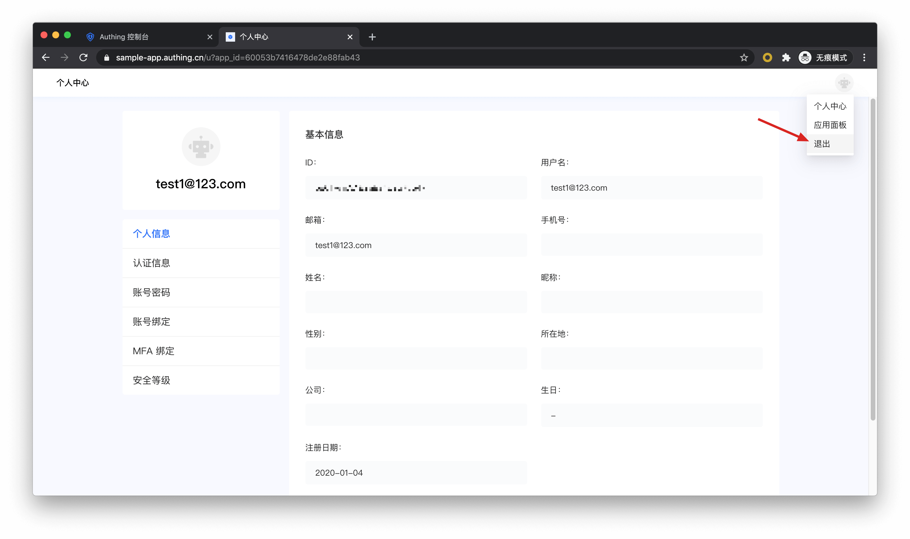
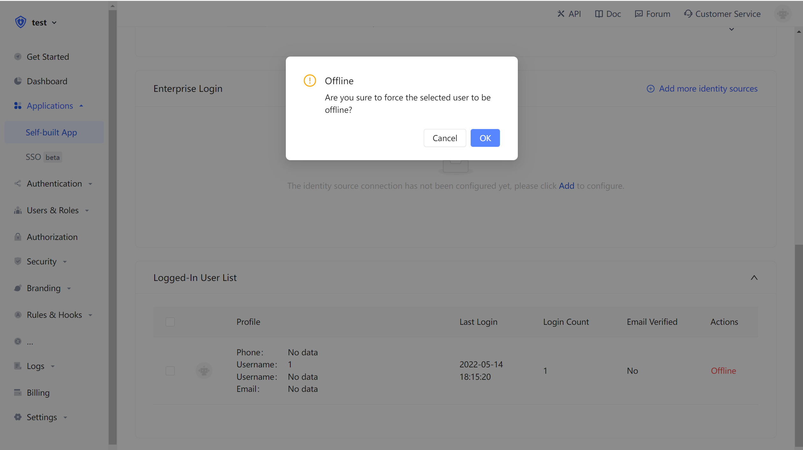

# how to log out

<LastUpdated/>

Approw supports multiple methods of logging out:

- [Log out from the personal center](#Log out from the personal center): This method is suitable for you to use the online personal center hosted by Approw.
- [Log out from the front end](#Log out from the front end): This method is suitable for almost any scenario.
- [Log out from the back end](#Log out from the back end): This method is suitable for scenarios where the administrator calls the API to force users to get offline.
- [Force users to log out](Force users to log out): This method is suitable for scenarios where the administrator uses the console to force users to get offline.

## Log out from the personal center

An end user can visit `https://{application_domain_name}.approw.com/u` to enter the personal center, click on the avatar in the upper right corner, and click logout.



## Log out from the front end

Guide your end users to visit `https://{application_domain_name}.approw.com/login/profile/logout?redirect_uri={{CALLBACK_URL}}` to logout. `redirect_uri` can be filled in with a callback address after logging out. For example, you can redirect the user to your business homepage.

> Attention ⚠️: you need to use encodeURIComponent to do URI encode operation on the callback link.

## Log out from the back end

If you need to log out an Approw user on the backend, you need to use the following interface: 

- Interface description: The user pool administrator logs out the Approw user on the backend.
- Interface：`POST` `https://<YOUR_APP_NAME>.authing.cn/api/v2/applications/:appId/kick-active-users`
- Request parameters: 

| Parameters | Type    | Required | Description           |
| ------- | -------- | -------- | -------------- |
| userIds | string[] | Yes       | User ID array |
| appId   | string   | Yes       | Application ID      |

- Return data：

```json
{
  "code": 200,
  "message": "forced logout success"
}
```

## Force users to log out

User pool administrator can force users to log out through **console** > **application** > **login status administration**.


