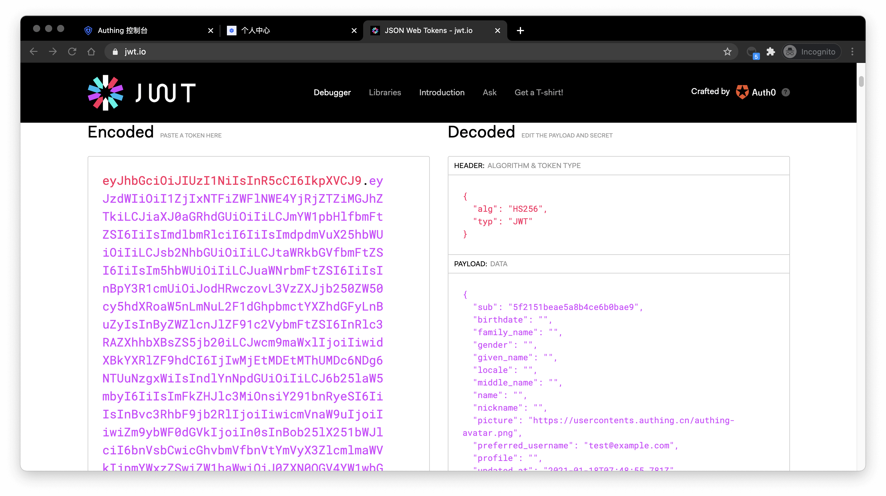

# Use API & SDK to authenticate

<LastUpdated/>

In the previous guide, you have learned how to [use the login page hosted by {{$localeConfig.brandName}}](../use-hosted-login-page.md) and the [embedded login component](../use-embeded-login-component/README.md) to implement the login and registration process. Not only that, we also provide HTTP APIs in two forms, RESTful and GraphQL, and SDKs in more than ten different languages and frameworks. You can flexibly build the authentication process you need based on combining these API & SDK resources.

## Choose the SDK you are familiar with

!!!include(common/sdk-list.md)!!!

## Initialize SDK

<StackSelector snippet="init-sdk" selectLabel="Language" :order="['java', 'javascript', 'swift', 'python', 'csharp']"/>

## Use SDK to authenticate users

Take the SMS code login (if the user account does not exist, an account will be created first) as an example:

First, send a SMS verification code:

<StackSelector snippet="send-sms-code" selectLabel="Language" :order="['java', 'javascript', 'swift', 'python', 'csharp']"/>

And then, use the SMS code to login.

<StackSelector snippet="login-by-phone-code" selectLabel="Language" :order="['java', 'javascript', 'swift', 'python', 'csharp']"/>

After successfully logging in, you can get the user's information. The `token` field in user information is the identity credential. In the following steps, you need to carry it in requests when you want to access back-end resources. The back end will verify this `token`.

## Verify user token

The `token` field of the user information is a standard OIDC IdToken. You can use the [Application ID and Secret](/guides/faqs/get-app-id-and-secret.md) to validate this `token` on the backend.

An example of `token` is like this:

```
eyJhbGciOiJIUzI1NiIsInR5cCI6IkpXVCJ9.eyJzdWIiOiI1ZjIxNTFiZWFlNWE4YjRjZTZiMGJhZTkiLCJiaXJ0aGRhdGUiOiIiLCJmYW1pbHlfbmFtZSI6IiIsImdlbmRlciI6IiIsImdpdmVuX25hbWUiOiIiLCJsb2NhbGUiOiIiLCJtaWRkbGVfbmFtZSI6IiIsIm5hbWUiOiIiLCJuaWNrbmFtZSI6IiIsInBpY3R1cmUiOiJodHRwczovL3VzZXJjb250ZW50cy5hdXRoaW5nLmNuL2F1dGhpbmctYXZhdGFyLnBuZyIsInByZWZlcnJlZF91c2VybmFtZSI6InRlc3RAZXhhbXBsZS5jb20iLCJwcm9maWxlIjoiIiwidXBkYXRlZF9hdCI6IjIwMjEtMDEtMThUMDc6NDg6NTUuNzgxWiIsIndlYnNpdGUiOiIiLCJ6b25laW5mbyI6IiIsImFkZHJlc3MiOnsiY291bnRyeSI6IiIsInBvc3RhbF9jb2RlIjoiIiwicmVnaW9uIjoiIiwiZm9ybWF0dGVkIjoiIn0sInBob25lX251bWJlciI6bnVsbCwicGhvbmVfbnVtYmVyX3ZlcmlmaWVkIjpmYWxzZSwiZW1haWwiOiJ0ZXN0QGV4YW1wbGUuY29tIiwiZW1haWxfdmVyaWZpZWQiOmZhbHNlLCJkYXRhIjp7InR5cGUiOiJ1c2VyIiwidXNlclBvb2xJZCI6IjVhOWZhMjZjZjg2MzVhMDAwMTg1NTI4YyIsImFwcElkIjoiNjAwNTNiNzQxNjQ3OGRlMmU4OGZhYjQzIiwiaWQiOiI1ZjIxNTFiZWFlNWE4YjRjZTZiMGJhZTkiLCJ1c2VySWQiOiI1ZjIxNTFiZWFlNWE4YjRjZTZiMGJhZTkiLCJfaWQiOiI1ZjIxNTFiZWFlNWE4YjRjZTZiMGJhZTkiLCJwaG9uZSI6bnVsbCwiZW1haWwiOiJ0ZXN0QGV4YW1wbGUuY29tIiwidXNlcm5hbWUiOiJ0ZXN0QGV4YW1wbGUuY29tIiwidW5pb25pZCI6bnVsbCwib3BlbmlkIjpudWxsLCJjbGllbnRJZCI6IjVhOWZhMjZjZjg2MzVhMDAwMTg1NTI4YyJ9LCJ1c2VycG9vbF9pZCI6IjVhOWZhMjZjZjg2MzVhMDAwMTg1NTI4YyIsImF1ZCI6IjYwMDUzYjc0MTY0NzhkZTJlODhmYWI0MyIsImV4cCI6MTYxMjE2NTg4OCwiaWF0IjoxNjEwOTU2Mjg4LCJpc3MiOiJodHRwczovL3NhbXBsZS1hcHAuYXV0aGluZy5jbi9vaWRjIn0.SNyGBffF-zBqDQFINGxUJZrWSAADHQhbEOsKvnH4SLg
```

You can decode this IdToken in [this website](https://jwt.io/):



Basically all languages provide libraries for validating IdToken. You can choose the language you are familiar with:

<StackSelector snippet="verify-id-token" selectLabel="Language" :order="['java', 'javascript', 'swift', 'python', 'csharp']"/>

If the validation is successful, you can get the user information of the `id_token`, where the `sub` field is the user ID, and the `aud` field is the application ID. You can click [here](/concepts/id-token.md) to understand the detailed definition of each field of IdToken.

## Next

After identifying the user, you may also need to perform [privilege management on the user](/guides/access-control/) to determine whether the user has privilege to operate on this API.
