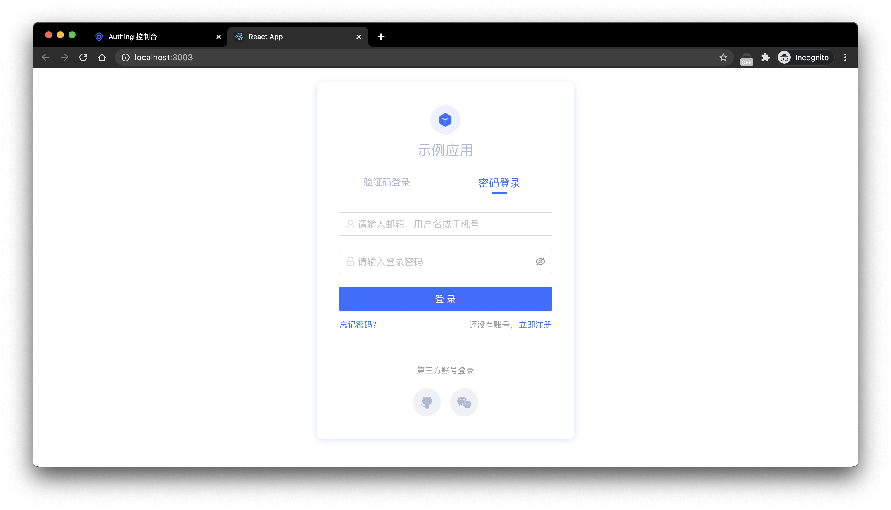
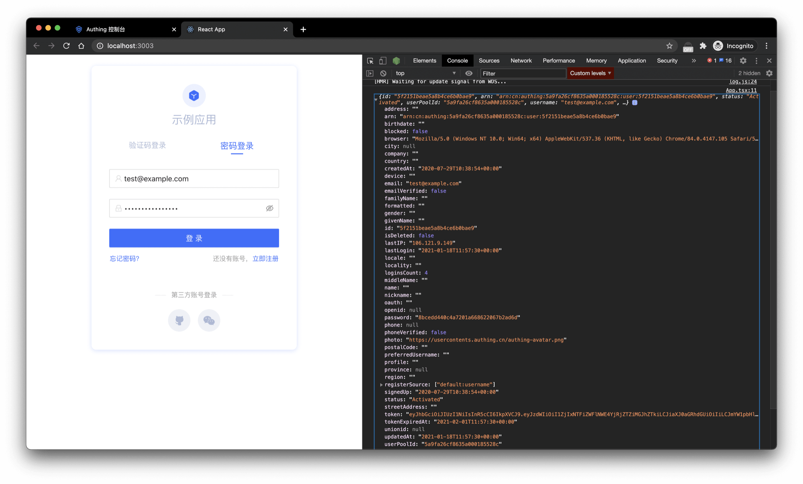

### Install

It is recommended to use `create-react-app` to initialize a React project

```shell
npx create-react-app first-approw-app --template typescript
```

And then, install `@approw/react-ui-components` SDK:

```shell
yarn add @approw/react-ui-components
```

Or:

```
npm install @approw/react-ui-components --save
```

### Initialize

You need to import `ApprowGuard` from `@approw/react-ui-components`. Initializing `ApprowGuard` requires only one parameter-your application ID (appId). You can get the appId of the application on the application list page of the console.

```javascript
import { ApprowGuard } from "@approw/react-ui-components";
import "@approw/react-ui-components/lib/index.min.css";

function App() {
  return (
    <div className="App">
      <ApprowGuard appId="APPROW_APP_ID" />
    </div>
  );
}
```

Approw Guard will automatically pull the configuration of the application, such as name, logo, etc., from the server.Refresh the page and an embedded login form is displayed:



Next, let's monitor user login events, and obtain user information after the user logs in successfully.

### Monitor login success event

It is simple. You only need to pass a callback `onLogin`.

```javascript
function App() {
  return (
    <div className="App">
      <ApprowGuard
        appId="APPROW_APP_ID"
        onLogin={(userinfo) => {
          console.log(userinfo);
        }}
      />
    </div>
  );
}
```

 Here we can use `console.log` to show user information:



The `token` field in user information is the identity credential. In the following steps, you need to carry it in requests when you want to access back-end resources. The back end will verify this `token`.