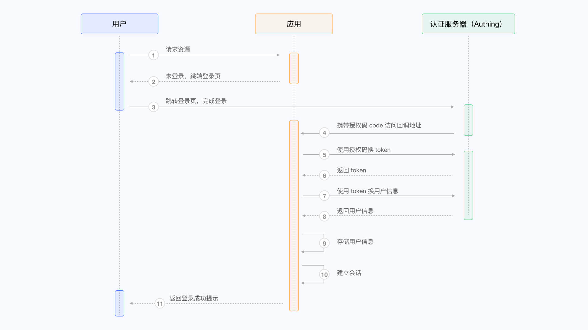
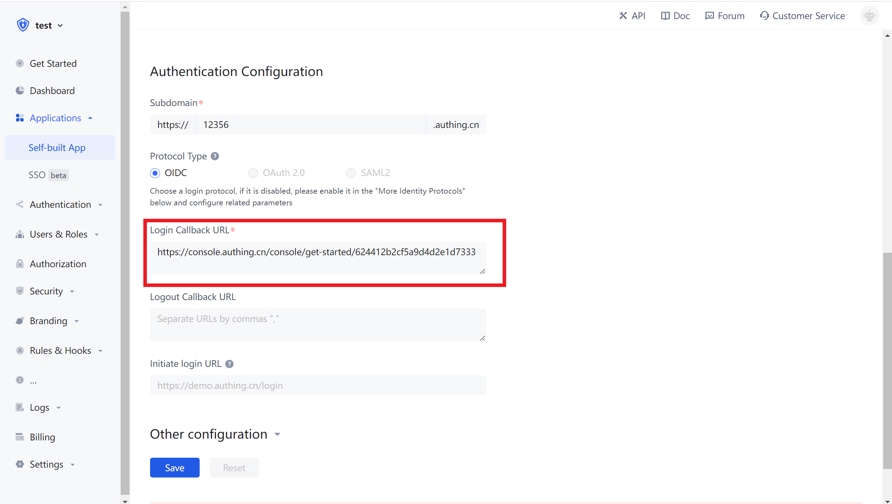
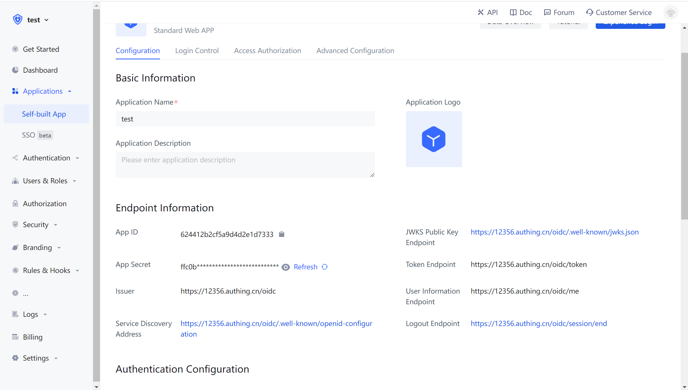
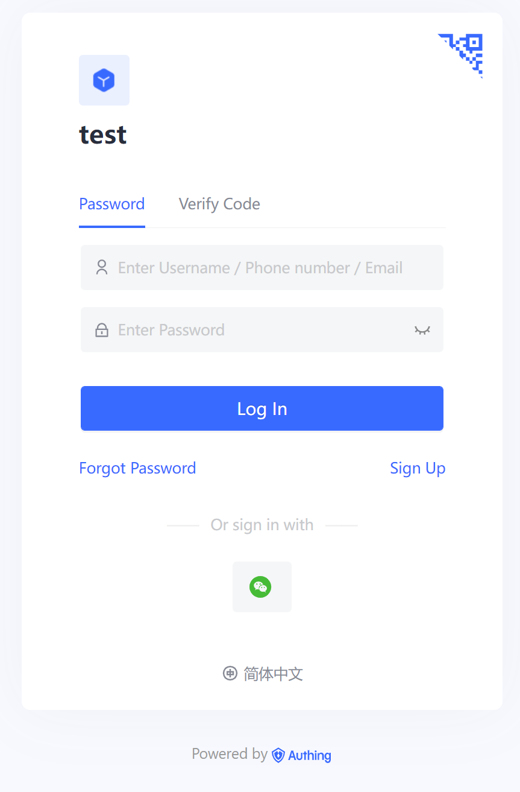
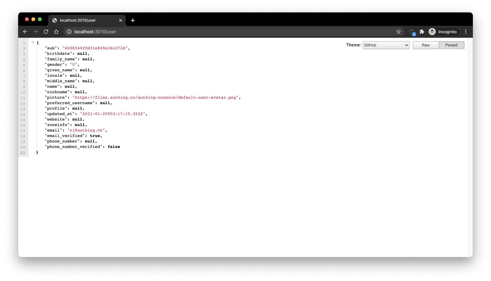
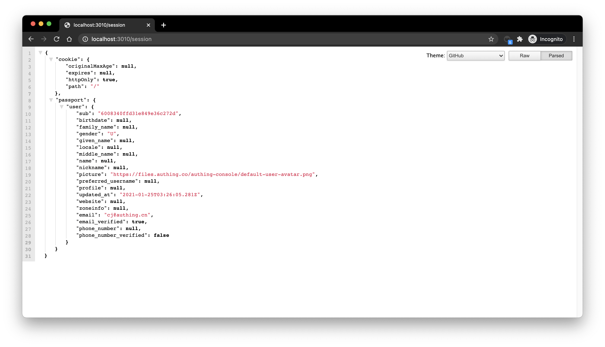

# Integrate Authing with regular Web App

<LastUpdated/>

This article uses the Node.js Web framework [Express](https://expressjs.com/) as an example to introduce how to quickly access Authing in regular Web projects (such as Express MVC, Django, PHP Laravel, etc.) to achieve functions such as login, logout, and user information acquisition.

There are three parties involved here: end users, application servers, and Authing servers. The complete flow is as follows:

1. The user requests the application service and it turns out that the user is not logged in, so the request will be redirected to the login page hosted by Authing;
2. After the user logs in on this login page, the browser will carry the Authorization Code and other data in the request parameters to jump to the callback link pre-configured by the application server;
3. The application server uses the authorization code (Authorization Code) to request the Authing server in exchange for user information;
4. After the application server obtains the user information, it establishes a session with the end user;
5. The terminal user is prompted with a successful login, and the authentication workflow is completed.

The flow chart shows as below:



## Configure in Authing

Before starting, you need to create an application in Authing. You can go to the application list page of the Authing console to create an application.

### Configure a callback link

When the user successfully logs in in Authing, the browser will jump to the Callback URL you configured. This callback link should be a route in your application, and you need to complete operations such as exchanging user information in this route. You must configure this callback link, otherwise the user will not be able to log in, and an error message `invalid_redirect_uri` will be displayed.

The callback URL of this sample code is: `http://localhost:3000/auth/callback`, copy and paste it into login callback URL configuration, and click save.



### Configure logout callback URL

When user logout at Authing hosted login page, you need to configure the callback URL of logging out: Logout URLs. You must configure this callback URL otherwise user can not log out and get a `misconfiguration` error.
The callback URL of this sample code is: `http://localhost:3000`, copy and paste it into logout callback URL configuration, and click save.

### Get application ID and secret

In the end, you need to copy and save these information:

- clientId: application ID
- clientSecet: application secret.
- Issuer URL: https://sample-app.authing.cn/oidc

## Integrate Authing to your system

### Install dependencies

You need to install [openid-client](http://github.com/panva/node-openid-client) and [passportjs](http://www.passportjs.org/) that support the standard OIDC protocol. Java developers can use [spring-security](https://spring.io/projects/spring-security) of the Spring framework. [Please refer to the documentation for the detailed integrating process](/frameworks/spring-security/).

```bash
yarn add express express-session passport openid-client
```

### Initialize

At the very beginning of the project, we need to initialize the `issuer` of `openid-client`. The initial parameters are as follows:

- client_id: OIDC Client ID, which is your [application ID](/guides/faqs/get-app-id-and-secret.md) in Authing;
- client_secret: OIDC Client Secret, which is [the secret key of your application](/guides/faqs/get-app-id-and-secret.md) in Authing;
- issuer: OIDC Issuer, you can get it from the endpoint information of the application.



For demonstration purposes, the `user` in `passport.serializeUser` is directly passed to the callback function `done`, which will store the user information in `req.session.passport.user`. This is not recommended in a formal production environment, because if the user information is modified but the session is not updated, it will cause data inconsistency. The second parameter passed by `passport.deserializeUser` to the callback function `done` will be mounted on `req.user`. If you don't know enough about [passport.js](http://www.passportjs.org), it is recommended to read [the official document](http://www.passportjs.org/docs/) first.

```javascript
passport.serializeUser(function(user, done) {
  console.log("serializeUser", user);
  done(null, user.sub);
});
passport.deserializeUser(function(userId, done) {
  console.log("deserializeUser", userId);
  done(null, userId);
});
```

The detailed sample code is as follows:

```javascript
const express = require("express");
const session = require("express-session");
const passport = require("passport");
const { Strategy, Issuer } = require("openid-client");

const OIDC_CLIENT_ID = "YOUR_APPLICATION_ID";
const OIDC_CLIENT_SECRET = "YOUR_APPLICATION_SECRET";
const OIDC_ISSUER = "YOUR_OIDC_ISSUER";
const REDIRECT_URI = "http://localhost:3000/auth/callback";

(async () => {
  const issuer = await Issuer.discover(OIDC_ISSUER);
  const client = new issuer.Client({
    client_id: OIDC_CLIENT_ID,
    client_secret: OIDC_CLIENT_SECRET,
    id_token_signed_response_alg: "HS256",
    token_endpoint_auth_method: "client_secret_post"
  });

  passport.use(
    "oidc",
    new Strategy(
      {
        client,
        params: {
          redirect_uri: REDIRECT_URI,
          scope: "openid profile email phone",
          grant_type: "authorization_code",
          response_type: "code"
        }
      },
      (tokenset, userinfo, done) => {
        return done(null, userinfo);
      }
    )
  );

  passport.serializeUser(function(user, done) {
    done(null, user);
  });
  passport.deserializeUser(function(user, done) {
    done(null, user);
  });

  const app = express();
  app.use(
    session({
      secret: "secret",
      resave: true,
      saveUninitialized: true
    })
  );
  app.use(passport.initialize());
  app.use(passport.session());
  app.listen(3010, () =>
    console.log(`Example app listening at http://localhost:3010 🚀`)
  );
})();
```

### Finish logic code of logging in

First we initialize a login route:

```javascript
app.get("/login", passport.authenticate("oidc"));
app.get(
  "/auth/callback",
  passport.authenticate("oidc", {
    successRedirect: "/user",
    failureRedirect: "/403"
  })
);
```

When calling `passport.authenticate` when accessing `/login`, the system will redirect to the online login address of Authing OIDC Provider:



After logging in using any of these login methods, the browser will redirect to `http://localhost:3000/auth/callback` (this is the callback link configured in the application details in the first step). Here, the user information will be obtained from the Authing server. After obtaining the user information successfully, it will redirect to the `/user` route.

### Finish logic code of showing user information

Next, let's implement the logic of `/user` routing. The user information will be mounted on `req.user` after the user logs in successfully, so here we add the following simple logic:

```javascript
app.get("/user", (req, res) => {
  res.send(req.user);
});
app.get("/session", (req, res) => {
  res.send(req.session);
});
```

Visit `/user` to see the user information of the currently logged in user:



Visit `/session` to see the `session` of the currently logged in user:



### Finish logic code of logging out

Finally, we implement the logout logic:

1. First, clear the current application `session` through `req.session.destroy()`;
2. Redirect to the logout link of the OIDC application.

```javascript
const OIDC_LOGOUT_URL = "{{YOUR_APP_DOMAIN}}/login/profile/logout";
const LOGOUT_REDIRECT_URL = "http://localhost:3000";
app.get("/logout", (req, res) => {
  req.session.destroy();
  const logoutUrl = `${OIDC_LOGOUT_URL}?app_id=${OIDC_CLIENT_ID}&redirect_uri=${LOGOUT_REDIRECT_URL}`;
  res.redirect(logoutUrl);
});
```
