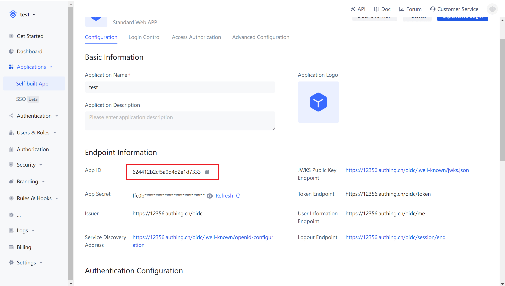

# Integrate Authing with Single Page Application

<LastUpdated/>

Single Page Application (SPA) refers to a Web application or website model that interacts with users by dynamically rewriting the current page, rather than traditionally reloading the entire new page from the server. This method avoids switching between pages to interrupt the user experience, making the application more like a desktop application. In a single-page application, all necessary codes (HTML, JavaScript, and CSS) are retrieved through the loading of a single page, or appropriate resources are dynamically loaded and added to the page as needed (usually in response to user actions). Interaction with single-page applications usually involves dynamic communication with back-end servers.

The easiest way to access Authing in SPA applications is to use [the embedded login component](/reference/guard/) and [Javascript SDK](/reference/sdk-for-node/) provided by Authing for login and authentication. This article takes the React project as an example.

## Get APP ID

After logging in to Authing, Authing will create a default user pool and application for you. You can also create your own application. In the application details, you can get the application ID and click the copy button:



## Integrate Authing in your SPA

### Install Authing login component

```bash
yarn add @authing/react-ui-components

 # OR

npm i @authing/react-ui-components --save
```

`@authing/react-ui-components` has some React components provided by Authing and APIs for obtaining [AuthenticationClient](/sdk/sdk-for-node/authentication/AuthenticationClient), including the [AuthingGuard](/reference/guard/) login component.

### Configure AuthingGuard

```js
import React from "react";
import ReactDOM from "react-dom";
import { AuthingGuard } from "@authing/react-ui-components";
// import css file
import "@authing/react-ui-components/lib/index.min.css";

const App = () => {
  const appId = "AUTHING_APP_ID";

  // successfully login
  const onLogin = userInfo => {
    console.log(userInfo);
    // redirect to other page here
    // ...
  };

  return <AuthingGuard appId={appId} onLogin={onLogin} />;
};

ReactDOM.render(<App />, root);
```

By passing in the `appId` and `AuthingGuard`, it can display the login box.

### Logout

Now you can log in, and you need to implement a method for users to log out, which can be achieved through [AuthenticationClient](/sdk/sdk-for-node/authentication/AuthenticationClient).

```js
// src/index.js

import { initAuthClient } from "@authing/react-ui-components";
// initialize AuthenticationClient in project entry
initAuthClient({
  appId: "YOUR_APP_ID"
});
```

```js
import React from "react";
import { getAuthClient } from "@authing/react-ui-components";

const LogoutButton = () => {
  return <button onClick={() => getAuthClient().logout()}>logout</button>;
};

export default LogoutButton;
```

### Get user information

After the user logs in, you may also need to obtain the user information of the currently logged-in user.

```js
// src/index.js

import { initAuthClient } from "@authing/react-ui-components";
// initialize AuthenticationClient in project entry
initAuthClient({
  appId: "YOUR_APP_ID"
});
```

```js
import React, { useState, useEffect } from "react";
import { getAuthClient } from "@authing/react-ui-components";

const UserInfo = () => {
  const [user, setUser] = useState();
  const [isAuthenticated, setIsAuthenticated] = useState(true);

  useEffect(() => {
    getAuthClient()
      .getCurrentUser()
      .then(userInfo => {
        if (userInfo) {
          setUser(userInfo);
        } else {
          setIsAuthenticated(false);
        }
      });
  }, []);

  return isAuthenticated ? (
    user ? (
      <div>
        
        <h2>{user.username}</h2>
        <p>{user.email}</p>
      </div>
    ) : (
      <div>Loading...</div>
    )
  ) : (
    <h3>not logged in yet</h3>
  );
};

export default UserInfo;
```

`getCurrentUser` can get the information of the currently logged in user. If not logged in, it will return `null`.
