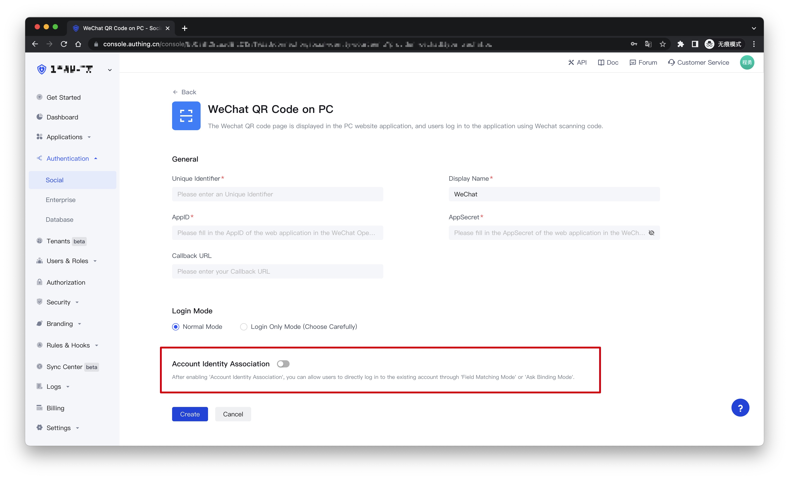
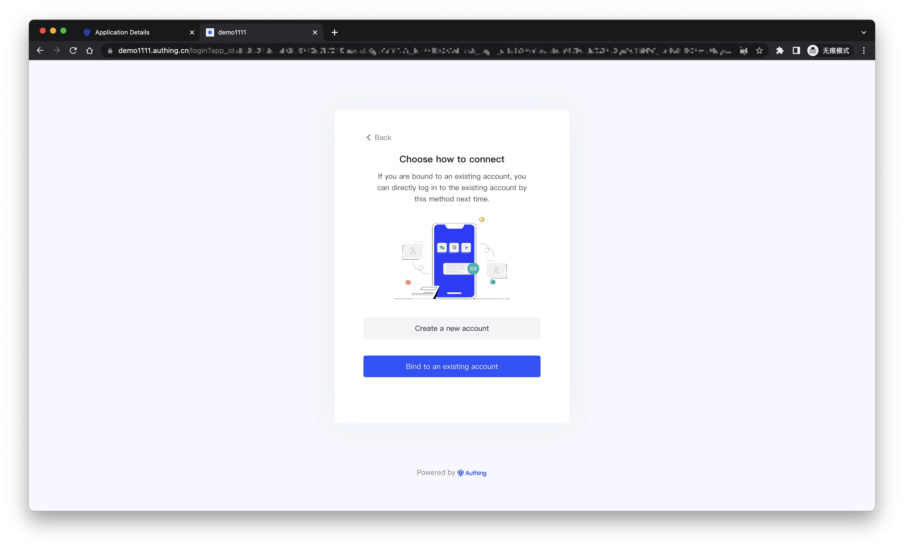
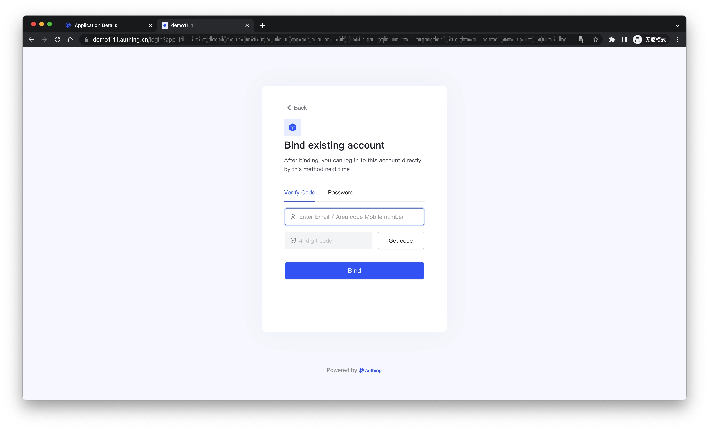

# Account Associations for Identity Provider Connections

<LastUpdated/>

Use the 'Identity Provider Connection Account Association' feature to enable your users to log in directly to existing accounts when logging in using the social and enterprise identity sources you configure. You can see the associated configuration items when creating an identity source connection.

## Features

Currently, the identity source connections supported by this feature are:

- Wechat
  - WeChat QR Code on PC
  - Wechat Official Accounts QR Code
- QQ
- Weibo

This feature of other identity provider is being tested and will be gradually opened, please look forward to.

## Instructions

When the **Account Identity Association** is not open, a new user is created in the user pool by default when the user logs in through the identity source for the first time.

If **Login Only** is turned on, the user who logged in with the identity source for the first time will not be able to complete the login, and only older users will be able to log in with the identity source.

When you open **Account Identity Association**, you can select the user's 'Identity Source Account Association Method', which allows the user to log in directly to an existing account via 'Field Match' or 'Ask Binding'.

It is important to note that Authing supports 'Account Matching' for identity source connections that can only be accessed to user mobile phone numbers and mailboxes, as detailed in: [Account Matching Rules for Identity Source Connections | Authing Documents](./user-mapping.md)

If you choose **Ask Binding** to associate with the account of the identity provider, you need to configure the binding that the user can use on the 'Ask Binding' page.

## User Journey

After the Author console completes the relevant configuration for the query binding, your user is prompted to choose whether to 'Create a New Account' or 'Bind to an Existing Account' when logging in using an identity source.

If a user chooses 'I want to create a new account', a new user is created in the user pool. If the user chooses 'I want to bind to an existing account', it jumps to the following page:

Your user can enter existing account information here, and after clicking 'Bind', the source of identity used for this login will be bound to the existing account as a login method. Users can log in to the same account directly through this identity source login in subsequent use.

In addition, the currently applied 'Login Protocol', 'Security Settings', and other configurations will still take effect on the Account Binding page, continuing to protect the user's login process.
