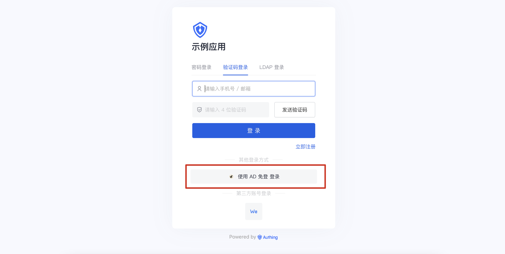

# AD Quick Login

<LastUpdated/>

## Introduction

- **Overview**: AD quick login is a function of logging in directly in the AD domain without the need for an account and password, implemented using the Kerberos protocol. Kerberos support is built into all major computer operating systems, including Microsoft Windows, Apple macOS, FreeBSD, and Linux.
- **Application Scenario**: Enterprise PC No Logon Scenario
- **End User Preview**:

## Caution

- Windows Domain Controller, Schema Windows 2003 or above
- A certificate trusted by the Windows terminal CA in the domain is required to achieve a high network security environment (SSL/TLS)
- Need to create a system account in the domain (no permissions required)
- Requires Domain Admin execute command privileges on DC
- Requires an intranet fixed IP address
- Requires a DNS A/CNAME record to be created within the domain
- Need to add a Domain Group Policy domain trust policy (enable Windows automatic login, domain trusted addresses)
- One of the following environments is required to install the Authing intra-domain proxy service:
  - Virtual Machine (ESXi)
  - Docker
- If you do not have a {{$localeConfig.brandName}} console account, please go to [ {{$localeConfig.brandName}}Console console](https://authing.cn/) to register a developer account;

## Configuration Steps

The specific configuration steps are complicated, please contact Authing after-sales service personnel for assistance in configuration.
