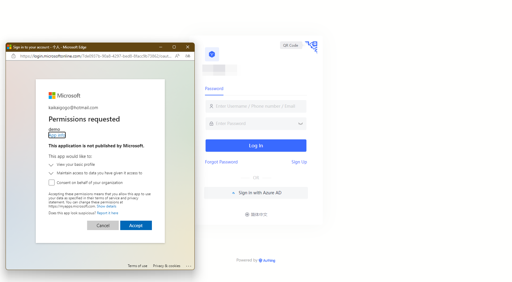
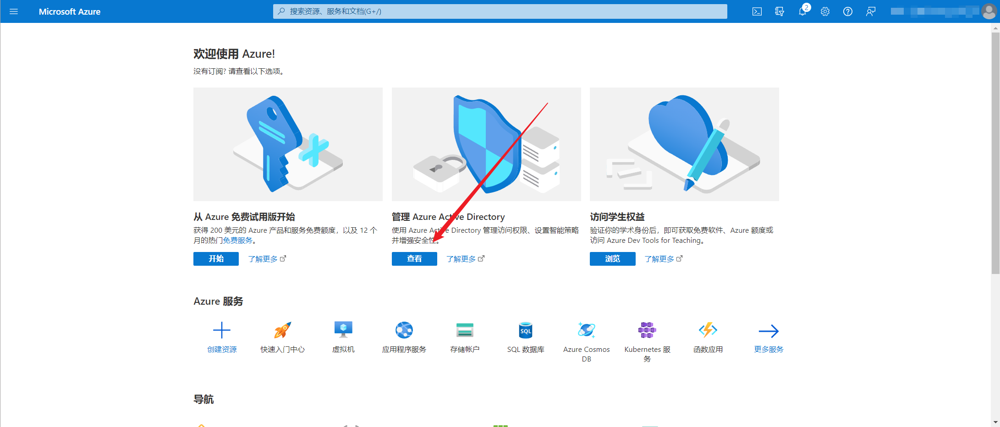
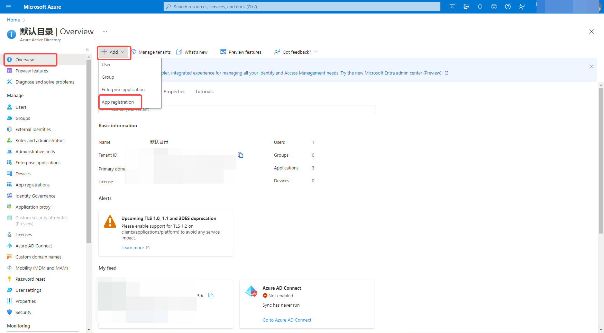
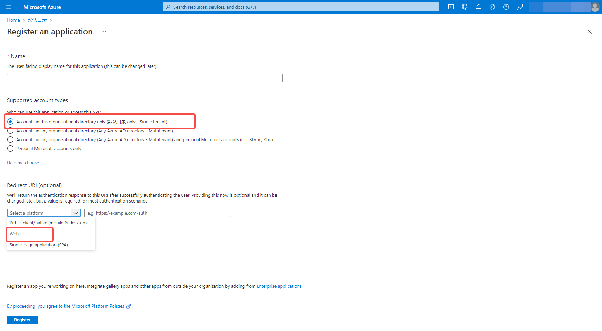
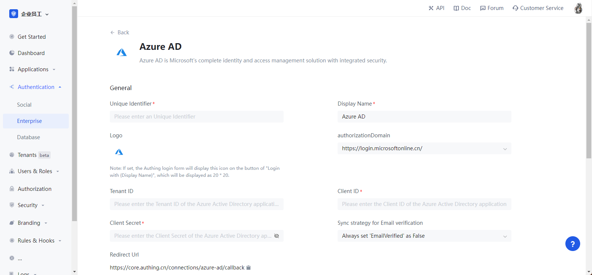
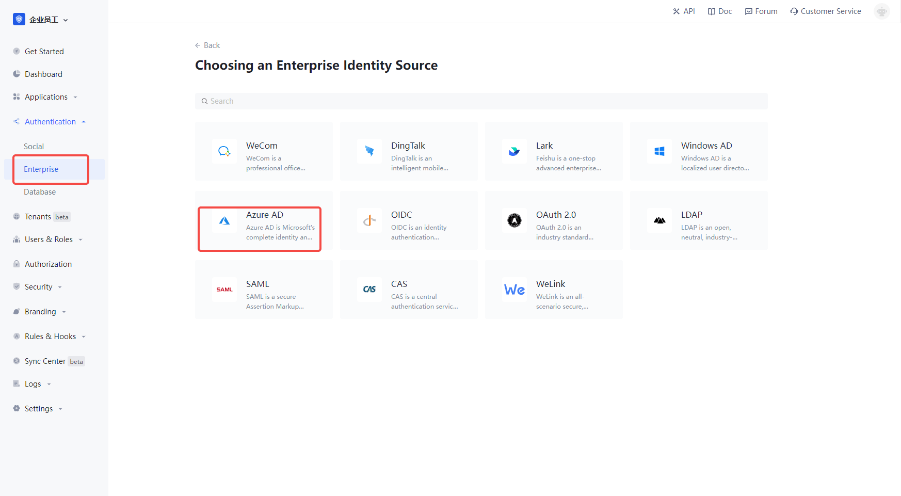
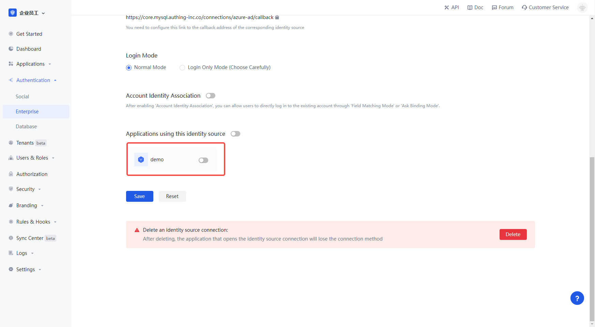
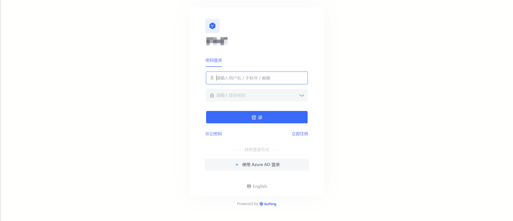
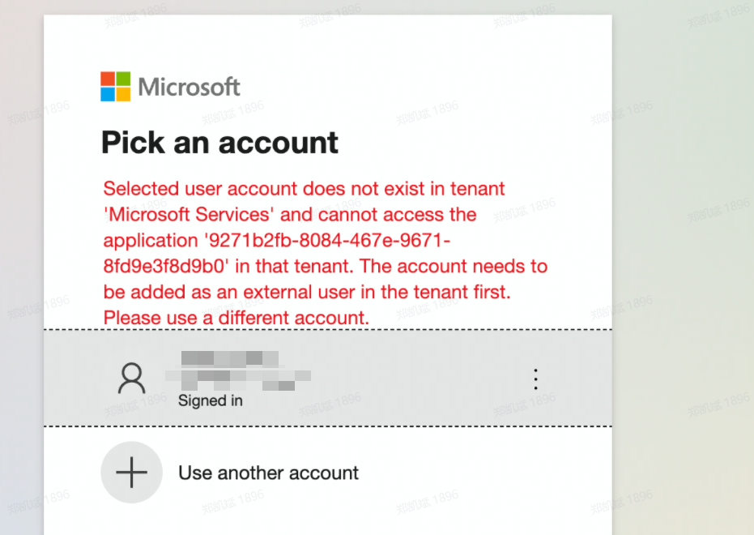

# Azure AD

<LastUpdated/>

## Introduction

- **Overview**: Azure AD is a complete identity and access management solution with integrated security from Microsoft. Configure and enable enterprise login for Azure AD in {{$localeConfig.brandName}} to enable quick access to Azure AD basic open information and help users to achieve password-free login functionality through {{$localeConfig.brandName}}.
- **Application Scenario**: PC Website
- **End-user preview image**.

## Caution.

- If you do not have a Microsoft account, please go to [Microsoft Platform](https://signup.live.com/signup) to register your account first.
- If your Microsoft account does not have Azure enabled, please go to [Azure Platform](https://signup.azure.com/) for account registration first, otherwise you cannot use Azure related functions normally.
- If you do not have {{$localeConfig.brandName}} Console account enabled, please go to [{{$localeConfig.brandName}} Console Console](https://authing.cn/) to register developer account first.

## Step 1: Create Azure Active Directory application

Go to [Azure Platform](https://portal.azure.com/#home) and click **Manage Azure Active Directory**.

On the overview page, select **New Registration** and find the **Application Registration** button to register the application.

On the app registration page, supported account types, choose the appropriate one for your situation. If you want accounts in other organizations to be able to use your app as well, you can select **Account in any organization directory (any Azure AD directory - multi-tenant) **, if you only want members of your own organization to use your app, select **Account in this organization directory only (default directory only - single tenant) **. Select **Web** for the redirect URI type and fill in the callback address **https://core.authing.cn/connections/azure-ad/callback**

Click **Register**.

## Step 2: Configure Azure AD in {{$localeConfig.brandName}} Console

2.1 Please click the "Create Enterprise Identity Source" button on the "Enterprise Identity Source" page of {{$localeConfig.brandName}} Console console, go to the "Select Enterprise Identity Source" page, and select the "Azure AD" identity source button to enter the "Azure AD Login Mode" page.

2.2 Please configure the relevant field information on the Enterprise Identity Source - Azure AD page in the {{$localeConfig.brandName}} Console console.

| field/function                                | description                                                                                                                                                                                                                                                                                                         |
| --------------------------------------------- | ------------------------------------------------------------------------------------------------------------------------------------------------------------------------------------------------------------------------------------------------------------------------------------------------------------------- |
| Unique identifier                             | a. The unique identifier consists of lowercase letters, numbers, and -, and is less than 32 bits long. b. This is the unique identifier for this connection and cannot be modified after it is set.                                                                                                               |
 | Display name                                  | This name is displayed on the button in the end-user's login screen.                                                                                                                                                                                                                                                | This is a unique identifier for this connection. |
| Authorization Domain                        | Azure AD has two different authentication domains, and the user data between them are not connected to each other. You can select the same authentication domain here for user authentication by confirming the login authentication domain currently used by existing services.                                    | 2.2.4 |
| Directory (Tenant) ID                         | Directory (Tenant) ID, not filled in, is selected as organization by default, that is, only accounts in the organization can login in the application.                                                                                                                                                              | The |
| Application (Client) ID                       | The application (client) ID, which needs to be obtained on the Azure AD platform.                                                                                                                                                                                                                                   | The application (client) ID needs to be obtained on the Azure AD platform. |
| Client password (value)                       | Client password (value), which needs to be obtained on the Azure AD platform                                                                                                                                                                                                                                        | 2.2.7 | Client password (value), which needs to be obtained on the Azure AD platform. |
| Callback address                              | The redirect URI for Azure AD. This URL needs to be configured on the Azure AD platform with the content **https://core.authing.cn/connections/azure-ad/callback**.                                                                                                                                                 | This URL needs to be configured to the Azure AD platform. |
| Mailbox authentication synchronization policy | Whether to mark user mailbox authentication status as authenticated after user authentication                                                                                                                                                                                                                       |
| Login Mode                                    | When "Login Only Mode" is enabled, only existing accounts can be logged in, and no new accounts can be created, please choose carefully.                                                                                                                                                                            | Please choose carefully. |
| Account Identity Association                  | If "Account Identity Association" is not enabled, new users will be created by default when users log in through the identity source. If you enable "Account Identity Association", you can allow users to log in to existing accounts directly by "Field Matching" or "Ask to Bind". a. Association Method: Select |

2.2.1 On the application overview page, you can find the application (client) ID and catalog (tenant) ID

2.2.2 On the Credentials and Passwords page of the app, click Generate **New Client Password** to get the client password value

Once the configuration is complete, click the "Create" or "Save" button to finish the creation.

## Step 3: Development Access

- **Recommended development access method**: Using a hosted login page

- **Description of advantages and disadvantages**: Simple operation and maintenance, {{$localeConfig.brandName}} is responsible for the operation and maintenance. Each user pool has an independent secondary domain; if you need to embed it into your application, you need to use pop-up mode login, i.e.: after clicking the login button, a window will pop up with the {{$localeConfig.brandName}} hosted login page, or redirect your browser to the {{$localeConfig.brandName}} hosted login page.

- **Detailed access method**.

  3.1 Create an application in {{$localeConfig.brandName}} console, for details see: [How to create an application in {{$localeConfig.brandName}}](./guides/app/create-app.md)

  3.2 In the created Azure AD Identity Source connection details page, open and associate an app created in the {{$localeConfig.brandName}} console

3.3 Experience Azure AD third-party login on the login page

## Step 4: Troubleshooting common errors

4.1 If you select a supported account type of **Accounts in this organization's directory only (Default Directory - Single Tenant only)**, when users from other organizations try to log in using Azure AD, they will be prompted with an error similar to the following.

